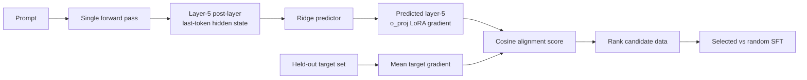

# Hidden-State Gradient Proxies for Data Selection

Can a language model's prompt hidden state predict the LoRA gradient that the
same example would produce—and can that prediction select better fine-tuning
data without running backward passes over the full candidate pool?

This repository studies that question on **Qwen2.5-1.5B-Instruct** with MATH
and GSM8K. The current answer is deliberately narrow:

> Hidden states contain a useful, mostly linear signal for single-layer LoRA
> gradient direction and candidate ranking. Gradient-selected data improves
> one matched in-domain holdout over random selection, but it has not yet
> produced a reliable end-to-end SFT improvement on MATH-500 or GSM8K.

## Method



The strongest selector uses the post-layer last-token representation at layer
5 to predict the full rank-4 `o_proj` LoRA A+B gradient. Candidates are ranked
by cosine similarity between their predicted gradient and a held-out mean
target gradient.

## Key results

| Question | Best current evidence | Takeaway |
|---|---:|---|
| Can hidden states predict a sample gradient? | cosine **0.7203** vs mean-gradient baseline **0.6613** | Yes, at the best layer/module |
| Can predicted gradients rank true target alignment? | Spearman **0.5956** | Useful but imperfect ranking signal |
| Is a nonlinear predictor necessary? | Ridge ≥ tested MLP/bottleneck variants | The recoverable signal is largely linear |
| Does more predictor data help? | 2k→5k: cosine **0.5167→0.5242**, rho **0.3180→0.3420** | Yes, modestly |
| Does selection beat random in-domain? | MATH common-unseen: **35.5% vs 32.8%**, p=**0.0055** | One significant positive result |
| Does selection improve public benchmarks? | MATH-500 **36.4% vs 37.8%**; GSM8K **60.7% vs 61.9%** | Not yet |

The main limitation is a geometry mismatch: selection uses one layer's
rank-4 `o_proj` gradient, while downstream SFT updates all layers and either
Q/K/V/O or every linear module at rank 16/32.

See [docs/RESULTS.md](docs/RESULTS.md) for the complete result summary and
[docs/EXPERIMENTS.md](docs/EXPERIMENTS.md) for experiment design and next steps.

## Repository layout

```text
configs/gradient_geometry/   Reproducible predictor experiment configs
gradient_geometry/           Data, extraction, and compression utilities
training/                    LoRA warmup and SFT training
evaluation/                  Extraction, predictors, selection, and evaluation
predictor/                   Predictor documentation
docs/                        Maintained result and experiment summaries
data/                        Local datasets; ignored by Git
result/                      Local SFT/GRPO artifacts; ignored by Git
```

Large arrays, adapters, checkpoints, logs, and prediction files are excluded
from Git. The compact tables in `docs/` are the repository's maintained result
record.

## Setup

```bash
python -m venv .venv
source .venv/bin/activate
pip install -r requirements.txt
```

The YAML configs contain a local model snapshot path. Change `model.path` and
`tokenizer.path` to your own Qwen2.5-1.5B-Instruct checkout before running.
GPU execution is expected for gradient extraction, SFT, and vLLM evaluation.

## Minimal reproduction path

The commands below illustrate the main stages. Output directories must be new;
the scripts intentionally avoid overwriting completed experiments.

```bash
# 1. Warm up a single-layer LoRA adapter.
python training/warmup_lora.py \
  --config configs/gradient_geometry/qwen2.5_1.5b_layer5_oproj_rank4_direct.yaml \
  --output runs/layer5_oproj/warmup \
  --device cuda:0

# 2. Extract matched prompt hidden states and per-example raw gradients.
python evaluation/extract_single_layer_raw_gradients.py \
  --config configs/gradient_geometry/qwen2.5_1.5b_layer5_oproj_rank4_direct.yaml \
  --adapter runs/layer5_oproj/warmup/adapter \
  --output runs/layer5_oproj/formal \
  --device cuda:0

# 3. Fit and evaluate the train-only-CV Ridge predictor.
python evaluation/evaluate_direct_raw_gradient_ridge.py \
  --experiment runs/layer5_oproj/formal \
  --device cuda:0

# 4. Measure candidate ranking against a held-out target gradient.
python evaluation/evaluate_target_alignment_spearman.py \
  --config configs/gradient_geometry/qwen2.5_1.5b_layer5_oproj_rank4_direct.yaml \
  --adapter runs/layer5_oproj/warmup/adapter \
  --experiment runs/layer5_oproj/formal \
  --device cuda:0
```

For the full layer/module/rank sweep, use
`evaluation/run_qvo_layer_rank_sweep.py`. SFT is implemented in
`training/train_lora_sft.py`; its selected and random branches must use the
same hyperparameters.

## Current status

- **Established:** hidden-state prediction of single-layer raw LoRA gradient
  direction; medium-strength target-alignment ranking.
- **Promising:** a statistically significant selected-over-random gain on a
  matched, unseen MATH-train holdout.
- **Unresolved:** public-benchmark improvement and transfer from a single-layer
  proxy to all-layer SFT.
- **Next:** stabilize the SFT control, test an exact-match layer-5 `o_proj`
  intervention, add a true-gradient oracle, and replace pure top-k selection
  with alignment-plus-diversity selection.
