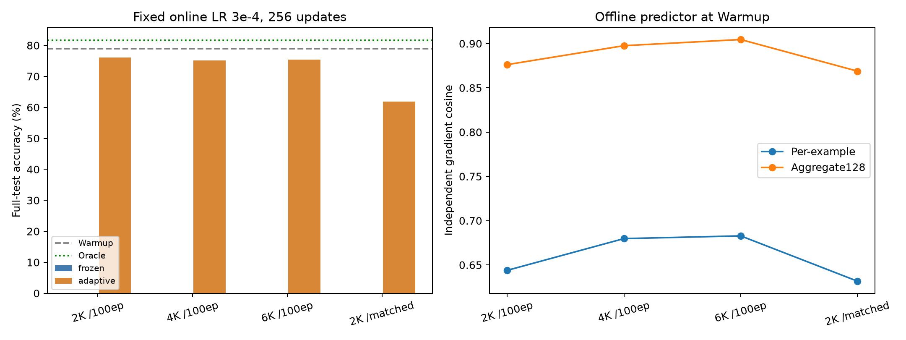
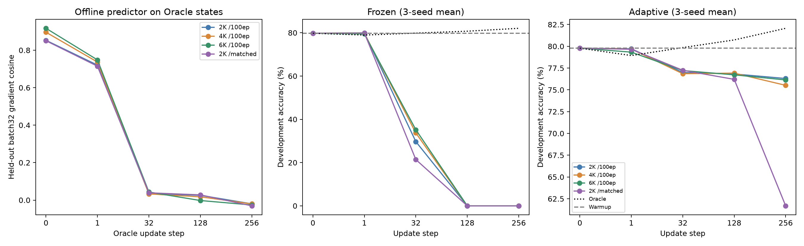

# BoolQ: more offline data does not preserve Oracle gains

**Qwen2.5-1.5B-Instruct · single-layer LoRA · three paired seeds · October 10, 2026**

True-gradient updates improve accuracy from **78.99% to 81.70% (+2.71 pp)**. Increasing offline predictor data from 2K to 6K improves initial gradient prediction, but Adaptive still finishes below Warmup. The main failure appears during repeated updates: prediction quality deteriorates as the model changes.

## Accuracy

Full BoolQ evaluation: **3,270 questions**, mean over three seeds. Warmup is the shared starting checkpoint; Oracle uses true gradients, Frozen keeps the offline predictor fixed, and Adaptive calibrates it at each update.

| Method | Offline examples | After 1 step | After 256 steps | Gain over Warmup at 256 |
|---|---:|---:|---:|---:|
| Warmup (no update) | — | 78.99% | 78.99% | — |
| Oracle | — | 79.02% | **81.70%** | **+2.71 pp** |
| Adaptive | 2,048 | 78.93% | 76.12% | −2.87 pp |
| Adaptive | 4,096 | 78.85% | 75.10% | −3.89 pp |
| Adaptive | 6,144 | 78.84% | 75.39% | −3.60 pp |
| Adaptive, matched training steps | 2,048 | 78.94% | 61.83% | −17.16 pp |
| Frozen | 2,048 | 78.90% | 0.00%* | −78.99 pp |
| Frozen | 4,096 | 78.89% | 0.00%* | −78.99 pp |
| Frozen | 6,144 | 78.86% | 0.00%* | −78.99 pp |
| Frozen, matched training steps | 2,048 | 78.97% | 0.00%* | −78.99 pp |

Oracle's gain has an adjusted 95% interval of **[+1.01, +4.41] pp**. Adaptive 6K minus Adaptive 2K is **−0.72 pp [−2.89, +1.98]**: no established benefit from scaling offline data. Intervals use 100,000 paired seed/passage-cluster bootstrap draws with Bonferroni adjustment across 17 primary comparisons. One-step results are descriptive secondary endpoints; even Oracle has almost no one-step gain.

*Frozen generates repetitive, invalid answers; all final 256-step outputs hit the 256-token output cap. Warmup, Oracle and Adaptive final-test outputs never hit that cap.*

## What explains the gap?

More offline data improves prediction **at the starting model state**, but this advantage disappears along the Oracle update trajectory:

| Offline examples | Initial per-example LoRA gradient cosine (128 questions) | Initial batch cosine (same 32 questions) | Batch cosine after 32 Oracle steps |
|---|---:|---:|---:|
| 2,048 | 0.644 | 0.853 | 0.035 |
| 4,096 | 0.680 | 0.896 | 0.033 |
| 6,144 | 0.683 | 0.917 | 0.043 |

These trajectory audits keep the offline predictor fixed and use the **same 32 held-out questions** at each Oracle state. They support a state-dependent prediction mismatch; they do not prove that broader state coverage will fix it.

Adaptive prevents Frozen's collapse, but does not recover useful gradient directions. At step 256, its 2K/4K/6K mean batch cosine is only 0.004–0.012 and predicted gradient norms are approximately 0.4–1.2% of true norms. Epoch 0 is selected on 57–61% of updates: this retains the **current** predictor, including earlier calibration, rather than resetting to the offline model.

The left panel audits fixed predictors on Oracle states; the other panels show **1,024-question development accuracy**, not the full-test values above. Checkpoint spacing is categorical.

## Configuration

| Component | Setting |
|---|---|
| Base and adapter | Qwen2.5-1.5B-Instruct; layer 8 `o_proj`; LoRA rank/alpha 64; shared historical Warmup; true-answer targets |
| Offline data | Nested 2,048 / 4,096 / 6,144 examples, collected at Warmup; predictor development 128; independent gradient audit 128 |
| Predictor | 5,787,136 parameters; width 512, depth 2, 8 heads, FFN 1,024; activation + mask + position + log-RMS inputs |
| Offline loss | Factor-balanced A/B relative MSE + 0.25 × normalized activation-gradient MSE |
| Offline fit | AdamW, LR 3e-4, weight decay 0.01, clip 1; 100 epochs; select minimum predictor-development individual factor-balanced relative error |
| Matched control | 2K data with the same total optimizer steps and validation-check grid as 6K; selected checkpoint steps may differ |
| Online LoRA | AdamW, LR 3e-4, weight decay 0, clip 1; 256 updates × batch 32; original 1,024-example update pool |
| Adaptive calibration | Four examples from each batch; fixed 16 predictor-development examples select epoch 0–30; LR 1e-4; predictor weights carry across batches |
| Seeds | Predictor/update pairs: 123/101, 124/102, 125/103 |
| Evaluation | Full inputs preserved; output generation limited to 256 new tokens; full-test endpoints at steps 1 and 256 |

## Interpretation and next experiment

**Priority: test offline training across model states at a fixed data budget.** Compare Warmup-only gradient records with an equal number collected across Oracle steps 0, 1, 4, 16 and 32. Keep predictor architecture, loss and optimizer-step budget fixed. Measure held-out gradient quality along updates, then whether 128/256-step accuracy exceeds Warmup. Separately tune the predictor-driven LoRA learning rate on development data.

This is an exploratory, single-task result with three paired seeds sharing Warmup and data splits; the test set was used historically. The fixed online LR 3e-4 is not established as optimal for predictor updates; the planned lower-LR extension was not run. Matched-control instability does not by itself establish overtraining. The common unseen-passage subset (2,369 questions) gives the same qualitative conclusion.

The output cap was reduced from 2,048 to 256 **before new full-test evaluation**, after a development runtime probe; input prompts were never truncated. All three Oracle final adapters and full-test predictions exactly reproduce the historical results. Resource-driven restarts occurred, and Adaptive training was not bitwise deterministic; no wall-time efficiency claim is made.

[Compact numerical results](results.json) include per-seed test counts, primary intervals, offline metrics and trajectory diagnostics. This release contains the report, two figures and aggregate data only; it is not a standalone reproduction package.
