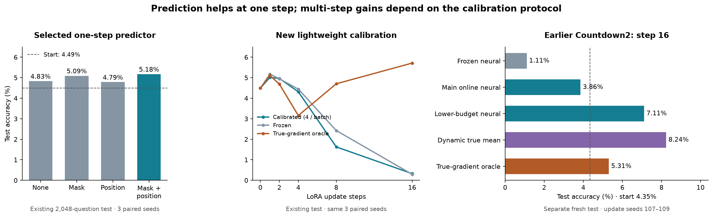

# Countdown: one-step prediction and multi-step calibration

**Single-step prediction improves the observed mean accuracy. Multi-step calibration is configuration-dependent; the new lightweight version does not prevent degradation.**

Qwen2.5-0.5B-Instruct · layer 8 `o_proj` LoRA · rank/alpha 64 · common teacher32 starting adapter. All reported accuracies are averages over three update runs unless stated otherwise.

## 1. Current selected predictor: Y + mask + position

Selected by **mean one-step development accuracy**, comparing four input variants under the same protocol. No test-based input or training-seed selection.

| Predictor input | Dev: 256 questions | Existing test: 2,048 questions |
|---|---:|---:|
| No update | 3.13% | 4.49% |
| Y only (`none`) | 5.60% | 4.83% |
| Y + mask | 5.47% | 5.09% |
| Y + position | 5.21% | 4.79% |
| **Y + mask + position** | **5.86%** | **5.18%** |

The selected predictor estimates activation gradients from module outputs; LoRA A/B gradients are reconstructed analytically. `none` still includes log-RMS and padding validity. Explicit position features are normalized position, its square, and sine. The predictor itself has no other positional encoding.

| Setting | Value |
|---|---|
| Architecture | Bidirectional Transformer; width 512, 2 layers, 8 heads, FFN 1024; 5.13M parameters |
| Training | 8,192 examples; 100 epochs; batch 32; AdamW lr 3e-4, weight decay 0.01 |
| Loss / checkpoint | Factor-balanced relative A/B MSE + 0.25 normalized activation-gradient MSE; minimum dev A/B error, evaluated every epoch |
| Training/update seed pairs | 123/101, 124/102, 125/103; not a full 3×3 crossing |
| LoRA update | One AdamW step; lr 3e-4, weight decay 0, batch 32, gradient clipping 1 |

The test improvement over no update is **+0.68 percentage points**, with paired question-bootstrap 95% CI **[−0.03, +1.40]**. Versus `none`, the difference is +0.34 points, CI [+0.05, +0.63], unadjusted for multiple comparisons and conditional on the three fitted models. None of the three per-seed comparisons survives the prespecified Holm correction. This is a promising point estimate, not an established robust gain.

## 2. Earlier Countdown2: 16-step dynamic predictors

| Method | Existing test (baseline 4.49%) | Separate fresh test (baseline 4.35%) |
|---|---:|---:|
| Frozen neural predictor | 0.96% | 1.11% |
| Main online neural predictor | 3.82% | 3.86% |
| **Lower-budget online neural predictor** | **7.06%** | **7.11%** |
| Dynamic true-gradient mean — **not a neural predictor** | 8.46% | 8.24% |
| Full-batch true-gradient oracle | 5.42% | 5.31% |

All are 16-step endpoints for update seeds 107/108/109, with fixed calibration sampling seed 701. The lower-budget neural variant was a prespecified secondary comparison, not the development-selected primary. Across a broader 3×3 calibration/update-seed crossing, the main neural predictor averaged 4.33% on the fresh test; the dynamic mean averaged 7.14%. These conditions share the initial predictor and evaluation questions.

| Calibration setting | Earlier main neural | Earlier lower-budget neural | New per-batch neural |
|---|---|---|---|
| Initial predictor | Y + none | Y + none | Y + mask + position |
| Calibration examples | Fixed 64 train + 32 validation | Fixed 32 train + 16 validation | 4 from the current batch32 |
| Refresh steps | 2, 4, 6, 8, 10, 12, 14, 16 | 2, 5, 9, 13 | Every step, 1–16 |
| Training per refresh | 30 epochs, 60 optimizer steps | 30 epochs, 30 optimizer steps | 1 optimizer step |
| Predictor learning rate | 1e-4 | 1e-4 | 3e-5 |
| Validation safeguard | Best checkpoint, including pre-refresh state | Same | None; keep the update |
| Total predictor optimizer steps | 480 | 120 | 16 |
| True-label example–state pairs | 512 train + 256 validation | 128 train + 64 validation | 64 calibration, plus separately counted diagnostics |

Earlier refreshes create a new predictor AdamW optimizer; the new experiment carries its optimizer state across steps. All three use LoRA AdamW lr 3e-4, batch32, weight decay 0. Thus this is **not** a controlled comparison of calibration-data sources alone.

The mean control periodically recomputes an actual average gradient on fixed training probes. After the shared first predictor step, it updates using that direction without neural prediction from the current batch. Its higher accuracy does not establish better neural gradient prediction or a compute advantage.

## 3. New lightweight calibration: completed, negative downstream result

All 9 trajectories and 92 accuracy evaluations are complete. Same starting adapter, matched update batches, and three training/update seed pairs as above. Calibrate the entire predictor on 4 examples, then use predicted gradients for **all 32 examples**. The other 28 true-gradient labels are diagnostic only and never train the predictor.

| Update step | Calibrated predictor | Frozen predictor | True-gradient oracle |
|---|---:|---:|---:|
| 0 | 4.49% | 4.49% | 4.49% |
| 1 | 5.01% | 5.18% | 5.11% |
| 2 | 4.96% | 4.95% | 4.69% |
| 4 | 4.31% | 4.44% | 3.16% |
| 8 | 1.63% | 2.43% | 4.70% |
| 16 | **0.33%** | **0.29%** | **5.71%** |

Existing 2,048-question test, three-run means. On the 28 non-calibration examples, calibration improves batch LoRA-gradient cosine in **47/48** within-state comparisons (mean increase **0.037**), yet this does not translate into sustained downstream accuracy. Diagnostic backward passes add measurement cost beyond the 4-example calibration budget.

The new update implementation partitions true-gradient acquisition into the 4-example calibration subset and the remaining 28 examples. Its floating-point batching differs from the original one-step implementation; per-seed frozen results should not be expected to be bit-identical. Within this experiment, calibration/frozen/oracle use matched batches and acquisition grouping.

## Reading the comparisons

- **Different tests:** current one-step and lightweight curves use the existing benchmark; the earlier fresh-test column uses a separate, numerically disjoint question set. Do not directly rank 5.18% vs 7.11% as a matched experiment.
- **Different seeds and training:** earlier dynamic runs start from one fixed Y-none predictor; current runs pair three newly trained predictors with three update seeds. The current offline trainer also changed sample-order RNG and checkpoint evaluation frequency.
- **Input policy:** preserve complete inputs. Training/calibration hidden states use questions plus reference answers; accuracy generation receives questions only. Greedy decoding, BF16 vLLM, output cap 2,048 new tokens — not an input-length limit.
- **Gradient aggregation:** sum per-example sum-loss gradients, divide by the batch's total supervised-token count, clip, then take one AdamW step. It is not an equal average of per-example mean gradients.

## Files

- [Configurations](configs/) — selection rule, training, online schedules, checkpoint SHA256 identities.
- [Per-seed results](results/) — CSV accuracy tables and JSON gradient/statistical records.
- [Implementation references](source/) — architecture and original update/calibration code; not a turnkey reproduction bundle.

Large model weights, gradient caches, datasets, and full generated answers are excluded. No unique best training seed is claimed; the selected current input configuration retains all three checkpoints. Results recorded September 19, 2026.
