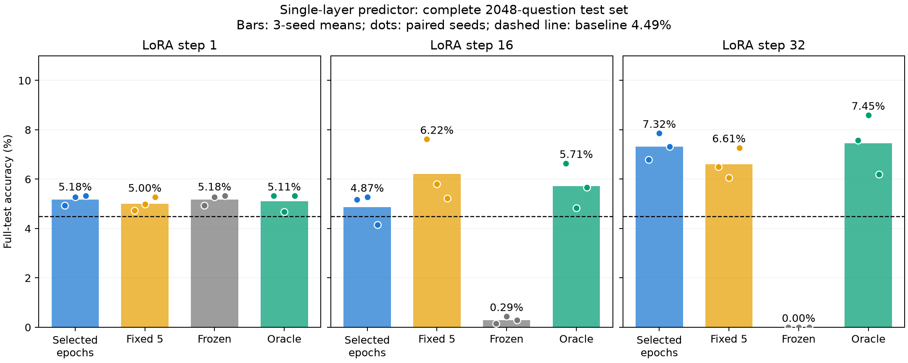

# Countdown: Gradient Prediction and Layer Updates

[Project overview](../../README.md) · [Predictor research map](../README.md) · [Earlier calibration experiments](HISTORY.md)

**Research question:** can a gradient predictor produce useful LoRA updates, and can small calibration batches keep it effective as the model changes?

**Current result:** the matched layer comparison is complete. Joint adaptive updates of layers 3/8/19 do not improve on their own warmup baseline, although real-gradient oracle updates do. Independent layer 8 remains the strongest predictor result; independent layer 3 is unstable across seeds.

Qwen2.5-0.5B-Instruct · `o_proj` LoRA rank/alpha 64 · three paired predictor/update seeds: **123/101, 124/102, 125/103**. Each scope has its own 32-step real-gradient warmup checkpoint.

## Joint and independent layer updates

Layers are **zero-indexed**. Independent rows update exactly one layer per model; the joint row updates all three layers in one model with a separate predictor for each layer. Layer 8 reuses the completed original experiment. Results below use the full **2,048-question test set**, averaged over three paired seeds; each shared warmup baseline is evaluated once.

| Update scope | Warmup | Adaptive, step 1 | Adaptive, step 16 | Adaptive, step 32 | Gain over own warmup | Oracle, step 32 |
|---|---:|---:|---:|---:|---:|---:|
| Independent layer 3 | 2.25% | 3.08% | 3.34% | **3.78%** | +1.53 pp | 6.85% |
| Independent layer 8 | 4.49% | 5.18% | 4.87% | **7.32%** | +2.83 pp | 7.45% |
| Independent layer 19 | 3.13% | 3.26% | 3.06% | **3.84%** | +0.72 pp | 4.41% |
| Joint layers 3+8+19 | 8.64% | 6.40% | 7.52% | **8.04%** | −0.60 pp | 10.73% |

- **Joint updates:** higher absolute accuracy than independent layer 8 does not imply improvement from predictor updates: joint warmup already reaches 8.64%. Adaptive finishes below that baseline, while oracle improves by 2.08 percentage points. Joint adaptive seed results are 9.86%, 8.30%, and 5.96%.
- **Independent layer 3:** adaptive seed results are 2.00%, 2.73%, and 6.59%; oracle gives 6.49%, 7.52%, and 6.54%. This motivates examining layer 3, but does not isolate its causal role inside the joint model.
- **Independent layer 19:** all adaptive seeds exceed warmup; fixed-5 reaches 4.05%, slightly above adaptive's 3.84%. At step 32 fixed-5 gives 1.29%, 6.61%, 4.05%, and 7.34% for independent 3/8/19 and joint updates respectively. Frozen predictors reach 0% in all four scopes.

The development/test distinction matters: joint adaptive improves development accuracy from 7.42% to 9.38%, but test accuracy declines. Independent layer 19 adaptive exceeds oracle on development (4.43% vs 4.17%) and trails it on test (3.84% vs 4.41%). These are descriptive three-seed results, not established statistical superiority or equivalence. Repeated evaluation of the same 2,048 questions does not create 6,144 independent questions.

### Matched configuration

| Stage | Settings |
|---|---|
| Base / adapters | Frozen Qwen2.5-0.5B-Instruct; `o_proj` LoRA rank=alpha=64, dropout=0 |
| Warmup | Real gradients; 32 steps; seed 101; AdamW lr **5e-4**, weight decay .01; batch 32 / microbatch 8; global clip 1. Each scope is warmed independently; joint scope warms all three adapters together |
| Offline predictor | A new bidirectional Transformer per layer/seed; Y+mask+position, width 512, depth 2, 8 heads; 8,192 training examples; AdamW lr **3e-4**, weight decay .01, batch 32, clip 1; run the full **100-epoch budget**, choose the lowest-error checkpoint using all 256 predictor-dev examples every epoch |
| LoRA updates | 32 steps; AdamW lr **3e-4**, weight decay 0, batch 32, global clip 1 across the updated adapters; new optimizer after warmup, then retain its state |
| Online calibration | 4 current-batch examples; AdamW lr **1e-4**, weight decay .01, clip 1; fixed 16 separate predictor-dev examples, refreshed true labels at each model state; adaptive selects epochs 0–30 independently per layer |
| Controls | Adaptive resets predictor optimizer every refresh and retains selected weights; fixed-5 retains optimizer state; frozen does no calibration; oracle uses real gradients |
| Evaluation | Full dev256 at steps 1/2/4/8/16/32; full test2048 at 1/16/32; greedy BF16 native-LoRA vLLM, max sequences 512, KV cache 16 GiB. No input truncation; **2,048 new tokens is the output cap** |
| Pairing / resources | Same data splits, update order, and calibration indices as layer 8; seeds 123/101, 124/102, 125/103; physical GPUs 0 and 1 |

Each predictor is trained from scratch on activations/gradients collected **after its scope's LoRA warmup**. Shared hyperparameters do not make independent and joint warmup checkpoints identical. Calibration training uses factor-balanced per-example A/B relative MSE plus 0.25 normalized activation MSE; checkpoint selection adds aggregate A/B relative error. The adaptive/fixed-5 comparison changes optimizer reset policy as well as selected epochs.

[All per-seed dev/test results](layer-comparison-32step/results/accuracy.csv) · [Configuration and evidence index](layer-comparison-32step/README.md) · [Gradient diagnostics](layer-comparison-32step/figures/independent_gradients.png) · [Next experiments](../../docs/EXPERIMENTS.md#next-experiments)

The following sections preserve the original layer-8 input-selection and calibration study.

## One-step input selection

Selected by **mean one-step development accuracy**, comparing four input variants under the same protocol. No test-based input or training-seed selection.

| Predictor input | Dev: 256 questions | Existing test: 2,048 questions |
|---|---:|---:|
| No update | 3.13% | 4.49% |
| Y only (`none`) | 5.60% | 4.83% |
| Y + mask | 5.47% | 5.09% |
| Y + position | 5.21% | 4.79% |
| **Y + mask + position** | **5.86%** | **5.18%** |

The selected predictor estimates activation gradients from module outputs; LoRA A/B gradients are reconstructed analytically. `none` still includes log-RMS and padding validity. Explicit position features are normalized position, its square, and sine. The predictor itself has no other positional encoding.

| Setting | Value |
|---|---|
| Architecture | Bidirectional Transformer; width 512, 2 layers, 8 heads, FFN 1024; 5.13M parameters |
| Training | 8,192 examples; 100 epochs; batch 32; AdamW lr 3e-4, weight decay 0.01 |
| Loss / checkpoint | Factor-balanced relative A/B MSE + 0.25 normalized activation-gradient MSE; minimum dev A/B error, evaluated every epoch |
| Training/update seed pairs | 123/101, 124/102, 125/103; not a full 3×3 crossing |
| LoRA update | One AdamW step; lr 3e-4, weight decay 0, batch 32, gradient clipping 1 |

The test improvement over no update is **+0.68 percentage points**, with paired question-bootstrap 95% CI **[−0.03, +1.40]**. Versus `none`, the difference is +0.34 points, CI [+0.05, +0.63], unadjusted for multiple comparisons and conditional on the three fitted models. None of the three per-seed comparisons survives the prespecified Holm correction. This is a promising point estimate, not an established robust gain.

## Dynamic calibration

At each of 32 LoRA update steps:

1. Take **32 examples** and randomly select **4** for predictor calibration using true gradients.
2. Recompute true gradients on **16 fixed, separate gradient-development examples** at the current LoRA state. They select the checkpoint and do not train the predictor.
3. Train the predictor for **30 epochs** on the four examples, one optimizer step per epoch. Evaluate epochs **0–30**, then restore the lowest-error checkpoint; epoch 0 retains the incoming weights.
4. Predict gradients for **all 32 examples**, sum their sum-loss A/B gradients, divide by total supervised tokens, clip, and take **one LoRA update**.

Epoch selection minimizes **per-example factor-balanced A/B relative squared error + concatenated aggregate A/B relative squared error**. It uses gradient validation, not downstream accuracy. Across 96 refreshes, selected epochs average **6.45**, with median **3**; epoch 0 is selected 8 times and epoch 30 four times.

### Complete test results

Every checkpoint is evaluated on the complete **2,048-question existing test set**. Entries are means over three paired seeds. The 1/16/32-step endpoints were specified before test evaluation; starting accuracy is **92/2048 = 4.49%**.

| Method | Step 1 | Step 16 | Step 32 |
|---|---:|---:|---:|
| Validation-selected calibration epochs | 5.18% | 4.87% | **7.32%** |
| Fixed 5 calibration epochs | 5.00% | **6.22%** | 6.61% |
| Frozen predictor | 5.18% | 0.29% | 0.00% |
| True-gradient oracle | 5.11% | 5.71% | **7.45%** |

At step 32, adaptive calibration exceeds baseline by **2.83 percentage points** and fixed-5 by **0.72 points**. Its three seed results are **6.79%, 7.86%, 7.32%**; each exceeds baseline and its paired fixed-5 control. It trails oracle by **0.13 points** in the mean, which does not establish equivalence. **Fixed-5 is better at step 16**, and performance is not monotonic.

### Update configuration and interpretation

| Setting | Value |
|---|---|
| Predictor calibration | AdamW lr **1e-4**, weight decay 0.01, clip 1; 4 training examples |
| Calibration training loss | Individual A/B relative MSE + 0.25 activation MSE normalized by the original offline scale; no aggregate training term |
| Epoch selection | 16 fixed validation examples; run 30 epochs and select among 0–30 |
| LoRA optimizer | AdamW lr **3e-4**, weight decay 0, clip 1; persistent optimizer state |
| Adaptive predictor optimizer | Reset at every new batch; selected predictor weights persist |
| Fixed-5 control | Same calibration examples, lr, and loss; always retain epoch 5; predictor optimizer state persists |
| Generation | Greedy native BF16 vLLM; full input prompts; output cap **2,048 new tokens** |

The adaptive/fixed-5 comparison changes **both epoch selection and predictor optimizer-state policy**. All three adaptive runs select epoch 0 at the first step, so the first-step gain comes from the original predictor. The 16 validation examples require fresh true gradients each step; another 28 current-batch true gradients are collected only for diagnostics. These costs preclude inferring a compute advantage from the four-example calibration count alone.

The original one-step input study and this dynamic study differ in floating-point gradient-acquisition grouping; their individual-seed results need not match exactly. Use matched controls within each study. These are three paired seeds, not a full seed crossing or an independent fresh-test confirmation.

## Original layer-8 evidence

| Need | File |
|---|---|
| Full current configuration | [protocol.json](adaptive-calibration-32step/protocol.json) |
| Per-seed accuracy | [Test](adaptive-calibration-32step/results/test_accuracy.csv) · [Accuracy development set](adaptive-calibration-32step/results/dev_accuracy.csv) |
| Each batch's four calibration examples and selected epoch | [Calibration choices](adaptive-calibration-32step/results/calibration_choices.csv) |
| Activation and LoRA gradient reconstruction | [All-step metrics](adaptive-calibration-32step/results/gradient_metrics.csv) |
| Evaluation integrity and source identity | [Audit](adaptive-calibration-32step/results/test_audit.json) · [SHA256 provenance](adaptive-calibration-32step/provenance.json) |
| Code and reproduction boundary | [Current source snapshots](adaptive-calibration-32step/source/README.md) |
| Original one-step evidence | [Configs](configs/) · [Results](results/) · [Source references](source/README.md) |
| Earlier dynamic variants | [Countdown2 and lightweight calibration](HISTORY.md) |

The subsequent joint and independent layer comparison is [reported above](#joint-and-independent-layer-updates). All-layer expansion is deferred; see the [current roadmap](../../docs/EXPERIMENTS.md#next-experiments). Large checkpoints, datasets, gradient caches, and full generated answers remain in the server archive.
