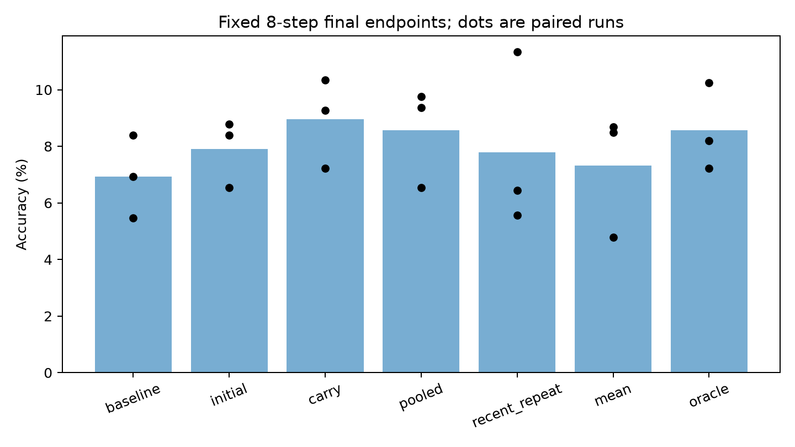

# Does history help beyond ordinary training?

[Countdown results](../README.md) · Ben learning audit · September 27, 2026

**History improves gradient prediction, but sequential calibration does not consistently beat ordinary training on the same history. The current implementation does not establish a compute advantage.**

## What was compared?

Historical states are main-model checkpoints at **0, 1, 2, 4, 8, 16 true-gradient updates after a shared 32-step warmup**. Each state supplies new **4 training + 16 checkpoint-selection examples**. State 32 is reserved for transfer probes and the start of the final eight-step rollout. These are reused, fixed reference trajectories.

| Predictor | Historical training |
|---|---|
| Initial | Existing pretrained predictor; no additional history |
| Carry | Visit the six states chronologically; train 30 steps per state and retain its selected predictor weights |
| Pooled | Same 24 training and 96 selection examples; shuffle the six states within each six-update cycle, repeated 30 times |
| Recent repeat | Repeat only state 16's 4 training + 16 selection examples for six rounds of 30 steps |

Carry, pooled and recent repeat each execute **180 optimizer steps, 720 training-example presentations and 2,976 selection-example presentations**. Carry and pooled also match each historical example's presentation count. Carry selects epochs 0–30 within each state; pooled selects every six steps using all historical selection examples. Optimizers reset every 30 steps. Checkpoint-selection organization differs, so this comparison does not isolate order alone. Pooled has all historical data available upfront.

## Results

### Transfer to a new model state

Held-out aggregate gradient relative L2, averaged over three seed pairs and four probes per pair; lower is better:

| Predictor | No current calibration | 4 training + 16 selection | Error reduction |
|---|---:|---:|---:|
| Initial | 1.690 | 1.271 | 0.419 |
| Carry | 1.275 | 1.109 | 0.166 |
| Pooled | 1.267 | 1.112 | 0.156 |
| Recent repeat | 1.329 | 1.141 | 0.187 |

History provides a better starting point. It does not show a larger gain from current calibration; different starting errors also prevent concluding that it learns more slowly. Carry-minus-pooled L2 differences are **−0.061, +0.065, −0.012** across seeds. A zero-gradient prediction has relative L2 = 1, so absolute reconstruction error remains substantial.

### Actual model updates

After eight updates, every model is evaluated on the **same 1,024 fresh questions**:

| Method | Correct: seeds 101 / 102 / 103 | Mean accuracy |
|---|---|---:|
| Before updates | 71 / 86 / 56 | 6.934% |
| Initial | 86 / 90 / 67 | 7.910% |
| Carry | 74 / 106 / 95 | 8.952% |
| Pooled | 100 / 96 / 67 | 8.561% |
| Recent repeat | 66 / 116 / 57 | 7.780% |
| Mean: average of 20 true-gradient examples | 49 / 87 / 89 | 7.324% |
| Oracle: all 32 true-gradient examples | 105 / 84 / 74 | 8.561% |

Carry improves over its starting model by **2.018 percentage points**, but pooled also improves by **1.628 points**. The primary carry-minus-pooled difference is **+0.391 points**, with question-bootstrap 95% interval **[−0.423, +1.237]**; seed differences are −2.539, +0.977 and +2.734 points. This establishes neither superiority nor equivalence. The interval is conditional on these trained runs and does not capture training-seed uncertainty.

A separate one-step intervention on 256 held-out reference answers also reduced loss for all four predictors; carry did not outperform pooled on mean loss improvement.

### Measured cost

Carry uses **20 rather than 32 true-gradient example presentations per update (37.5% fewer)**. However, its eight updates take **6.423 s**, versus **1.631 s** for Oracle. Calibration and selection account for approximately **65%** of carry's time.

In a controlled first-step replay on the same GPU and matched starting states, median times are **0.721 s vs 0.235 s (3.07×)**, with one warmup and five timed repeats. These online timings exclude historical fitting and reused predictor pretraining. Time to equal quality was not measured.

Setup and scope

| Item | Setting |
|---|---|
| Main model | Frozen Qwen2.5-0.5B-Instruct; zero-indexed layer 8 `o_proj` LoRA, rank = alpha = 64 |
| Predictor | Y + supervision mask + position; bidirectional Transformer, width 512, 2 layers, 8 heads; reused 8,192-example pretraining with 256 development examples |
| Input access | Full teacher-forced question and reference-answer hidden states; supervised training setting |
| Seeds | Predictor/update pairs 123/101, 124/102, 125/103 |
| Data | Countdown-Tasks-3to4; 3,288 new exact-solver-verified questions; balanced three/four-number puzzles; no number-multiset overlap between new splits or with 111 checked prior data files |
| Predictor fitting | AdamW lr 1e-4, weight decay .01, clip 1; factor-balanced LoRA A/B relative MSE + .25 normalized activation-gradient MSE |
| Probes | Four per pair at state 32; current total gradient-label budgets 0/20/32; 16 diagnostic examples excluded from training and selection |
| Final rollout | Eight updates, batch 32; AdamW lr 3e-4, weight decay 0, clip 1; all four predictors retain weights and continue 4+16 calibration each step, including Initial |
| Learning-rate choice | Shared lr selected from 1e-4 and 3e-4 by three-seed Oracle accuracy on a separate 256-question development set; no per-method tuning |
| Evaluation | Greedy generation; full inputs preserved; **2,048 new output tokens maximum**; some answers reach this cap |

Only three paired seeds, one model, one adapted layer and eight updates are tested. There is no self-generated recursive history or learned data-selection policy. The 21 evaluated versions are three starting models plus 18 endpoints, not 21 independent seeds.

## Evidence

[Gradient summary](results/probe_summary.csv) · [Primary gradient comparison by seed](results/primary_gradient_by_seed.csv) · [Accuracy by seed](results/accuracy_results.csv) · [Accuracy differences and intervals](results/accuracy_comparisons.csv) · [Eight-step costs](results/rollout_costs.csv) · [Controlled timing](results/controlled_timing.json) · [Integrity checks](results/integrity.json)

This compact results release comes from `ben_learning_audit_20260927`. Integrity checks rescored all 21,504 final answers and verified data separation, complete inputs, gradient reconstruction and matched budgets. Full inputs/outputs, datasets, checkpoints, caches, logs and execution code remain in the local experiment archive; this bundle is not a standalone rerun package.
