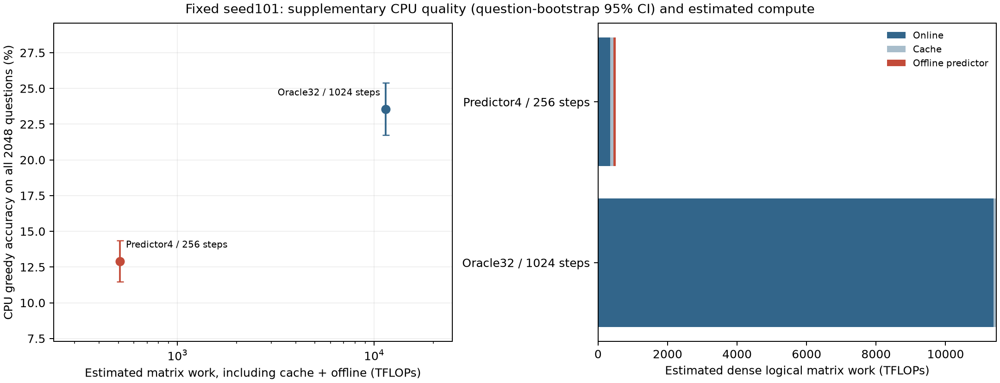

# Efficient predictor test: 0.5B Countdown

[Project](../../../README.md) · [Predictor research](../../README.md) · [Preceding cross-domain experiments](../scaling-domains-20260930/README.md)

October 2, 2026 follow-up, published October 4. Local source: `efficient_test/`.

**The selected predictor reduces estimated optimization FLOPs, but falls well below Oracle accuracy: 12.89% vs 23.54%. This experiment does not establish an efficiency advantage at matched quality, and controlled GPU timing remains incomplete.**

## What changed

This is a separate 0.5B Countdown study, following the 1.5B/7B domain experiments. It tests smaller predictors, cheaper calibration, small true-gradient batches, residual corrections and shared caching. Its results should not be merged with the earlier 32-step Adaptive comparisons.

| Setup | Configuration |
|---|---|
| Main model | Qwen2.5-0.5B-Instruct; one layer-8 `o_proj` LoRA, rank = alpha = 64 |
| Shared starting point | Historical teacher32 warmup; warmup LR 5e-4 |
| Selected predictor | Width 128, 2 layers, 8 heads; fitted from scratch on 128 examples, 32 predictor-dev examples, 30 epochs, LR 3e-4 |
| Predictor updates | 256 LoRA steps, LR 1e-3, batch 32; 4 true-gradient probes every step; 1 calibration epoch every 4 steps at LR 3e-4 |
| Gradient correction | Predict activation gradients and reconstruct LoRA gradients; add a residual correction using probes, with separate A/B coefficients estimated from past probes |
| Oracle32 | Independently dev-selected LR 1e-3 and 1,024 steps; 32 true-gradient examples per step |
| Shared optimization | Cache the frozen prefix and target linear inputs for both methods; reuse a fixed 1,536-example update pool |
| Search coverage | 149 completed grid runs plus 5 implementation checks; frozen/head calibration, hybrid updates, control variates, probe sizes and calibration settings |

The selected method uses current probes for the update, then fits the predictor for future batches. It still reads reference solutions for all 32 examples; using four true-gradient probes does **not** mean needing only four task answers. [Selected configurations](configs/final_selected.json) · [Search inventory](results/completed_search_work.json)

## Completed accuracy comparison

Full original 2,048-question evaluation, one fixed training seed (101), CPU BF16 greedy generation. Inputs are preserved in full; 2,048 limits **new output tokens**.

| Method | Update steps | Correct | Accuracy | Outputs reaching the cap |
|---|---:|---:|---:|---:|
| Predictor4, calibration every 4 steps | 256 | 264 / 2,048 | **12.89%** | 442 |
| Oracle32 | 1,024 | 482 / 2,048 | **23.54%** | 9 |

Predictor − Oracle = **−10.64 percentage points**. The paired question-bootstrap 95% interval is **[−12.30, −8.98] pp**, or **[−13.09, −8.24] pp** with the recorded 12-comparison Bonferroni correction. Predictor alone solves 54 questions; Oracle alone solves 272. These intervals condition on the fixed models, not new training seeds.

The original question set's independence from historical model selection was not re-established. These are supplementary CPU results, not the planned fresh 8,192-question GPU validation. [Audited statistics and output hashes](results/cpu_accuracy_statistics.json)

## Cost: less estimated arithmetic, lower quality

Complete selected-trajectory **matrix-work estimates**, in TFLOPs, including shared cache construction and offline predictor work:

| Method | Online | Cache | Offline predictor | Total | Full accuracy completed? |
|---|---:|---:|---:|---:|---|
| Predictor4, 256 steps | 355.121 | 86.450 | 69.100 | **510.671** | Yes |
| Oracle32, 1,024 steps | 11,380.158 | 86.450 | 0 | **11,466.608** | Yes |
| EarlyOracle32, 512 steps | 5,687.070 | 86.450 | 0 | 5,773.520 | No |
| Oracle8, 1,024 steps | 2,812.151 | 86.450 | 0 | 2,898.601 | No |
| Matched ProbeOnly4, 256 steps | 348.479 | 86.450 | 0 | **434.929** | No |

Predictor uses approximately **1/22.45** of Oracle32's estimated optimization work, at substantially lower accuracy and fewer update steps. This is **not a 22.45× wall-time speedup or a matched-quality result**. Against the same-step, same-probe ProbeOnly4 control, predictor costs **17.4% more**; its extra quality benefit remains unverified.

The estimates sum actual saved batch shapes and token lengths, validated against independent shapes and two-step GPU matrix counts. They include dense attention arithmetic (multiply-add = 2 FLOPs), but omit elementwise, normalization, softmax and optimizer scalar operations. Common historical warmup, search and generation evaluation are excluded. An offline backward-pass undercount was corrected; **69.100 TFLOPs** is the revised offline value. CPU evaluation wall times are not comparable because execution schedules differed.

[Compact cost/quality table](results/quality_compute.csv) · [Shape-derived estimates](results/logical_flops_estimates.json) · [Offline correction](results/offline_flops_corrected.json)

## Does the predictor add useful information?

On 256 independent gradient-test examples at the final frozen checkpoint:

- Raw predicted-gradient mean cosine is **−0.0297**; relative L2 error is **1.8109**.
- With four probes, corrected-gradient cosine is **0.436218**, versus **0.436219** for probe-only true gradients.
- Corrected/probe-only raw-gradient variance ratios are **0.999994 / 1.000002** for A/B: essentially no extra variance reduction at this checkpoint.

The historical correction coefficients are near zero (A: −0.00414; B: 0.01029). Here, the useful direction comes almost entirely from the real-gradient probes. This is an endpoint diagnostic, not a proof about all predictors or the full training trajectory. [Independent gradient audit](results/final_gradient_cpu_summary.json)

## What remains unverified

GPU availability ended during the experiment. Completed evidence consists of the two full CPU accuracy evaluations, the independent gradient audit and corrected structural FLOP estimates. The fresh 8,192-question evaluation, full ProbeOnly4 / Oracle8 / early-Oracle accuracy controls, three-seed validation and controlled GPU timing were **not completed**; partial outputs are not reported as full results.

**Next priority:** complete the matched ProbeOnly4 accuracy comparison to isolate predictor value, then measure quality versus total time with independently tuned Oracle stopping points. This study's substantial Predictor–Oracle gap cannot be explained solely by the weak continued-SFT gains in the preceding 1.5B/7B study: the model, method, data and training horizon differ.

[Provenance and source hashes](provenance.json). This compact release includes the original English figure and numerical evidence; model checkpoints, caches and raw generations remain local.
