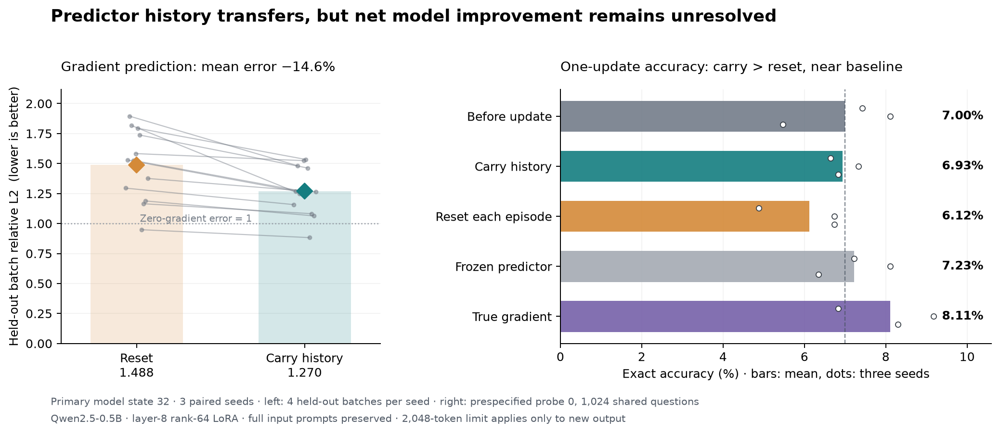

# Does predictor history transfer?

[Countdown results](../README.md) · September 23, 2026

**Retaining calibration history improves gradient prediction and beats restarting the predictor. It does not yet establish a net gain in model accuracy or faster learning.**

## Results

- **Gradient prediction:** carry-history has lower held-out batch relative L2 in **24/24 paired probes**. At the primary model state, mean error falls from **1.488 to 1.270 (−14.6%)**; cosine increases from **0.267 to 0.345**.
- **Generated answers:** carry beats reset in all three seeds, by **+0.81 percentage points** on average. Its mean accuracy remains close to the unchanged model and below the frozen-predictor and true-gradient point estimates.

| Condition | Seed 101 | Seed 102 | Seed 103 | Mean accuracy |
|---|---:|---:|---:|---:|
| Before update | 76 | 83 | 56 | 7.00% |
| **Carry history** | **68** | **75** | **70** | **6.93%** |
| Reset each episode | 50 | 69 | 69 | 6.12% |
| Frozen pretrained predictor | 74 | 83 | 65 | 7.23% |
| True gradient | 70 | 94 | 85 | 8.11% |

Counts are out of the **same 1,024 fresh questions**, after one update at reference model state 32, using the probe batch chosen before evaluation. These are three seed pairs, not 3,072 independent questions. Carry-minus-reset question-bootstrap 95% CI: **[+0.33, +1.30] pp**, conditional on these seeds and this probe; it excludes seed and calibration-batch uncertainty.

Matched setup and configuration

| Item | Setting |
|---|---|
| Model | Frozen Qwen2.5-0.5B-Instruct; layer **8** (zero-indexed) `o_proj` LoRA, rank=alpha=64 |
| Predictor | Existing Y + mask + position bidirectional Transformer; 512 width, 2 layers, 8 heads; full teacher-forced question + reference-answer hidden states |
| History | Calibrate at real-gradient reference states 0/1/2/4/8/16; state 0 is the shared teacher32 warmup |
| Carry vs reset | Retain selected predictor weights vs restart from the same pretrained predictor; reset optimizer state in **both** |
| Each calibration | **4 training + 16 selection gradient labels**; 30 AdamW steps, lr=1e-4; select epochs 0–30 by gradient validation |
| Probes | Identical model state and new data in each pair; 4 batches at states 16 and 32 × 3 seed pairs; probe fits never feed back into history |
| Actual update | Same 32 examples (4 calibration + 28 held-out-gradient examples); fresh AdamW, lr=3e-4, weight decay=0, clip=1; one step |
| Fresh data | 1,784 exact-solver examples, balanced three/four-number puzzles; no number-multiset overlap with checked prior project data or between new splits |
| Evaluation | Loss on 256 separate examples for every probe; accuracy on the prespecified state32/probe0; greedy generation; **full inputs, 2,048 new output tokens maximum** |

The advantage is already present **before** current calibration. It supports transfer of retained experience, not a claim that the predictor learns more from the same new supervision. Mean batch relative L2 still exceeds 1, so absolute gradient reconstruction remains weak.

## Limits and cost

Downstream loss gains vary by state and batch. A separately labeled, outcome-informed **lr=1e-4** control improves mean loss but still does not give a consistent carry-over-reset advantage; it reuses the loss set and has no accuracy evaluation. Teacher-forced loss and generated accuracy can disagree here: the true-gradient control worsens mean state32 completion loss at the main LR but improves accuracy.

Each current calibration requires **20 true-gradient examples**, not four. Before the primary probe, history adds **120 gradient labels and 180 predictor optimizer steps**, plus reused offline pretraining. Both sequential conditions pay the same history budget, but a one-off reset query could skip it. **No total compute saving is established.** This tests fixed reference trajectories and one-step updates, not a self-generated long rollout or recursive improvement. The new test set also differs from the earlier 2,048-question benchmark.

## Evidence

[All paired updates](results/paired_updates.csv) · [Per-seed accuracy](results/accuracy.csv) · [Per-question correctness](results/accuracy_per_question.csv) · [Summary and uncertainty](results/summary.json)

[Protocol](protocol.json) · [Frozen plan](PLAN.md) · [Exploratory control](EXPLORATORY_CONTROL.md) · [Data identities](data_manifest.json) · [Audit](results/audit.json) · [Source and reproduction boundary](source/README.md)
