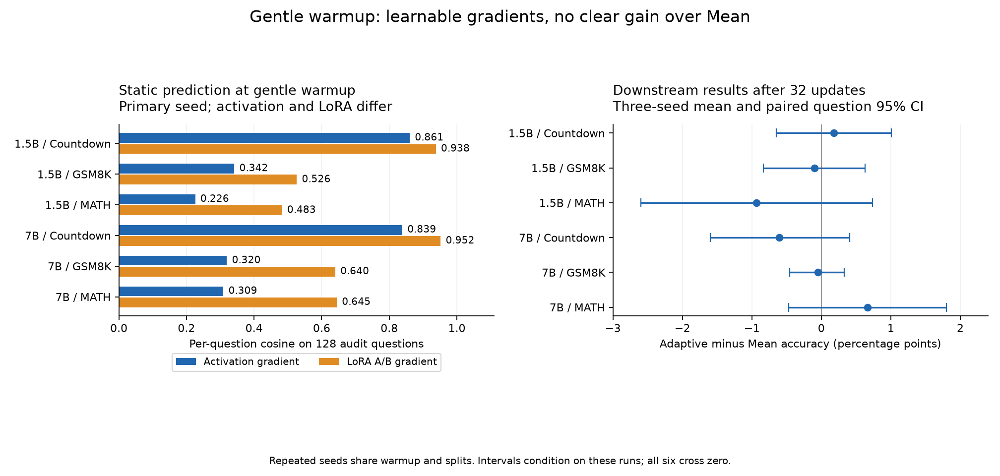
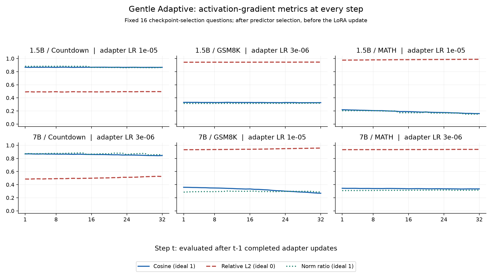

# Scaling gradient predictors: 1.5B / 7B across three math tasks

[Project](../../../README.md) · [Earlier Countdown experiments](../README.md) · Executed September 27, 2026

**Gradient prediction remains learnable, but a general downstream accuracy or compute advantage is not established.** Adaptive calibration prevents some severe frozen-predictor failures. Under gentle warmup, none of the six three-seed Adaptive-versus-Mean comparisons has a positive 95% interval excluding zero.

## Setup

Each model/task trains its own predictor. Only zero-indexed **layer 8 `o_proj`**, rank/alpha **64**, is adapted; the base model is frozen.

| Stage | Configuration |
|---|---|
| Models / tasks | Qwen2.5-1.5B-Instruct and Qwen2.5-7B-Instruct; Countdown, GSM8K, MATH |
| Warmup | 512 questions; 32 real-gradient AdamW updates, batch 32, weight decay .01; original LR **5e-4**, gentle LR **5e-5** |
| Offline predictor | Full question + reference-solution Y hidden states, supervision mask, position and log-RMS; bidirectional Transformer, width 512 / depth 2 / 8 heads; **4096 train + 128 dev**, 100 epochs, AdamW LR **3e-4** |
| Predictor target | Activation gradient **G = d(sum supervised CE)/dY**; analytically reconstruct full LoRA A/B gradients using current X, A and B |
| Online calibration | **4 current-batch training + 16 fixed selection questions**, fresh true gradients each step; AdamW LR **1e-4**; execute all **30 epochs**, restore the best of epochs **0–30** |
| Adapter updates | **32 steps**, batch 32; AdamW, weight decay 0, clip 1; all 32 use predicted gradients in Adaptive; keep LoRA optimizer state |
| LR selection | Original: 3e-4/1e-4; gentle: 1e-4/3e-5/1e-5/3e-6. Select on 128-question generation dev; also tune each baseline independently |
| Tests | Countdown 2048, GSM8K 1319, MATH-500; greedy, **2048 new output tokens**; complete inputs preserved |

**Epoch selection is based on LoRA error, not activation cosine:** mean factor-balanced A/B relative squared error plus aggregate A/B relative squared error on the 16 selection questions. Training includes A/B relative squared error plus 0.25 normalized activation MSE. The predictor optimizer resets at each calibration; selected weights carry forward. [Exact protocol and selected LRs](protocol.json)

## Main accuracy results

Accuracy in percent. Primary predictor/update seeds **123/101**. **Base** is unadapted; **Warmup** is the common starting adapter. **Oracle** uses true gradients for all 32 update examples. **Frozen** holds the offline predictor fixed. **Adaptive** calibrates each step. **Mean** uses fresh true A/B gradients from the same 4+16 calibration/selection examples, weighted by supervised tokens.

Within each row, Oracle/Frozen/Mean use the **same LR as Adaptive**. The final endpoint is fixed at 32, not selected on test accuracy.

### Original warmup

| Model / task | Update LR | Base | Warmup | Oracle | Frozen | Mean | Adaptive |
| --- | --- | --- | --- | --- | --- | --- | --- |
| 1.5B / countdown | 0.0001 | 10.45 | 7.13 | 10.64 | 10.21 | 6.54 | 9.08 |
| 1.5B / gsm8k | 0.0001 | 73.09 | 63.00 | 62.09 | 61.33 | 59.74 | 61.11 |
| 1.5B / math | 0.0003 | 56.00 | 32.60 | 31.80 | 29.60 | 26.40 | 35.00 |
| 7B / countdown | 0.0003 | 37.40 | 11.08 | 14.94 | 0.00 | 10.89 | 15.23 |
| 7B / gsm8k | 0.0001 | 91.66 | 81.43 | 79.61 | 71.65 | 78.32 | 79.23 |
| 7B / math | 0.0003 | 76.40 | 49.80 | 47.80 | 3.00 | 42.40 | 50.60 |

All six warmups damage base accuracy. Adaptive recovers some Countdown/MATH performance but stays below Base in all six conditions. In 7B Countdown and MATH, calibration prevents the same-LR Frozen collapse to 0% and 3%.

### Gentle warmup

| Model / task | Update LR | Base | Warmup | Oracle | Frozen | Mean | Adaptive |
| --- | --- | --- | --- | --- | --- | --- | --- |
| 1.5B / countdown | 1e-05 | 10.45 | 10.89 | 10.64 | 11.18 | 10.45 | 10.84 |
| 1.5B / gsm8k | 3e-06 | 73.09 | 73.46 | 73.09 | 72.71 | 72.33 | 72.71 |
| 1.5B / math | 1e-05 | 56.00 | 51.40 | 50.20 | 46.60 | 49.60 | 48.00 |
| 7B / countdown | 3e-06 | 37.40 | 32.18 | 32.08 | 33.20 | 31.88 | 32.18 |
| 7B / gsm8k | 1e-05 | 91.66 | 91.58 | 91.89 | 91.81 | 91.81 | 91.58 |
| 7B / math | 3e-06 | 76.40 | 78.40 | 77.80 | 77.40 | 77.60 | 77.60 |

In the primary seed, no Adaptive endpoint exceeds its own warmup. For example, 7B MATH exceeds Base but loses 0.80 points relative to Warmup. True-gradient Oracle also often fails to improve generation accuracy; better CE gradients alone do not ensure better answers.

### Independently tuned baselines and repeated seeds

Across the fixed 24 primary comparisons, the **only positive Holm-corrected result** is original 7B Countdown Adaptive versus independently tuned Mean: **15.23% vs 11.82%, +3.42 pp**, unadjusted paired 95% CI [1.56, 5.27], Holm p=.0073. Base is 37.40%; independently tuned Oracle is 14.94%. This is recovery from a damaged warmup, not superiority to Base or established superiority to Oracle. No positive Adaptive-versus-Base comparison survives correction.

Gentle conditions repeat predictor/update pairs 123/101, 124/102, 125/103 at the primary Adaptive-selected LR:

| Model / task | Adaptive | Mean | Difference, pp [95% CI] |
| --- | --- | --- | --- |
| 1.5B / countdown | 11.00 | 10.82 | +0.18 [-0.65, +1.01] |
| 1.5B / gsm8k | 72.63 | 72.73 | -0.10 [-0.83, +0.63] |
| 1.5B / math | 48.73 | 49.67 | -0.93 [-2.60, +0.73] |
| 7B / countdown | 32.11 | 32.71 | -0.60 [-1.60, +0.41] |
| 7B / gsm8k | 91.89 | 91.94 | -0.05 [-0.45, +0.33] |
| 7B / math | 77.80 | 77.13 | +0.67 [-0.47, +1.80] |

All six Adaptive-minus-Mean and Adaptive-minus-Warmup intervals include zero. Seeds share warmup and data splits; question-bootstrap intervals condition on these runs and do not measure full training-pipeline uncertainty. Repeated baselines are not independently retuned per seed. [All comparisons](results/comparisons.csv) · [Seed results](results/seed_replications.csv)

## What is actually predicted?

Gentle static results below are **per-question averages on 128 gradient-audit questions at the warmup state**, using the selected offline predictor. They do not average over update steps. Activation cosine flattens each question's token-by-channel G; LoRA cosine concatenates its full A/B gradients. Relative L2 is norm(pred-true)/norm(true), and norm ratio is norm(pred)/norm(true).

| Model / task | Activation cos | Activation rel. L2 | Activation norm ratio | LoRA cos |
| --- | --- | --- | --- | --- |
| 1.5B / countdown | 0.861 | 0.496 | 0.863 | 0.938 |
| 1.5B / gsm8k | 0.342 | 0.937 | 0.312 | 0.526 |
| 1.5B / math | 0.226 | 0.972 | 0.185 | 0.483 |
| 7B / countdown | 0.839 | 0.523 | 0.835 | 0.952 |
| 7B / gsm8k | 0.320 | 0.946 | 0.265 | 0.640 |
| 7B / math | 0.309 | 0.949 | 0.276 | 0.645 |

The high Countdown LoRA cosine does not imply equally accurate activation gradients. GSM8K/MATH activation errors remain large and predicted norms are small. Removing the fixed training mean leaves sample-specific signal, but batch gradients can already align strongly with that mean. Gradient audits informed exploratory changes; they are not independent confirmatory evidence for those changes. [All 36 fits and mean controls](results/gradient_metrics.csv)

Every-step activation metrics and calibration choices

Each point uses the same 16 **checkpoint-selection** questions at the current model state, after selecting this step's predictor. It is validation, not independent test evidence. Step t is measured **before LoRA update t**, after t-1 completed updates. Diagnostics on the 28 current-batch examples excluded from calibration and selection, and actual batch 32 gradient checks, exist only at 1/2/8/16/32; missing entries remain blank. The 28 examples differ across steps. Batch 32 includes the four calibration training examples.

In the six gentle primary runs, **167/192 steps select epoch 0**; 8 select epoch 1 and 17 select epochs 2–13. All still execute 30 trial epochs. Epoch 0 keeps incoming predictor weights; the adapter still updates. Across all 18 gentle primary/repeat runs, 491/576 steps select epoch 0. Stable cosine is therefore not evidence that calibration repeatedly improved the predictor.

[All 384 primary-step records: cosine, relative L2, norm ratio, selected epoch](results/step_metrics.csv)

## Attempts, robustness and cost

**Labels, residual H and multistate training:** all 8 exploratory Adaptive variants fail to show a clear positive advantage over the independently tuned original method. Residual H lowers 1.5B GSM8K accuracy by 2.58 pp; labels has a local Frozen improvement but no corresponding Adaptive gain. [Attempt-by-attempt results](ATTEMPTS.md)

**Full MATH:** after excluding one training-overlap question, 1.5B Adaptive scores 49.27% versus 52.15% Warmup and 49.69% Mean; 7B scores 75.30% versus 75.22% Warmup and 75.28% Mean. Extra 4499 questions show the same pattern. Full MATH contains MATH-500 and is not an independent replication. **Longer Countdown output:** increasing the cap to 4096 new tokens leaves both Adaptive correct counts unchanged. Strict boxed-format scoring is also retained; format and mathematical correctness can differ.

**No speedup claim:** 32 Adaptive steps use 640 online true-gradient sample presentations versus 1024 for Oracle, plus offline supervision, predictor fitting, and 30 trial calibration epochs per step. Selection questions also require backward passes. The diagnostic runs add 140 backward presentations, and shared-GPU wall time is not a controlled speed comparison. The study does not test a fresh 20-example-per-step true-gradient baseline.

## Files and scope

Completed: **36 predictor fits, 232 update trajectories, 175 final evaluations** (103 main/auxiliary, 48 seed repeats, 24 robustness). Aggregate test scores include all 175 versions, including negative outcomes.

| File | Contents |
|---|---|
| [ATTEMPTS.md](ATTEMPTS.md) | Tested changes, results and unsuccessful directions |
| [protocol.json](protocol.json) | Architecture, losses, selection, data budgets, seeds and LR choices |
| [results/main_results.csv](results/main_results.csv) | 12 primary rows with exact correct counts |
| [results/accuracy.csv](results/accuracy.csv) | All 175 final scores, strict scores and output-limit hits |
| [results/comparisons.csv](results/comparisons.csv) | Paired differences, intervals and primary Holm correction |
| [results/seed_replications.csv](results/seed_replications.csv) | Per-seed accuracies and paired aggregate results |
| [results/gradient_metrics.csv](results/gradient_metrics.csv) | Static activation/LoRA metrics for all 36 fits |
| [results/step_metrics.csv](results/step_metrics.csv) | All 32 primary steps; no interpolation of missing audits |
| [provenance.json](provenance.json) | Source and released-file SHA256 identities |

This compact release contains no checkpoints, datasets, gradient caches, raw generated answers or run logs. Those remain in the original experiment archive. Published aggregates reproduce the tables and figures, not model training or per-question statistical recomputation. Run `python plot_results.py` with NumPy/Matplotlib to redraw the figures. Results apply to one LoRA module, two Qwen scales, three math tasks and 32 update steps; they do not establish a best predictor architecture, all-layer effectiveness, or long-run convergence.
