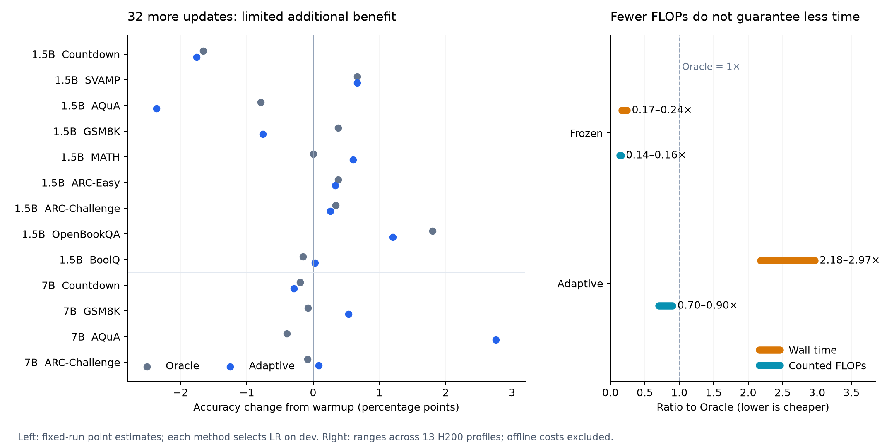

# Gradient prediction across domains: accuracy, sensitivity and cost

[Project](../../../README.md) · [Predictor research](../../README.md) · [Earlier scaling study](../scaling-benchmarks-20260926/README.md)

Experiments: September 30–October 2, 2026. Updated analysis: October 4.

**Subsequent study:** [Efficient 0.5B Countdown updates](../efficient-test-20261002/README.md) tests smaller predictors, residual correction and caching. Its separate CPU accuracy and estimated FLOPs are not included in the tables below.

**Adaptive reaches accuracy close to the true-gradient Oracle, but neither consistently improves on warmup. Frozen updates are cheaper per step; long runs lose accuracy. A reliable improvement at lower total cost is not yet established.**

## What we tested

| Component | Scope |
|---|---|
| Models / tasks | Qwen2.5-1.5B-Instruct and 7B-Instruct; 13 model/task conditions across 9 tasks (8 dataset families): math, science QA and reading comprehension |
| Method | Predict activation gradients from module output, supervision mask, position and log-RMS; reconstruct LoRA A/B gradients using current activations and factors |
| Updated parameters | One zero-indexed layer-8 `o_proj`; LoRA rank = alpha = 64; frozen backbone |
| Main search | 501 completed training configurations: 65 warmups, 30 initial predictor fits and 406 update trajectories; 156 final evaluation versions |
| Sensitivity / cost | Warmup LR and duration, update LR, calibration frequency, limited seed repeats, 14 warmup states / 28 closed-loop endpoints; 13 controlled GPU profiles |
| Long-run follow-up | 15 additional trajectories in 4 conditions, up to 1,024 updates, with offline-inclusive time-budget controls |

**Base** is the original model without training. **Warmup** stops after real-gradient warmup. **Oracle** continues with true gradients on all 32 update examples. **Adaptive** uses predicted gradients and recalibrates every step; **Frozen** keeps the predictor fixed; **Periodic8** recalibrates every eight steps. Additional controls include Oracle20, an online mean gradient, and a fixed offline gradient matrix (MeanM).

Predictors are fitted separately for each model/task, using reference solutions for gradient supervision. Downstream generation receives questions only. Evaluation preserves full inputs; **2,048 new tokens is an output cap**, not an input limit.

## Main result: separate warmup gains from continued learning

Accuracy (%), after 32 additional updates. Oracle and Adaptive each select their own LR on dev, starting from the same warmup checkpoint. Differences are percentage points (pp).

| Model / task | N | Base | Warmup | Oracle | Adaptive | Adaptive − Warmup |
|---|---:|---:|---:|---:|---:|---:|
| 1.5B / Countdown | 2048 | 10.45 | 11.87 | 10.21 | 10.11 | -1.76 |
| 1.5B / SVAMP | 300 | 87.33 | 83.33 | 84.00 | 84.00 | +0.67 |
| 1.5B / AQuA | 254 | 55.51 | 56.30 | 55.51 | 53.94 | -2.36 |
| 1.5B / GSM8K | 1319 | 73.09 | 74.22 | 74.60 | 73.46 | -0.76 |
| 1.5B / MATH | 500 | 56.00 | 56.60 | 56.60 | 57.20 | +0.60 |
| 1.5B / ARC-Easy | 2376 | 87.42 | 88.05 | 88.43 | 88.38 | +0.34 |
| 1.5B / ARC-Challenge | 1172 | 73.63 | 72.95 | 73.29 | 73.21 | +0.26 |
| 1.5B / OpenBookQA | 500 | 73.60 | 76.20 | 78.00 | 77.40 | +1.20 |
| 1.5B / BoolQ | 3270 | 77.83 | 78.99 | 78.84 | 79.02 | +0.03 |
| 7B / Countdown | 2048 | 37.40 | 37.21 | 37.01 | 36.91 | -0.29 |
| 7B / GSM8K | 1319 | 91.66 | 91.51 | 91.43 | 92.04 | +0.53 |
| 7B / AQuA | 254 | 77.17 | 77.17 | 76.77 | 79.92 | +2.76 |
| 7B / ARC-Challenge | 1172 | 90.27 | 89.93 | 89.85 | 90.02 | +0.09 |

| Comparison | Higher / tied / lower | Mean difference |
|---|---:|---:|
| Adaptive − Base | 7 / 0 / 6 | +0.33 pp |
| Adaptive − Warmup | 9 / 0 / 4 | +0.10 pp |
| Oracle − Warmup | 5 / 1 / 7 | +0.02 pp |
| Adaptive − Oracle | 5 / 1 / 7 | +0.08 pp |

Means weight the 13 conditions equally; they are descriptive summaries, not a pooled statistical test. Ten of 13 Adaptive–Oracle gaps are below 1 pp in magnitude. At Adaptive's chosen LR, the 11 available matched-LR Oracle comparisons instead average **−0.21 pp** (3 higher, 8 lower).

**Warmup already accounts for much of some observed improvement.** On 1.5B BoolQ, correct answers go from 2,545 (Base) to 2,583 (Warmup) to 2,584 (Adaptive). Conversely, 1.5B OpenBookQA improves further: 381 → 387 with Adaptive, or 390 with Oracle. Continued training is useful in some settings; its benefit is not consistent across this search.

**Uncertainty:** the later Adaptive-specific paired analysis finds no Adaptive–Warmup or Adaptive–Oracle difference significant after Holm correction within 13 comparisons. Adaptive improves over Base on 1.5B ARC-Easy even after correction across all 39 Adaptive comparisons; this does not establish an additional gain over warmup. Tests condition on fitted runs, not independent repetitions of the whole pipeline. Similar accuracy does not prove equivalence or accurate gradient prediction.

This readout isolates **Adaptive**. The original experiment selected among Frozen / Adaptive / Periodic8 on dev; that selected strategy improved over Warmup in 4/13 conditions. These are different comparisons, not conflicting results. [All final results](results/all_final_results.csv) · [Paired tests](results/adaptive_paired_comparisons.csv)

## Sensitivity: smaller warmup LR is not always better

- Warmup LR covered **3e-6, 1e-5, 5e-5, 1e-4, 5e-4**, with checkpoints at **8 / 32 steps**; supplemental closed-loop probes included zero warmup and refitted predictors.
- Better static gradient cosine did not reliably imply better downstream accuracy. Activation-gradient and reconstructed-LoRA metrics could also move in different directions.
- Update LR and the strength of the comparison baseline matter. In the long-run follow-up, 7B AQuA Frozen32 scored **204/254**, versus **171/254** for a same-LR, time-budget Oracle. Giving Oracle its independently dev-selected LR raised it to **203/254**.
- Three repeated 1.5B task comparisons changed sign across update/predictor seeds. They shared warmup and data splits, so they do not measure full-pipeline reproducibility.
- Adaptive calibration is not always an effective correction: on 7B Countdown, all 32 calibrations selected epoch 0. Small score changes relative to Frozen cannot then be attributed to learned calibration.

[Warmup development sweep: 1.5B](results/warmup_sensitivity_1p5b.csv) · [7B](results/warmup_sensitivity_7b.csv) · [Closed-loop probes](results/warmup_closed_loop.csv) · [Seed repeats](results/seed_replications.csv)

## Computational efficiency: FLOPs and time tell different stories

Controlled online step, relative to Oracle = 1×; ranges across all 13 conditions:

| Method | Wall time | Counted FLOPs | Interpretation |
|---|---:|---:|---|
| Frozen | **0.171–0.242×** | **0.143–0.156×** | About 4.1–5.9× faster per step |
| Adaptive | **2.18–2.97×** | **0.704–0.904×** | Less arithmetic, but slower with calibration and selection |

Measured on an H200: 2 timing warmups, 7 randomized repetitions, median time, matched initial states and the same 32-example main batch. Timing includes required gradient-label collection, transfers, calibration and checkpoint selection; excludes model loading, tokenization, state restoration and research evaluation. Timings were collected separately from FLOP instrumentation.

**Counted FLOPs cover matrix and attention arithmetic**, with multiply-add counted as two operations. They exclude some scalar, normalization, softmax, activation, transfer and optimizer work; offline FLOPs were not measured. These are measurements of this implementation, not optimized production throughput. [Per-condition measurements](results/controlled_efficiency.csv)

Offline collection and fitting change the economics: for the original dev-selected strategies, all 13 single-use 32-step runs cost **3.37–19.68×** the same-LR Oracle time once offline work is included. Common warmup is excluded from both sides. [Trajectory and offline costs](results/cost_amortization.csv)

## Long runs: cost is amortized, but accuracy deteriorates

The follow-up tests **Frozen, not Adaptive**, with a new update seed and the same fitted predictor. Correct answers:

| Model / task | N | Warmup | Frozen32 | Frozen1024 | Oracle at Frozen1024 budget |
|---|---:|---:|---:|---:|---:|
| 1.5B / GSM8K | 1319 | 979 | 968 | 662 | 900 |
| 1.5B / ARC-Challenge | 1172 | 855 | 852 | 0 | 862 |
| 7B / GSM8K | 1319 | 1207 | 1213 | 408 | 1062 |
| 7B / AQuA | 254 | 196 | 204 | 0 | 161 |

The Oracle column uses the same LR and the last completed update within Frozen1024's **offline + online** time budget. These controls were not optimized for long-run LR schedules or early stopping. The four conditions were exploratory choices after the main results; update pools were reused.

Frozen1024's offline-inclusive time was **0.285–0.732×** that of same-LR Oracle1024, but Frozen1024 lost to both Warmup and its matched-time Oracle in all four cases. ARC-Challenge and AQuA reached zero accuracy, with every output hitting the generation cap. **Amortizing setup cost did not establish an advantage at matched quality.**

[Long-run scores](results/long_run_overview.csv) · [Measured costs](results/long_run_costs.csv)

## Configuration and interpretation

| Setting | Main experiment |
|---|---|
| LoRA updates | 32 steps, effective batch 32, fresh AdamW after warmup, weight decay 0, clip 1; FP32 master parameters / BF16 backbone autocast |
| Update LR grid | 3e-6, 1e-5, 3e-5, 1e-4; independently selected per method on dev |
| Predictor | Bidirectional Transformer; width 512, depth 2, 8 heads, FFN 1,024; up to 2,048 offline examples; 100 epochs, LR 3e-4 |
| Online calibration | 4 current examples for fitting, 16 fixed predictor-dev examples with refreshed true gradients for selection; 30 epochs, LR 1e-4; epoch 0 eligible |
| Warmup selection | Best **nonzero** dev checkpoint by accuracy, then CE / fewer steps / lower LR; Base remains a separate control |

[Exact selected LRs and run identifiers](results/selected_configs.csv) · [Attempt inventory, including unsuccessful attempts](results/attempts.csv)

**Working interpretation:** accurately imitating true gradients cannot guarantee downstream gains when continued Oracle SFT itself has little reliable benefit. This is a limitation of the tested data, starting states and training settings—not evidence that SFT generally fails. Nor does similar downstream accuracy prove the predictor is accurate.

The next decisive experiment is to establish a reproducible Oracle improvement over Warmup, then test how much of that gain the predictor preserves at lower **total wall time**. Repeat warmup and data splits, include independently tuned real-gradient and mean controls, and test early stopping and long-run calibration. Coverage here is one model family and eight dataset families, not the proposed 20–30-dataset study.

This release contains compact evidence and a reproducible figure (`python render_figures.py`; NumPy + Matplotlib). [Provenance](provenance.json) records source hashes and the paired-analysis boundary. Training checkpoints, activation caches, full generations and the meeting transcript remain local; this is an analysis release, not a self-contained training reproduction package.
