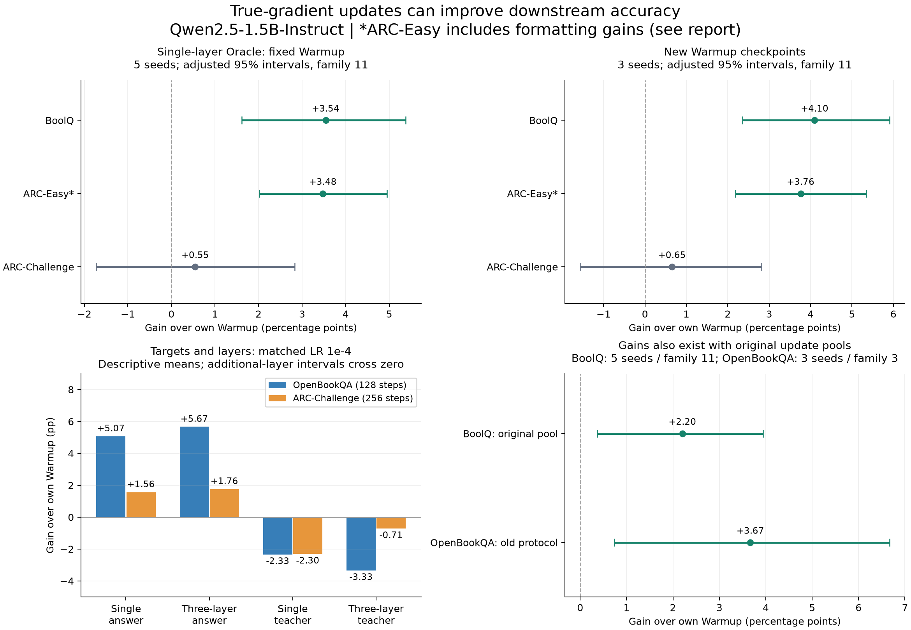

# Oracle improvements: which tasks benefit from continued training?

**Qwen2.5-1.5B-Instruct · true-gradient LoRA updates · experiments completed October 7, 2026**

**Single-layer, correct-answer training establishes Oracle gains on BoolQ and OpenBookQA.** ARC-Easy also improves, although part of its measured gain comes from answer formatting. ARC-Challenge remains uncertain. Neither teacher explanations nor additional LoRA layers establishes an extra advantage in these experiments.

This report brings together six follow-up studies after the [earlier nine-task benchmark](../../predictor/countdown_predictor_results/scaling-domains-20260930/README.md). All updates here use true gradients; predictor performance is a separate question.

## Main results

Accuracy on each full evaluation set; gain is relative to the **same starting Warmup under the same evaluation protocol**. Different studies use different prompts and training pools, so their absolute scores should not be pooled.

| Study / task | Warmup | Oracle mean | Gain | Adjusted 95% interval | Seeds | Selected recipe |
|---|---:|---:|---:|---|---:|---|
| Scope search / BoolQ | 78.99% | **82.53%** | **+3.54 pp** | [+1.61, +5.38] | 5 | Layer 8, LR 3e-4, 256 steps |
| Scope search / ARC-Easy | 86.99% | **90.47%** | **+3.48 pp** | [+2.02, +4.95] | 5 | Layer 8, LR 3e-4, 128 steps |
| Scope search / ARC-Challenge | 75.00% | 75.55% | +0.55 pp | [−1.72, +2.83] | 5 | Layer 8, LR 3e-4, 32 steps |
| Target/layer study / OpenBookQA | 76.40% | **81.47%** | **+5.07 pp** | [+1.67, +8.63] | 3 | Layer 8, answer target, LR 1e-4, 128 steps |
| Target/layer study / ARC-Challenge | 75.00% | 76.56% | +1.56 pp | [−0.68, +3.87] | 3 | Layer 8, answer target, LR 1e-4, 256 steps |

Intervals retain the studies' comparison families: 11 for scope search/confirmation/pool comparisons, 8 for target/layer policies. They are not a new adjustment across this entire report.

## 1. Update location and scope

On BoolQ, ARC-Easy and ARC-Challenge, we searched four adapter scopes, four learning rates (1e-5, 3e-5, 1e-4, 3e-4), and 32/128/256 steps. All candidates start from the same task-specific historical layer-8 Warmup function; new adapters have zero B factors. When training new positions, the original layer-8 Warmup stays frozen.

Best development correct counts **within each scope**:

| Trainable scope | Parameters | BoolQ / 1,024 | ARC-Easy / 570 | ARC-Challenge / 299 |
|---|---:|---:|---:|---:|
| Layer 8 `o_proj` | 196,608 | **857** | **518** | **232** |
| Layer 23 `o_proj` | 196,608 | 831 | 510 | 230 |
| Layers 19/23/27 `o_proj` | 589,824 | 835 | 513 | 231 |
| Layers 19/23/27 `down_proj` | 2,015,232 | 841 | 515 | 231 |

The original single layer wins development selection in all three tasks. Only selected recipes receive the five-seed final-test replication; this table is not a final-test comparison of every scope. Learning rates selected at the grid's upper boundary are not established optima.

**ARC-Easy needs a formatting caveat.** A post-hoc, gold-independent parser recognizes additional explicit answer forms, without changing checkpoints. Its gain falls from +3.48 to **+1.41 pp**; across fresh Warmups, from +3.76 to **+1.56 pp**. The original gain is therefore not entirely evidence of improved answer knowledge. This diagnostic does not replace the primary scoring rule. BoolQ corrections are predominantly changes from an explicit wrong yes/no answer, rather than recovery from parse failures.

## 2. Does the gain survive a new Warmup?

We retrained Warmup with seeds 201/202/203, then applied the already selected recipe. Each continuation is compared with its own starting checkpoint; data splits remain fixed.

| Task | Mean gain across three new Warmups | Adjusted 95% interval | Outcome |
|---|---:|---|---|
| BoolQ | **+4.10 pp** | [+2.35, +5.91] | Positive at all three starts |
| ARC-Easy | **+3.76 pp** | [+2.19, +5.35] | Positive; formatting caveat above |
| ARC-Challenge | +0.65 pp | [−1.56, +2.82] | Still uncertain |

BoolQ's 3,270 evaluation rows include 2,938 distinct passages; final inference clusters by passage. On the 2,577-question subset with passages unseen in Warmup/update/development data, gains are +2.96 pp for the fixed Warmup and +3.49 pp for fresh Warmups. These subset checks are descriptive.

## 3. BoolQ: is the expanded update pool necessary?

Hold Warmup, layer 8, LR 3e-4, 256 steps and five seeds fixed; change only the update pool.

| Update pool | Oracle mean | Gain over Warmup |
|---|---:|---:|
| Original 1,024 examples | 81.19% | **+2.20 pp** [ +0.37, +3.94 ] |
| Expanded 4,096 examples | 82.53% | **+3.54 pp** [ +1.61, +5.38 ] |

The original pool already supports a positive Oracle gain. The direct expansion effect is **+1.34 pp [−0.32, +3.31]**, so its extra benefit is not established after adjustment. The recipe was selected using the expanded pool; this is a fixed-recipe sensitivity comparison, not separate optimization for both sizes.

The [later predictor data-scale study](../../countdown_predictor_results/boolq-predictor-datascale-20261010/README.md) uses the first three original-pool seeds, yielding Oracle **81.70% (+2.71 pp)**. That number and this five-seed 81.19% summarize different seed sets, not different Oracle implementations. Here “pool size” refers to **Oracle update examples**, not offline predictor examples.

## 4. Teacher targets and extra layers

OpenBookQA and ARC-Challenge each compare correct-option targets with full 7B-teacher explanations, using either layer 8 or layers 3/8/19 `o_proj`. All four arms use identical teacher-answer-verified questions (933 OpenBookQA; 932 ARC-Challenge), a common Warmup and paired update orders. There is no student-success filter.

Each arm selects its own development recipe, with the option to stop at Warmup:

| Task | Single + answer | Three layers + answer | Single + teacher | Three layers + teacher |
|---|---:|---:|---:|---:|
| OpenBookQA; Warmup 76.40% | **81.47%** | **80.93%** | 76.40% (stop) | 76.40% (stop) |
| ARC-Challenge; Warmup 75.00% | 76.56% | 76.48% | 75.00% (stop) | **71.50%** |

Both OpenBookQA answer-target arms improve over Warmup after eight-comparison adjustment. ARC answer-target intervals cross zero. ARC's development-selected three-layer teacher recipe drops **3.50 pp [−6.74, −0.26]**. “Stop” means the policy keeps the original Warmup; its zero gain does not demonstrate equivalence of trained candidates. Best-trained candidates are retained in the numerical results.

To compare factors at the same LR and steps, all arms also use LR 1e-4 and the single-answer recipe's endpoint (128 steps for OpenBookQA, 256 for ARC-Challenge):

| Task | Single + answer | Three + answer | Single + teacher | Three + teacher | Three − single, answer target |
|---|---:|---:|---:|---:|---|
| OpenBookQA | 81.47% | 82.07% | 74.07% | 73.07% | +0.60 pp [−1.73, +3.00] |
| ARC-Challenge | 76.56% | 76.76% | 72.70% | 74.29% | +0.20 pp [−1.76, +2.13] |

The additional-layer effect remains uncertain (13-comparison supplementary intervals per task). OpenBookQA's three-layer primary endpoint stays at the development-selected 256 steps; its higher 128-step test score is not used to replace that selection.

Teacher explanations with **mean token cross-entropy** do not help here. They also change output style and the answer's relative loss weight: final answer/EOS tokens account for roughly 4.04% of teacher supervision on OpenBookQA and 3.25% on ARC, versus 100% for answer-only targets. This is not a causal decomposition or evidence that all rationale-based training fails; fixed-answer-weight rationale training was not tested.

## 5. OpenBookQA under the original protocol

To check whether gains require the new prompt or teacher filtering, a separate three-seed run retains the old prompt, original unfiltered 1,024-example update pool, common Warmup, layer 8 and LR 1e-4.

| Endpoint | Correct counts by seed | Mean accuracy | Gain over Warmup |
|---|---|---:|---:|
| Warmup | 381 / 500 | 76.20% | — |
| 32 steps | 390 / 390 / 387 | 77.80% | +1.60 pp |
| 128 steps | 400 / 400 / 398 | **79.87%** | **+3.67 pp** |

The 128-step gain over Warmup is **+3.67 pp [+0.73, +6.67]**. The direct 128-minus-32 contrast is **+2.07 pp [−0.60, +4.80]**, so the extra effect of extending training is not statistically established. Seed 101 exactly reproduces the historical 32-step adapter and score. This bridge was proposed after the main OpenBookQA result and remains exploratory.

## Configuration and evidence limits

All six studies use Qwen2.5-1.5B-Instruct, LoRA rank = alpha = 64, batch 32, fresh AdamW, weight decay 0 and joint gradient clip 1. The frozen backbone uses BF16 computation with FP32 trainable master weights. Target/layer searches use LR 3e-6/1e-5/3e-5/1e-4, 32/128/256 steps and seeds 101–103; scope searches use seeds 101–105. Candidate selection uses full development accuracy before final-test readout; ties favor smaller scopes where applicable, fewer steps and lower LR.

| Study | Task | Update / development / full-test rows |
|---|---|---|
| Scope search | BoolQ | 4,096 / 1,024 / 3,270 |
| Scope search | ARC-Easy | 1,993 / 570 / 2,376 |
| Scope search | ARC-Challenge | 862 / 299 / 1,172 |
| Target/layer | OpenBookQA | 933 / 500 / 500 |
| Target/layer | ARC-Challenge | 932 / 299 / 1,172 |

**All evaluation inputs are preserved. The 2,048-token cap applies only to generated output.** Intervals use 100,000 paired seed/question-cluster bootstrap draws with Bonferroni adjustment: family 11 for scope/confirmation/pool, family 8 for target/layer primary comparisons, and a separate family 3 for the original-protocol step bridge. Non-significance does not establish equivalence.

These are exploratory results on historically used benchmarks. Most replicas share Warmup and data; fresh-Warmup checks still share splits. Prompt, update-pool and development changes prevent attributing all historical improvements to step count alone. Scope changes also change parameter count and position. Teacher explanations were not exhaustively verified, and matched update counts do not equal matched token or compute budgets. Resource interruptions were audited; no wall-time efficiency advantage is claimed.

**Next:** test whether a predictor can preserve the established gains on fixed BoolQ or OpenBookQA recipes. The later BoolQ study finds that simply increasing offline predictor data is insufficient; improving prediction along the update trajectory is the next controlled test.

[Results and configuration](results.json) contain per-seed counts, adjusted intervals, development scope winners, matched target/layer contrasts, and source hashes. [Plot script](plot_results.py) regenerates the figure with Python, NumPy and Matplotlib. This is a compact results release; weights, raw generations, training caches and full training code are not included.
