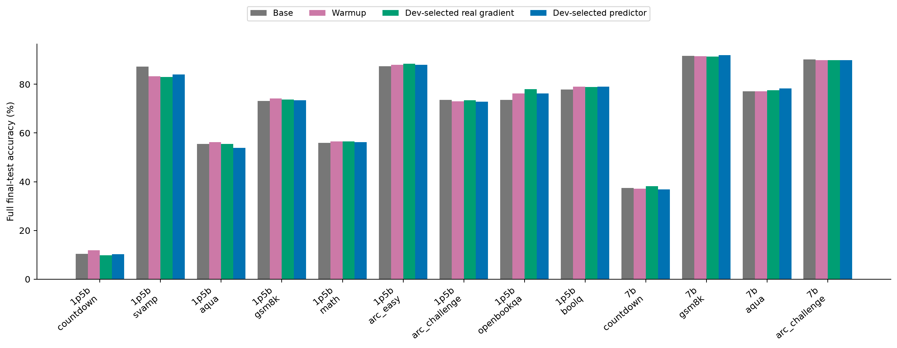
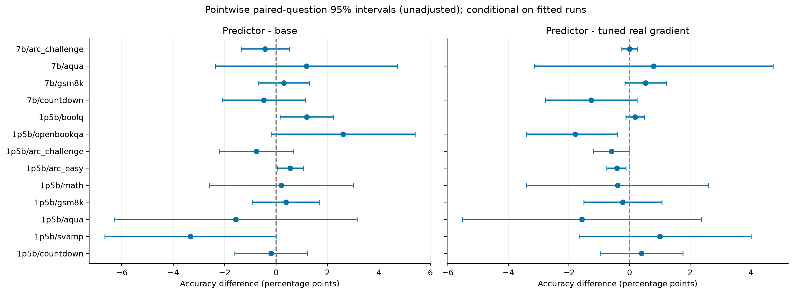
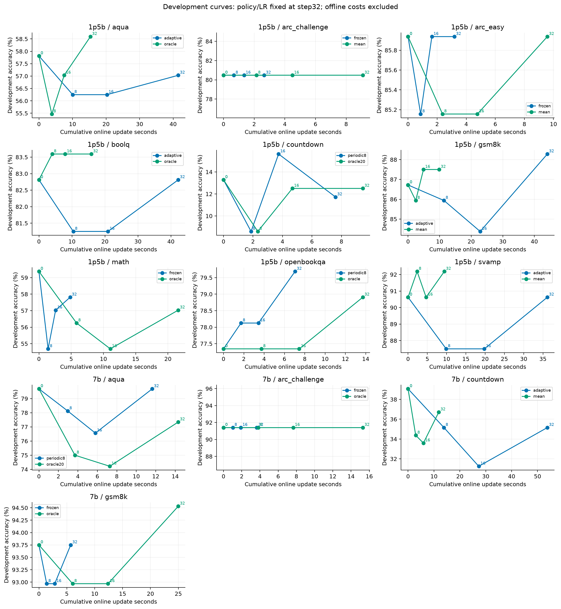
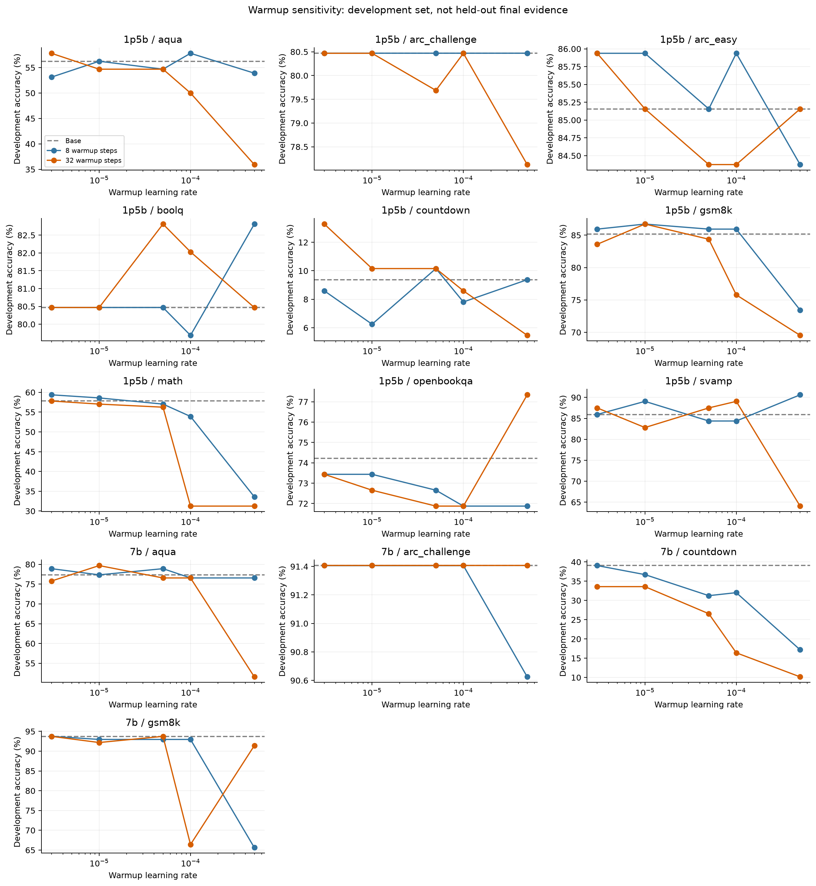
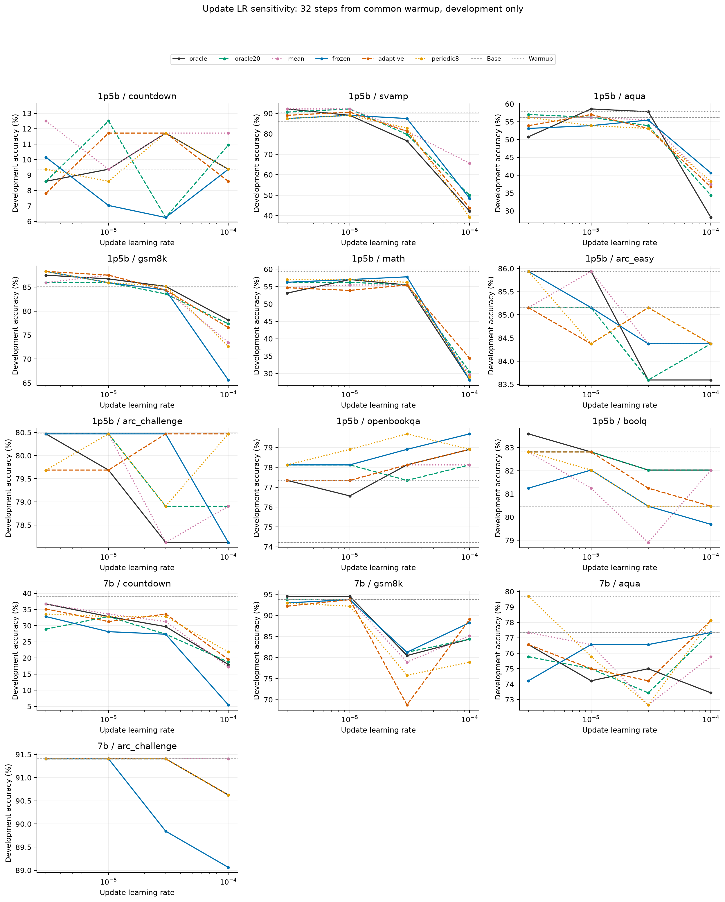
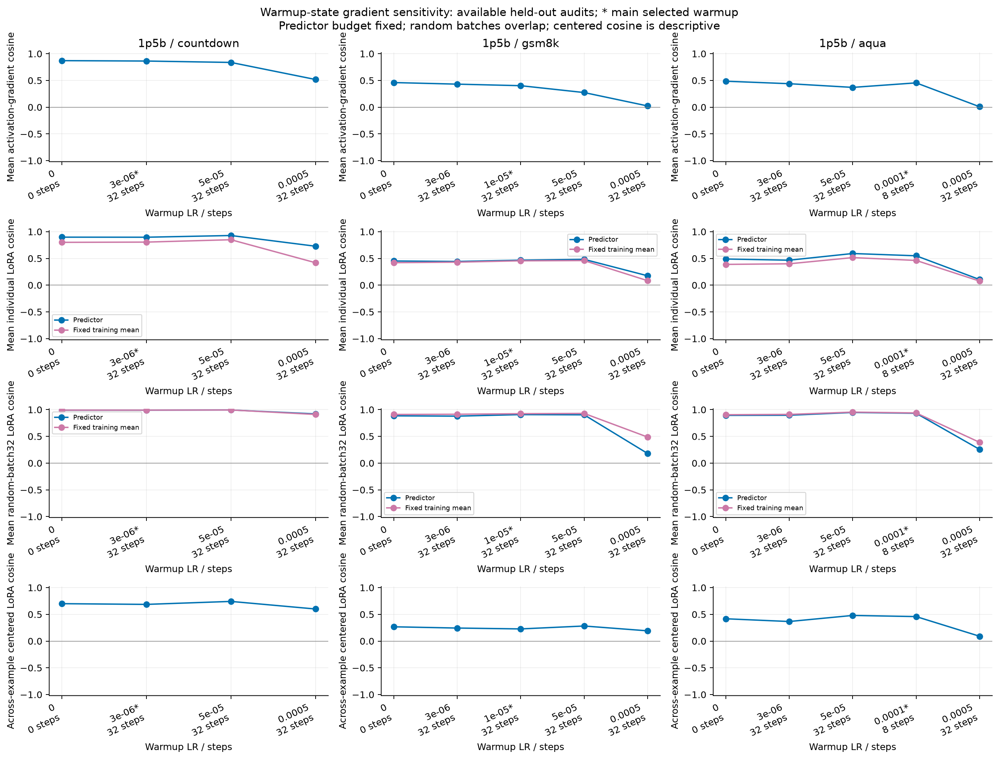
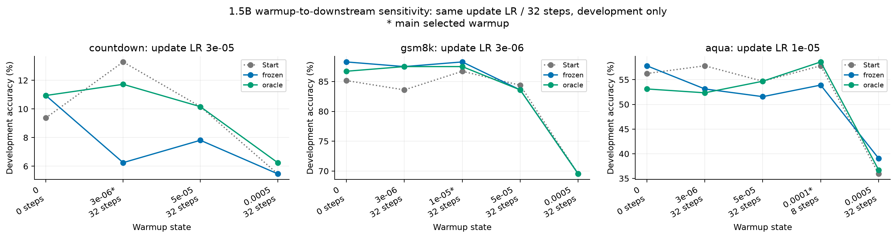

# 跨任务梯度预测、训练敏感性与单卡计算效率

## 最终结论与建议

本轮完成了8个数据集家族、9个任务配置、13个模型/任务条件，包含501个完成的训练配置（65个warmup、30次初始predictor拟合、406条更新轨迹），以及13组受控计算效率测量。训练配置数不等于独立统计实验数。156个冻结最终测试版本全部完成，共198,030条最终输出；加上开发与checkpoint评测，共737个版本、269,646条逐题输出，完整输入核验全部通过。

**当前结果尚未确立 predictor 相对强基线的稳定优势。** 按测试前固定的开发选择，predictor在13个条件中有7个高于Base、4个高于共同Warmup、5个高于开发选择的真实梯度策略；对无需拟合predictor的固定梯度矩阵MeanM，仅3个更高、2个相同、8个更低。这些是点估计计数，不是跨任务总体检验。26项主比较和39项合并比较均无Holm校正后p<0.05的结果；未显著不表示等效、非劣或方法无效。

**不能概括为“SFT更新都不如baseline”，也不能把问题全部归因于warmup LR。** 例如1.5B OpenBookQA的Oracle32为390/500，高于Base368与Warmup381；7B Countdown在线Mean为782/2048，高于Base766与Warmup762。另一方面，1.5B SVAMP的Base262/300高于本轮所有最终更新版本，7B ARC-Challenge的Base1058/1172也高于全部更新版本。任务、起点、后续LR与梯度策略共同影响结果。

**相对Base的改善，经常主要来自warmup，而非后续predictor更新。** 1.5B BoolQ从Base2545到Warmup2583，再到predictor2584：相对Base多39题，其中Warmup已经多38题。GSM8K相应为964→979→969，OpenBookQA为368→381→381。这里是分数变化的算术分解，不是对训练机制的因果分解。

**小warmup LR值得纳入，但不是越小越好。** 本轮扫描3e-6至5e-4和8/32步，并对零warmup及其他起点分别重训predictor、做14个起点/28个闭环端点的补充。Countdown的中间LR可提高静态LoRA cosine，却未保证更好的闭环结果；GSM8K与AQuA的activation cosine和还原LoRA cosine还可能反向变化。只按warmup起点准确率选状态，也不一定选到后续更新最有效的状态。

**在线计算节省已经测到，端到端经济性尚未建立。** Frozen受控单步耗时为Oracle32的0.171–0.242倍，所计矩阵/attention FLOPs为0.143–0.156倍。Adaptive虽减少这部分FLOPs，耗时却为2.18–2.97倍。按预选策略的实际32步轨迹，8/13条件在线更快；加上离线梯度采集和predictor拟合后，13/13单次使用均更慢，为同LR Oracle32的3.37–19.68倍。在线较快的8项需要算术上至少复用4–30次才可能抵消离线成本，但长期质量与可复用性未验证。

### 冻结最终测试总览（正确题数）

P表示测试前从Frozen/Adaptive/Periodic8中按开发集选定的策略；“选中真梯度”是开发集选择的Oracle32/Oracle20/在线Mean，不是测试集上得分最高的方法。MeanM为固定离线梯度矩阵。全部方法及同LR对照见 [final_all.csv](results/final_all.csv)。

| 模型/任务 | 题数 | Base | Warmup | P | 选中真梯度 | MeanM |
|---|---:|---:|---:|---:|---:|---:|
| 1p5b/countdown | 2048 | 214 | 243 | 210 | 202 | 245 |
| 1p5b/svamp | 300 | 262 | 250 | 252 | 249 | 254 |
| 1p5b/aqua | 254 | 141 | 143 | 137 | 141 | 131 |
| 1p5b/gsm8k | 1319 | 964 | 979 | 969 | 972 | 974 |
| 1p5b/math | 500 | 280 | 283 | 281 | 283 | 282 |
| 1p5b/arc_easy | 2376 | 2077 | 2092 | 2090 | 2100 | 2098 |
| 1p5b/arc_challenge | 1172 | 863 | 855 | 854 | 861 | 859 |
| 1p5b/openbookqa | 500 | 368 | 381 | 381 | 390 | 383 |
| 1p5b/boolq | 3270 | 2545 | 2583 | 2584 | 2578 | 2577 |
| 7b/countdown | 2048 | 766 | 762 | 756 | 782 | 749 |
| 7b/gsm8k | 1319 | 1209 | 1207 | 1213 | 1206 | 1213 |
| 7b/aqua | 254 | 196 | 196 | 199 | 197 | 205 |
| 7b/arc_challenge | 1172 | 1058 | 1054 | 1053 | 1053 | 1053 |

图中95%区间按题目配对bootstrap，条件于已拟合run，未做多重校正；Holm校正检验另见下文。区间不包含warmup、数据划分或整个训练管线的不确定性。

### 本轮固定配置

所有更新均为32步、batch32、单个layer8 o_proj、LoRA rank=alpha64。下表是开发集预选配置，不是已证明普适最优的配置；完整网格及失败尝试均保留。

| 模型/任务 | Warmup LR × 步数 | P策略 / 更新LR | 选中真梯度 / 更新LR | MeanM更新LR |
|---|---|---|---|---|
| 1p5b/countdown | 3e-06 × 32 | periodic8 / 3e-05 | oracle20 / 1e-05 | 0.0001 |
| 1p5b/svamp | 0.0005 × 8 | adaptive / 1e-05 | mean / 1e-05 | 1e-05 |
| 1p5b/aqua | 0.0001 × 8 | adaptive / 1e-05 | oracle / 1e-05 | 3e-05 |
| 1p5b/gsm8k | 1e-05 × 32 | adaptive / 3e-06 | mean / 1e-05 | 1e-05 |
| 1p5b/math | 3e-06 × 8 | frozen / 3e-05 | oracle / 1e-05 | 3e-05 |
| 1p5b/arc_easy | 0.0001 × 8 | frozen / 3e-06 | mean / 1e-05 | 1e-05 |
| 1p5b/arc_challenge | 0.0005 × 8 | frozen / 3e-05 | mean / 1e-05 | 3e-06 |
| 1p5b/openbookqa | 0.0005 × 32 | periodic8 / 3e-05 | oracle / 0.0001 | 1e-05 |
| 1p5b/boolq | 0.0005 × 8 | adaptive / 1e-05 | oracle / 3e-06 | 3e-06 |
| 7b/countdown | 3e-06 × 8 | adaptive / 3e-06 | mean / 3e-06 | 3e-06 |
| 7b/gsm8k | 5e-05 × 32 | frozen / 1e-05 | oracle / 1e-05 | 3e-06 |
| 7b/aqua | 1e-05 × 32 | periodic8 / 3e-06 | oracle20 / 0.0001 | 0.0001 |
| 7b/arc_challenge | 0.0005 × 32 | frozen / 3e-06 | oracle / 3e-05 | 1e-05 |

### 值得保留的候选与容易误读的比较

- 7B AQuA：Frozen更新LR1e-4得到207/254（81.50%），比Base/Warmup196多11题；在线Mean也为207，MeanM为205。Frozen是后续验证候选，但正式预选P仍是Periodic8 LR3e-6，得199。开发集Periodic8为102/128、Frozen为99/128，最终排序反转；不能按最终分数把Frozen重新宣布为本轮主赢家。
- 7B GSM8K：预选Frozen得1213/1319，高于Base1209、Warmup1207及预选Oracle32的1206，但Oracle20/在线Mean均为1214，MeanM也为1213。相同正确题数不表示逐题预测相同，更不构成等效证明。
- 1.5B Countdown：MeanM得245/2048，Warmup243，预选P210；三个P seed分别为210/234/212。复杂predictor需要先证明相对这个简单对照的额外价值。MeanM离线采集/矩阵构造加选中32步在线共约32.88秒（共同warmup之后，不含加载、tokenization、研究审计和评测）；不是另做的预热受控profiling结果。
- 真实梯度对照也需要独立调LR。例如1.5B AQuA的P137，相对同LR Oracle20的133为正，相对Oracle20独立开发选择的143却为负。选一个较弱或未调参的对照会改变表面结论。

### Seed与停止步数的稳定性

| 1.5B任务 | P：seed101/102/103 | 选中真梯度：seed101/102/103 | 配对差值（题） |
|---|---|---|---|
| aqua | 137 / 135 / 135 | 141 / 131 / 139 | -4 / +4 / -4 |
| arc_challenge | 854 / 858 / 865 | 861 / 858 / 856 | -7 / +0 / +9 |
| countdown | 210 / 234 / 212 | 202 / 208 / 221 | +8 / +26 / -9 |

三个任务都出现差值符号翻转。重复run共享warmup、划分与主seed选择的策略/LR；seed汇总区间是对题目联合重采样，固定这三个run，并非对seed总体或完整pipeline的置信区间。

52个新增step8/16评测连同既有step0/32，共104个曲线点全部齐备。多条轨迹在中途下降后恢复；1.5B Countdown的P在step16高于step32，另一些条件则在step32恢复。策略/LR与主终点在读出曲线前固定，本轮不据此重选停止步数。图只计在线更新时间，不含离线成本，且各面板坐标范围不同；应比较数值变化而非视觉斜率。更新LR敏感性图的各面板y范围也不同。

### 对下一轮实验的具体判断

先把研究问题收窄到“在强SFT和均值对照下，predictor能否以更低总成本维持或改善适配质量”。优先独立复验7B AQuA Frozen LR1e-4、7B GSM8K Frozen LR1e-5，同时保留Base、Warmup、独立调参Oracle32/Oracle20/Mean及MeanM，并重复warmup与数据划分。它们是本轮提出的后续假设，不是已验证的胜出方案。

随后比较逐题相对梯度误差与实际batch/optimizer更新误差的训练或选择目标。静态高cosine、共同均值方向和下游增益并不等价；7B ARC-Challenge中极小梯度样本对相对误差的主导，以及29/30次拟合中两种指标偏好不同epoch，给出了可检验的诊断方向。本轮尚未更改目标并验证其改善。

经济性实验应把离线预算也给予真实梯度对照，并在固定质量要求下测总耗时；若依赖复用，应真实运行更长轨迹或多次适配，验证梯度漂移和质量，再谈4–30次的摊销门槛。当前每步30epoch的Adaptive在时间上没有优势，且部分校准全部选择epoch0，不能把与Frozen的小分数差异解释成学到了有效校准。完成这些后再扩展到Ben提出的20–30数据集与更多模型家族，会更容易解释跨域成功或失败。

这些建议来自本轮结果；没有依据最终测试再增加搜索、修改评分或替换主配置。模型家族、模块/秩、32步时域、校准LR和离线预算均有限，本轮不声称全局最优、跨家族泛化或同质量端到端加速。

### 输出预算与完整性

所有评测输入完整保留，2048仅为新输出token上限。Countdown尤受该输出预算约束：1.5B Base有1472/2048题（71.88%）触及上限，7B Base为445/2048（21.73%）。全部156版本中有7条触及输出上限的输出仍按固定评分被判正确，因此不能把“触及上限”直接当作错误标签，也不能据此推断延长输出必然改善多少。逐版本统计见 [输出预算诊断](results/final_output_budget_diagnostic.json)。

严格boxed格式分数与主正确率分别保存。例如1.5B BoolQ Base严格boxed正确为0，但主评分为2545/3270；格式遵循的改善不能替代答题能力改善。GSM8K历史split与最终prompt的复原核查见 [split/prompt审计](results/gsm8k_split_prompt_audit.json)，未发现所检查的划分、答案字段或prompt泄漏错误；它不排除所有可能造成开发/测试差异的因素。

以下保留完整方法、网格、计算量、失败和资源记录。训练/初始化/归档尝试的计数口径见 [尝试计数](results/experiment_attempt_counts.json)，逐条配置见 [attempts.csv](results/attempts.csv)。

人工报告整理时间：2026-10-02 04:01:54 UTC。自动实验与读出于2026-10-01 21:29:29 UTC结束，距开始17.17小时；授权截止UTC 2026-10-02 04:19:12。

## 当前证据状态

完整最终评测 156/156 个冻结版本。开发warmup结果 143 个；已选共同起点 13 个。未完成实验不计零分，不用部分测试结果代替完整评测。

## 研究问题与实际范围

依据 Ben 会议：验证计算节省，扩展数据/domain/model scale，研究早期敏感性。主模型为 Qwen2.5-1.5B-Instruct，7B作为配对规模检查。初始适配配置为layer8 o_proj、rank=alpha64、冻结底座。每个模型/任务分别训练predictor；不是通用checkpoint零样本迁移。

两模型均有28层，统一使用索引为8的目标层；隐藏维度分别为1536和3584。LoRA rank64与predictor width512固定，因此相对秩和输入压缩比例随模型规模变化。各模型分别按开发集选择warmup，起点的LR与步数也可能不同。规模比较条件于这套配置，观察到的差异不能单独归因于底座参数量。

Ben在会议原文（本地存档）中将20–30个数据集作为后续empirical paper的目标，同时明确可以先观察跨domain和scale的早期敏感性。本轮24小时计划覆盖8个数据集家族、9个任务配置、13个模型/任务条件，是这一步早期检验；不是已经完成20–30数据集的论文级覆盖。

Predictor使用完整问题＋参考解答的teacher-forced激活；最终生成只输入问题，不提供参考答案。

文中的“梯度标签”指真实反向传播得到的梯度目标，不是人工答案标注。Frozen仍使用更新题目的参考解答；没有在线真实反向传播不等于无监督或不需要答案。

开发阶段完成了答案格式核查并修正解析遗漏。主评分识别boxed选项字母、独立最终答案行、“字母)原选项全文”，以及精确匹配唯一选项文本的boxed内容（例如AQuA直接给出该选项数值）。规范化限于空白、大小写、单个结尾句点、配对数学美元定界符和完整LaTeX文本包装；BoolQ的true/false对应yes/no。不从自由推理中搜索字母，不做数值近似或猜测，重复选项文本不作唯一匹配。

修正在首次predictor训练及最终测试前完成，旧v1和中间v2评分/选择完整归档，全部开发选择按统一v3重算。最终manifest冻结grader hash；原受限解析和严格按要求boxed字母/yes-no指标作为辅助结果保留。数学任务的math-verify和Countdown评分不变。

主解析并不覆盖所有自然语言答案格式。后续AQuA更新开发核查发现，带“The correct answer is”等前缀、末行给出明确选项及原文的少量答案仍可能漏计；v3规则和既有选择保持不变，避免根据后续方法结果继续改评分。具体记录见 [AQuA开发评分与输出上限核查](results/aqua_high_lr_development_audit.json)。因此这里的准确率受固定解析规则约束，小幅差异尤其需要结合原始输出和重复实验判断。

实际路径是先预测目标o_proj输出的activation gradient，再用当前LoRA因子解析还原参数梯度。若Y=X(W+sBA)^T、G=∂L/∂Y，则∇A=sB^T G^T X、∇B=sG^T XA^T；实现按监督token总数归一化。Frozen固定predictor参数，但还原时始终使用更新后的A/B。

九个任务配置来自八个数据集家族；ARC两种难度不是两个独立domain。Countdown/GSM8K/MATH仍是历史benchmark；新增任务提供新的评测覆盖。数学使用已有推导，科学选择题和BoolQ使用短答案监督，输入/目标风格不同不能解释成纯domain单因素效应。

| 任务 | Warmup题数 | Predictor train | Predictor dev | 梯度审计 | 更新题池 | 生成dev | 最终test |
|---|---:|---:|---:|---:|---:|---:|---:|
| countdown | 512 | 2048 | 128 | 128 | 1024 | 128 | 2048 |
| gsm8k | 512 | 2048 | 128 | 128 | 1024 | 128 | 1319 |
| math | 512 | 2048 | 128 | 128 | 1024 | 128 | 500 |
| svamp | 64 | 320 | 32 | 32 | 128 | 64 | 300 |
| aqua | 256 | 2048 | 128 | 128 | 1024 | 128 | 254 |
| arc_easy | 128 | 1024 | 64 | 64 | 512 | 128 | 2376 |
| arc_challenge | 128 | 512 | 64 | 64 | 256 | 128 | 1172 |
| openbookqa | 256 | 2048 | 128 | 128 | 1024 | 128 | 500 |
| boolq | 256 | 2048 | 128 | 128 | 1024 | 128 | 3270 |

全部输入完整保留；主生成上限2048仅限制新输出token。训练小数据集可能重复呈现题目，题目数与样本呈现次数分别记录。数据来源、revision、文件hash及去重见 [数据清单](data/manifest.json)。BoolQ官方validation作为本实验最终测试，开发题从官方train划分。

最终生成采用每次最多1024题的请求队列，实际同时运行的序列仍最多256。这样允许已完成请求留下的空位接收等待中的题目；每个提交块完成后保存输出。开发和中间checkpoint评测继续使用原256题提交块。最初KV缓存为1.5B/7B各48/64 GiB；14:43 UTC起外部进程占用GPU0后，后续评测的恢复配置改为16 GiB、memory fraction .25，实际参数以各阶段protocol.json为准。完整prompt、2048新token预算、greedy解码、seed42、batch-invariant设置、评分与冻结候选保持一致。这些均在最终测试前声明；没有单独测量队列或缓存调整的加速比，也不将1024解释为输入长度或GPU并发数。

本次报告生成时，已逐项核验737个完整评估版本、269646条输出：题数、sample ID顺序、问题全文及其在保存prompt中的完整性均与原始数据清单一致。生成token上限另行核查。逐版本source/protocol/output hash见 [输入完整性核查](results/evaluation_input_audit.json)；现有737个完整版本与计划逐项对齐；全部计划完成的独立核查见 results/completion_audit.json。

| 任务 | 更新集平均prompt tokens | 更新集平均监督tokens | 最终test最大prompt tokens |
|---|---:|---:|---:|
| countdown | 140.4 | 67.0 | 144 |
| gsm8k | 107.2 | 125.8 | 236 |
| math | 122.0 | 223.7 | 839 |
| svamp | 88.4 | 25.7 | 121 |
| aqua | 122.7 | 93.8 | 203 |
| arc_easy | 86.3 | 6.0 | 222 |
| arc_challenge | 96.6 | 6.0 | 226 |
| openbookqa | 71.4 | 6.0 | 137 |
| boolq | 176.8 | 6.0 | 1299 |

监督tokens包含EOS。完整逐模型/任务/划分的长度分位数、source和tokenized hash见 [token_audit.json](results/token_audit.json)。这些统计不用于排除题目；相同batch题数不意味着相同token工作量。

## 尝试与配置

- Warmup：LR 3e-6/1e-5/5e-5/1e-4/5e-4，保存8/32步，另有零步Base；相同初始化、题目顺序、batch32、AdamW、weight decay .01、clip1。
- 每条件选择非零warmup：开发准确率最高，然后CE较低、步数较少、LR较小；Base始终独立报告。
- 后续更新：32步、batch32，LR 3e-6/1e-5/3e-5/1e-4，重建AdamW optimizer，weight decay0、clip1。
- 组批实现：骨干前向/反向/特征采集的microbatch最多4题，按最长序列长度×题数的2048-token预算分组；predictor拟合最多32题、预测与梯度评分最多16题、在线校准拟合最多4题，三者使用8192-token组批预算。单题超出预算仍完整处理，随后为计算补齐padding；这些都是组批设置，不是输入长度上限。逻辑LoRA更新batch仍为32题。
- Predictor：width512、depth2、8个attention heads、FFN width1024、dropout0，双向Transformer，Y+监督mask+位置+logRMS；输出activation gradient，解析重建A/B梯度。训练目标为因子平衡A/B相对平方误差+.25归一化G误差；AdamW LR3e-4、weight decay .01、clip1，100epoch，以梯度dev的逐题因子误差选择checkpoint。离线最多2048题，较旧4096/8192预算更小。
- 方法：Oracle32；同一更新batch中20道题的Oracle20；Mean每步在当前模型重算4道当前题+16道固定dev题的真实梯度，再按监督token加权平均；Frozen；每步校准Adaptive；每8步校准Periodic8（steps1/9/17/25）。Oracle20随题池循环可能重访题目，不是每步20个此前从未见过的样本。
- 在线校准：使用4道当前更新题训练、16道固定predictor-dev题选择；每次新建AdamW，LR1e-4、weight decay .01、clip1，训练30epoch，epoch0也可被选中。选择分数为逐题因子误差加整批梯度relative-L2的平方。校准LR本轮固定，未单独扫描；两种校准频率与Frozen参与开发选择。
- 每种方法独立按生成dev选择LR；再在三种predictor方法中选择策略，在三种真梯度方法中选择基线。全部候选保留，最终测试前冻结。主策略的破同分规则使用CE，未将耗时纳入选择；选中策略不自动代表计算成本最低，全部策略的最终质量和实测成本分别报告。

### Warmup敏感性（开发集，不是独立测试）

| 模型 | 任务 | Base dev正确 | 选中warmup LR | 步数 | Warmup dev正确 | dev总数 |
|---|---|---:|---:|---:|---:|---:|
| 1p5b | aqua | 72 | 0.0001 | 8 | 74 | 128 |
| 1p5b | arc_challenge | 103 | 0.0005 | 8 | 103 | 128 |
| 1p5b | arc_easy | 109 | 0.0001 | 8 | 110 | 128 |
| 1p5b | boolq | 103 | 0.0005 | 8 | 106 | 128 |
| 1p5b | countdown | 12 | 3e-06 | 32 | 17 | 128 |
| 1p5b | gsm8k | 109 | 1e-05 | 32 | 111 | 128 |
| 1p5b | math | 74 | 3e-06 | 8 | 76 | 128 |
| 1p5b | openbookqa | 95 | 0.0005 | 32 | 99 | 128 |
| 1p5b | svamp | 55 | 0.0005 | 8 | 58 | 64 |
| 7b | aqua | 99 | 1e-05 | 32 | 102 | 128 |
| 7b | arc_challenge | 117 | 0.0005 | 32 | 117 | 128 |
| 7b | countdown | 50 | 3e-06 | 8 | 50 | 128 |
| 7b | gsm8k | 120 | 5e-05 | 32 | 120 | 128 |

完整的warmup开发网格已有 13 个模型/任务条件，其中 9 个在5e-4、32步时同时出现CE下降、生成正确数下降。这是开发集描述，提示loss下降不能代替生成质量验证。

具体例子：1.5B MATH的Base为 74/128，CE 0.6461；5e-4、32步为 40/128，CE 0.6147。开发loss改善而生成能力退化；尚不能由此替代该任务的冻结最终测试。

完整warmup网格及CE见 `results/warmup_sensitivity_*.csv`；所有已完成更新开发结果见 [development_endpoints.json](results/development_endpoints.json)。选中的开发分数有选择偏差，最终结论以冻结后的测试为准。

### 后续更新LR敏感性（开发集）

只汇总完整的24端点网格；正在生成的条件不参与选优。每种方法独立选择LR，再按已声明规则选择predictor和真实梯度策略。分数经过开发选择，不能视作独立验证。所有LR、CE、时间与结果hash见 [development_progress.csv](results/development_progress.csv)。

| 模型 | 任务 | Base | Warmup | Predictor方法 / LR | Predictor正确 | 真梯度方法 / LR | 真梯度正确 | dev题数 |
|---|---|---:|---:|---|---:|---|---:|---:|
| 1p5b | countdown | 12 | 17 | periodic8 / 3e-05 | 15 | oracle20 / 1e-05 | 16 | 128 |
| 1p5b | svamp | 55 | 58 | adaptive / 1e-05 | 58 | mean / 1e-05 | 59 | 64 |
| 1p5b | aqua | 72 | 74 | adaptive / 1e-05 | 73 | oracle / 1e-05 | 75 | 128 |
| 1p5b | gsm8k | 109 | 111 | adaptive / 3e-06 | 113 | mean / 1e-05 | 112 | 128 |
| 1p5b | math | 74 | 76 | frozen / 3e-05 | 74 | oracle / 1e-05 | 73 | 128 |
| 1p5b | arc_easy | 109 | 110 | frozen / 3e-06 | 110 | mean / 1e-05 | 110 | 128 |
| 1p5b | arc_challenge | 103 | 103 | frozen / 3e-05 | 103 | mean / 1e-05 | 103 | 128 |
| 1p5b | openbookqa | 95 | 99 | periodic8 / 3e-05 | 102 | oracle / 0.0001 | 101 | 128 |
| 1p5b | boolq | 103 | 106 | adaptive / 1e-05 | 106 | oracle / 3e-06 | 107 | 128 |
| 7b | countdown | 50 | 50 | adaptive / 3e-06 | 45 | mean / 3e-06 | 47 | 128 |
| 7b | gsm8k | 120 | 120 | frozen / 1e-05 | 120 | oracle / 1e-05 | 121 | 128 |
| 7b | aqua | 99 | 102 | periodic8 / 3e-06 | 102 | oracle20 / 0.0001 | 99 | 128 |
| 7b | arc_challenge | 117 | 117 | frozen / 3e-06 | 117 | oracle / 3e-05 | 117 | 128 |

1p5b完整开发网格中，选中predictor在7/9个任务高于Base，但仅在2/9个任务高于共同Warmup；同时高于Base、Warmup及开发选中真梯度的候选为：gsm8k（比开发选中真梯度多1题）、openbookqa（比开发选中真梯度多1题）。这些是经过开发选优的逐任务描述，不能作为跨任务显著性或独立测试结论。

7b完整开发网格中，选中predictor在1/4个任务高于Base，但仅在0/4个任务高于共同Warmup；同时高于Base、Warmup及开发选中真梯度的候选为：暂无。这些是经过开发选优的逐任务描述，不能作为跨任务显著性或独立测试结论。

7B Countdown是静态梯度质量与下游表现分离的具体例子：Base/Warmup分别为50/50题，选中predictor为45题，开发选中真梯度为47题，共128题。这里即使使用真实梯度，开发选中的32步更新也没有超过起点；高静态cosine本身不足以证明继续更新有效。对应冻结最终测试已完成，见本报告首部；开发分数本身不作独立结论。

该条件选中的adaptive在32次校准中均保留epoch0，最终predictor权重与初始逐位相同。它与Frozen的adapter更新差异相对范数为0.001538；两者开发分数差异不能解释为学到了更好的校准。特征微批次与浮点求和路径存在差异，本轮没有单独隔离其生成因果效应。

## 完整最终测试

| 模型 | 任务 | 选中predictor | Base % | Warmup % | Predictor % | 开发选中真梯度方法 | 真梯度 % |
|---|---|---|---:|---:|---:|---|---:|
| 1p5b | countdown | periodic8 | 10.45 | 11.87 | 10.25 | oracle20 | 9.86 |
| 1p5b | svamp | adaptive | 87.33 | 83.33 | 84.00 | mean | 83.00 |
| 1p5b | aqua | adaptive | 55.51 | 56.30 | 53.94 | oracle | 55.51 |
| 1p5b | gsm8k | adaptive | 73.09 | 74.22 | 73.46 | mean | 73.69 |
| 1p5b | math | frozen | 56.00 | 56.60 | 56.20 | oracle | 56.60 |
| 1p5b | arc_easy | frozen | 87.42 | 88.05 | 87.96 | mean | 88.38 |
| 1p5b | arc_challenge | frozen | 73.63 | 72.95 | 72.87 | mean | 73.46 |
| 1p5b | openbookqa | periodic8 | 73.60 | 76.20 | 76.20 | oracle | 78.00 |
| 1p5b | boolq | adaptive | 77.83 | 78.99 | 79.02 | oracle | 78.84 |
| 7b | countdown | adaptive | 37.40 | 37.21 | 36.91 | mean | 38.18 |
| 7b | gsm8k | frozen | 91.66 | 91.51 | 91.96 | oracle | 91.43 |
| 7b | aqua | periodic8 | 77.17 | 77.17 | 78.35 | oracle20 | 77.56 |
| 7b | arc_challenge | frozen | 90.27 | 89.93 | 89.85 | oracle | 89.85 |

### 配对主比较

固定检验族为13个计划条件×2比较=26项；缺项不缩小检验族。逐项95%题目配对bootstrap区间条件于拟合run，不代表完整训练管线不确定性；p值为精确McNemar加Holm校正。

| 模型 | 任务 | 比较 | 差值pp | 逐项95%CI | Holm p |
|---|---|---|---:|---|---:|
| 1p5b | countdown | selected_predictor - base | -0.20 | [-1.61, +1.22] | 1 |
| 1p5b | countdown | selected_predictor - best_real | +0.39 | [-0.98, +1.76] | 1 |
| 1p5b | svamp | selected_predictor - base | -3.33 | [-6.67, +0.00] | 1 |
| 1p5b | svamp | selected_predictor - best_real | +1.00 | [-1.67, +4.00] | 1 |
| 1p5b | aqua | selected_predictor - base | -1.57 | [-6.30, +3.15] | 1 |
| 1p5b | aqua | selected_predictor - best_real | -1.57 | [-5.51, +2.36] | 1 |
| 1p5b | gsm8k | selected_predictor - base | +0.38 | [-0.91, +1.67] | 1 |
| 1p5b | gsm8k | selected_predictor - best_real | -0.23 | [-1.52, +1.06] | 1 |
| 1p5b | math | selected_predictor - base | +0.20 | [-2.60, +3.00] | 1 |
| 1p5b | math | selected_predictor - best_real | -0.40 | [-3.40, +2.60] | 1 |
| 1p5b | arc_easy | selected_predictor - base | +0.55 | [+0.04, +1.05] | 1 |
| 1p5b | arc_easy | selected_predictor - best_real | -0.42 | [-0.76, -0.13] | 0.553 |
| 1p5b | arc_challenge | selected_predictor - base | -0.77 | [-2.22, +0.68] | 1 |
| 1p5b | arc_challenge | selected_predictor - best_real | -0.60 | [-1.19, +0.00] | 1 |
| 1p5b | openbookqa | selected_predictor - base | +2.60 | [-0.20, +5.40] | 1 |
| 1p5b | openbookqa | selected_predictor - best_real | -1.80 | [-3.40, -0.40] | 0.8438 |
| 1p5b | boolq | selected_predictor - base | +1.19 | [+0.15, +2.23] | 0.735 |
| 1p5b | boolq | selected_predictor - best_real | +0.18 | [-0.12, +0.49] | 1 |
| 7b | countdown | selected_predictor - base | -0.49 | [-2.10, +1.12] | 1 |
| 7b | countdown | selected_predictor - best_real | -1.27 | [-2.78, +0.24] | 1 |
| 7b | gsm8k | selected_predictor - base | +0.30 | [-0.68, +1.29] | 1 |
| 7b | gsm8k | selected_predictor - best_real | +0.53 | [-0.15, +1.21] | 1 |
| 7b | aqua | selected_predictor - base | +1.18 | [-2.36, +4.72] | 1 |
| 7b | aqua | selected_predictor - best_real | +0.79 | [-3.15, +4.72] | 1 |
| 7b | arc_challenge | selected_predictor - base | -0.43 | [-1.37, +0.51] | 1 |
| 7b | arc_challenge | selected_predictor - best_real | +0.00 | [-0.26, +0.26] | 1 |

所有方法、同LR控制、strict boxed指标与原始完整输出见 [final_all.csv](results/final_all.csv)、[paired_comparisons.csv](results/paired_comparisons.csv) 和 `results/eval/final_*`。

## 冻结训练均值的补充对照

固定 M=ΣGᵀX/Σ监督tokens，每步用当前LoRA因子计算 sBᵀM、sMAᵀ。该方法使用相同predictor训练题池的离线梯度，但无需拟合predictor或读取当前更新batch特征；它是共同warmup处的线性近似，不是每步重新计算全训练集梯度。独立按原4档LR和32步开发结果选择，仅在预定时间余量内执行。

以下为已完成补充网格的开发集正确题数，用于选择该对照的LR；最终测试结果另列。

| 条件 | dev题数 | LR3e-6 | LR1e-5 | LR3e-5 | LR1e-4 | 选中LR |
|---|---:|---:|---:|---:|---:|---:|
| 1p5b_countdown | 128 | 14 | 13 | 16 | 17 | 0.0001 |
| 1p5b_svamp | 64 | 58 | 58 | 51 | 29 | 1e-05 |
| 1p5b_aqua | 128 | 70 | 69 | 72 | 53 | 3e-05 |
| 1p5b_gsm8k | 128 | 110 | 113 | 108 | 84 | 1e-05 |
| 1p5b_math | 128 | 69 | 73 | 73 | 39 | 3e-05 |
| 1p5b_arc_easy | 128 | 109 | 109 | 107 | 106 | 1e-05 |
| 1p5b_arc_challenge | 128 | 103 | 102 | 101 | 97 | 3e-06 |
| 1p5b_openbookqa | 128 | 99 | 100 | 99 | 95 | 1e-05 |
| 1p5b_boolq | 128 | 106 | 105 | 103 | 86 | 3e-06 |
| 7b_countdown | 128 | 42 | 39 | 32 | 7 | 3e-06 |
| 7b_gsm8k | 128 | 120 | 118 | 110 | 117 | 3e-06 |
| 7b_aqua | 128 | 97 | 96 | 97 | 99 | 0.0001 |
| 7b_arc_challenge | 128 | 117 | 117 | 116 | 105 | 1e-05 |

原26项主比较保持不变；补充13项predictor−冻结均值比较，并另给合并39项的保守Holm校正。缺项不缩小检验族。结果见 [mean_matrix_comparisons.csv](results/mean_matrix_comparisons.csv)、[combined_multiplicity.csv](results/combined_multiplicity.csv)；配置与资源规则见 [mean_matrix_plan.json](configs/mean_matrix_plan.json)。

| 模型 | 任务 | 均值控制LR | 均值控制准确率 % | Predictor−均值 pp | 合并39项Holm p | 均值32步秒 | 均值离线秒 |
|---|---|---:|---:|---:|---:|---:|---:|
| 1p5b | aqua | 3e-05 | 51.57 | +2.36 | 1 | 0.0450 | 32.6 |
| 1p5b | arc_challenge | 3e-06 | 73.29 | -0.43 | 1 | 0.1956 | 8.3 |
| 1p5b | arc_easy | 1e-05 | 88.30 | -0.34 | 1 | 0.0446 | 17.3 |
| 1p5b | boolq | 3e-06 | 78.81 | +0.21 | 1 | 0.1851 | 37.3 |
| 1p5b | countdown | 0.0001 | 11.96 | -1.71 | 1 | 0.0450 | 32.8 |
| 1p5b | gsm8k | 1e-05 | 73.84 | -0.38 | 1 | 0.0452 | 37.4 |
| 1p5b | math | 3e-05 | 56.40 | -0.20 | 1 | 0.0483 | 45.3 |
| 1p5b | openbookqa | 1e-05 | 76.60 | -0.40 | 1 | 0.0499 | 32.4 |
| 1p5b | svamp | 1e-05 | 84.67 | -0.67 | 1 | 0.0450 | 5.6 |
| 7b | aqua | 0.0001 | 80.71 | -2.36 | 1 | 0.4527 | 52.1 |
| 7b | arc_challenge | 1e-05 | 89.85 | +0.00 | 1 | 0.4425 | 9.9 |
| 7b | countdown | 3e-06 | 36.57 | +0.34 | 1 | 0.5670 | 50.3 |
| 7b | gsm8k | 3e-06 | 91.96 | +0.00 | 1 | 0.6614 | 53.9 |

均值离线时间包括训练梯度采集和矩阵构造，复用缓存时采集时间仍完整计入；不含加载、开发生成或研究诊断。均值32步时间来自实际轨迹内的同步计时，保留首次调用开销，不含checkpoint保存和CE诊断；没有为这个补充方法另做预热重复profiling或FLOPs测量，不能与下节的受控单步中位数混用。该对照用于检验共同均值方向是否足以解释短轨迹收益，不能视作每步真实梯度。

14:43:26 UTC开始，GPU0出现本实验以外的三个进程；7B均值矩阵对照的更新阶段随后共享GPU，首个7B对照评测因显存不足在模型加载前失败，未生成输出。后续共享设备上的轨迹或评测耗时不能直接与独占时的受控计时比较。13组主受控profiling及主更新轨迹均在这些外部进程启动前完成，保留原结果和进程核验。事件、失败日志和资源配置见 [资源事件记录](provenance/failures/external_gpu0_occupancy/resource_incident.json) 与 [AMENDMENTS.md](AMENDMENTS.md)。

## Computational efficiency

物理GPU0 H200，独占授权；每种方法预热2次、随机顺序重复7次，同模型/optimizer/predictor起点和同32题主batch。受控首步profiling统一使用更新LR1e-5；下方完整32步成本另按实际轨迹及开发选中的LR报告。计时含方法必要的真实标签、CPU/GPU搬运、校准与选择；不含加载、tokenization、状态恢复、研究用诊断与评测。Oracle20和Mean的标签预算为20题，Oracle32为32题。

FLOPs使用Torch的算子公式与计数基础，改为仅统计实际原生dispatch，关闭默认算子分解与模块/autograd追踪hook，乘加计2；给出operator分项。对默认计数器遗漏的融合Transformer/MHA推理算子，补充基于实际输入shape的稠密矩阵与attention计数公式，保持执行路径不变；融合/非融合CPU已知规模核验均为483840 FLOPs。GPU实测另外记录逐算子覆盖，未知的不透明attention算子会报错。不覆盖全部标量、归一化、softmax、非线性、搬运及优化器操作，不是精确硬件指令计数。时间测量与带计数器运行分开，分别记录正常重复与计数运行的optimizer更新差异。首个GPU核查发现默认计数器的反向数值会改变，因此原计数版本归档并重测。核验见 [flop_fused_audit.json](results/flop_fused_audit.json)、[原生dispatch CPU核验](results/flop_native_dispatch_audit.json)。

骨干和LoRA保留FP32主权重，骨干前向使用BF16 autocast；predictor为FP32，允许TF32矩阵乘法。各方法使用相同骨干精度和SDPA math后端。

本轮测量固定上述microbatch和后端，没有分别为各方法搜索最快的生产实现。报告中的时间比适用于这套实测实现与硬件，不能直接外推为优化后的SFT框架中的相同比例。离线采集、拟合与checkpoint选择记录实测时间，未单独profile离线FLOPs；因此不报告包含离线训练的总FLOPs加速比。

| 条件 | 方法 | 中位秒/步 | 时间/Oracle | TFLOPs/步 | FLOPs/Oracle | 峰值allocated GiB |
|---|---|---:|---:|---:|---:|---:|
| 1p5b_aqua | oracle | 0.5597 | 1.000 | 53.316 | 1.000 | 14.57 |
| 1p5b_aqua | oracle20 | 0.3051 | 0.545 | 28.084 | 0.527 | 12.09 |
| 1p5b_aqua | mean | 0.3004 | 0.537 | 28.821 | 0.541 | 13.04 |
| 1p5b_aqua | frozen | 0.1071 | 0.191 | 7.680 | 0.144 | 6.41 |
| 1p5b_aqua | adaptive | 1.2804 | 2.288 | 39.517 | 0.741 | 13.05 |
| 1p5b_arc_challenge | oracle | 0.4923 | 1.000 | 22.400 | 1.000 | 10.34 |
| 1p5b_arc_challenge | oracle20 | 0.2949 | 0.599 | 13.469 | 0.601 | 9.99 |
| 1p5b_arc_challenge | mean | 0.2950 | 0.599 | 14.706 | 0.657 | 10.34 |
| 1p5b_arc_challenge | frozen | 0.0840 | 0.171 | 3.207 | 0.143 | 5.96 |
| 1p5b_arc_challenge | adaptive | 1.1747 | 2.386 | 19.246 | 0.859 | 10.34 |
| 1p5b_arc_easy | oracle | 0.4900 | 1.000 | 22.939 | 1.000 | 10.78 |
| 1p5b_arc_easy | oracle20 | 0.3128 | 0.638 | 13.832 | 0.603 | 10.78 |
| 1p5b_arc_easy | mean | 0.2963 | 0.605 | 11.883 | 0.518 | 9.89 |
| 1p5b_arc_easy | frozen | 0.0853 | 0.174 | 3.284 | 0.143 | 5.98 |
| 1p5b_arc_easy | adaptive | 1.1776 | 2.403 | 16.148 | 0.704 | 9.89 |
| 1p5b_boolq | oracle | 0.5068 | 1.000 | 45.782 | 1.000 | 12.80 |
| 1p5b_boolq | oracle20 | 0.3178 | 0.627 | 28.639 | 0.626 | 12.80 |
| 1p5b_boolq | mean | 0.3034 | 0.599 | 30.066 | 0.657 | 12.22 |
| 1p5b_boolq | frozen | 0.0930 | 0.184 | 6.560 | 0.143 | 6.09 |
| 1p5b_boolq | adaptive | 1.2945 | 2.554 | 39.191 | 0.856 | 12.24 |
| 1p5b_countdown | oracle | 0.4767 | 1.000 | 38.933 | 1.000 | 11.16 |
| 1p5b_countdown | oracle20 | 0.2980 | 0.625 | 24.490 | 0.629 | 11.16 |
| 1p5b_countdown | mean | 0.2934 | 0.615 | 24.132 | 0.620 | 11.16 |
| 1p5b_countdown | frozen | 0.0891 | 0.187 | 5.556 | 0.143 | 6.00 |
| 1p5b_countdown | adaptive | 1.2619 | 2.647 | 31.637 | 0.813 | 11.18 |
| 1p5b_gsm8k | oracle | 0.5064 | 1.000 | 53.556 | 1.000 | 13.66 |
| 1p5b_gsm8k | oracle20 | 0.3325 | 0.657 | 34.968 | 0.653 | 13.66 |
| 1p5b_gsm8k | mean | 0.3039 | 0.600 | 33.508 | 0.626 | 12.91 |
| 1p5b_gsm8k | frozen | 0.0976 | 0.193 | 7.666 | 0.143 | 6.15 |
| 1p5b_gsm8k | adaptive | 1.3556 | 2.677 | 44.307 | 0.827 | 12.93 |
| 1p5b_math | oracle | 0.6976 | 1.000 | 94.587 | 1.000 | 15.54 |
| 1p5b_math | oracle20 | 0.4334 | 0.621 | 59.139 | 0.625 | 15.54 |
| 1p5b_math | mean | 0.5602 | 0.803 | 60.489 | 0.640 | 15.54 |
| 1p5b_math | frozen | 0.1558 | 0.223 | 13.658 | 0.144 | 6.98 |
| 1p5b_math | adaptive | 2.0098 | 2.881 | 85.511 | 0.904 | 15.55 |
| 1p5b_openbookqa | oracle | 0.4711 | 1.000 | 16.054 | 1.000 | 9.43 |
| 1p5b_openbookqa | oracle20 | 0.2949 | 0.626 | 10.298 | 0.641 | 9.43 |
| 1p5b_openbookqa | mean | 0.2911 | 0.618 | 9.770 | 0.609 | 9.32 |
| 1p5b_openbookqa | frozen | 0.0817 | 0.173 | 2.293 | 0.143 | 5.92 |
| 1p5b_openbookqa | adaptive | 1.1422 | 2.424 | 12.778 | 0.796 | 9.33 |
| 1p5b_svamp | oracle | 0.4973 | 1.000 | 22.396 | 1.000 | 9.99 |
| 1p5b_svamp | oracle20 | 0.3102 | 0.624 | 14.174 | 0.633 | 9.99 |
| 1p5b_svamp | mean | 0.3132 | 0.630 | 13.821 | 0.617 | 9.99 |
| 1p5b_svamp | frozen | 0.0852 | 0.171 | 3.199 | 0.143 | 5.94 |
| 1p5b_svamp | adaptive | 1.2455 | 2.504 | 18.204 | 0.813 | 10.00 |
| 7b_aqua | oracle | 0.7767 | 1.000 | 238.066 | 1.000 | 49.45 |
| 7b_aqua | oracle20 | 0.4105 | 0.528 | 125.872 | 0.529 | 44.92 |
| 7b_aqua | mean | 0.4181 | 0.538 | 129.108 | 0.542 | 46.50 |
| 7b_aqua | frozen | 0.1803 | 0.232 | 37.033 | 0.156 | 29.32 |
| 7b_aqua | adaptive | 1.6936 | 2.180 | 168.026 | 0.706 | 46.52 |
| 7b_arc_challenge | oracle | 0.4709 | 1.000 | 100.843 | 1.000 | 41.98 |
| 7b_arc_challenge | oracle20 | 0.2993 | 0.636 | 60.649 | 0.601 | 41.47 |
| 7b_arc_challenge | mean | 0.3023 | 0.642 | 66.193 | 0.656 | 41.98 |
| 7b_arc_challenge | frozen | 0.1095 | 0.232 | 15.677 | 0.155 | 28.86 |
| 7b_arc_challenge | adaptive | 1.3163 | 2.795 | 82.476 | 0.818 | 41.99 |
| 7b_countdown | oracle | 0.5940 | 1.000 | 174.715 | 1.000 | 43.31 |
| 7b_countdown | oracle20 | 0.3762 | 0.633 | 109.894 | 0.629 | 43.31 |
| 7b_countdown | mean | 0.3689 | 0.621 | 108.300 | 0.620 | 43.31 |
| 7b_countdown | frozen | 0.1436 | 0.242 | 27.124 | 0.155 | 28.90 |
| 7b_countdown | adaptive | 1.7629 | 2.968 | 135.856 | 0.778 | 43.34 |
| 7b_gsm8k | oracle | 0.7627 | 1.000 | 239.576 | 1.000 | 47.55 |
| 7b_gsm8k | oracle20 | 0.4948 | 0.649 | 156.356 | 0.653 | 47.55 |
| 7b_gsm8k | mean | 0.4722 | 0.619 | 149.912 | 0.626 | 46.29 |
| 7b_gsm8k | frozen | 0.1732 | 0.227 | 37.212 | 0.155 | 29.03 |
| 7b_gsm8k | adaptive | 1.9018 | 2.493 | 187.774 | 0.784 | 46.33 |

已完成的13个条件中，Frozen单步实测时间为Oracle的0.17–0.24倍，Adaptive为2.18–2.97倍；其中13个条件的Adaptive同时表现为FLOPs更少、耗时更长。因此计算量节省与当前实现的时延节省必须分别判断，尤其要计入在线校准和checkpoint选择；这里也尚未加入离线拟合成本或要求下游质量相同。

计时fixture让完整backbone及predictor同时驻留GPU，所有方法共享此设置；峰值allocated是该fixture的实测值，不是各方法裁剪到最小后的部署显存。另存相对调用前的增量峰值；Frozen执行只到目标模块的前缀，但本轮未卸载后半模型权重。

首次更新的profiling不能替代连续运行时间；各轨迹history记录实际online_seconds、校准选择和真梯度token数。Periodic8的全程成本按其实际运行统计，不把单步Frozen时间当全程结果。

### 离线成本与复用

| 条件 | train/dev采集秒 | 拟合及dev选择秒 | held-out采集/审计秒 | 采集+拟合进程总秒 | best epoch |
|---|---:|---:|---:|---:|---:|
| 1p5b_aqua | 36.4 | 193.9 | 2.9 | 255.0 | 87 |
| 1p5b_aqua_sensitivity_w0 | 39.3 | 202.4 | 2.9 | 270.0 | 61 |
| 1p5b_aqua_sensitivity_w0.0005 | 40.0 | 192.0 | 2.9 | 260.0 | 40 |
| 1p5b_aqua_sensitivity_w3e-06 | 40.3 | 185.7 | 2.9 | 250.0 | 48 |
| 1p5b_aqua_sensitivity_w5e-05 | 40.0 | 187.0 | 2.9 | 255.0 | 56 |
| 1p5b_arc_challenge | 10.4 | 38.6 | 1.3 | 70.0 | 94 |
| 1p5b_arc_easy | 19.5 | 65.7 | 1.5 | 110.0 | 98 |
| 1p5b_boolq | 40.7 | 174.1 | 2.8 | 240.0 | 45 |
| 1p5b_countdown | 38.5 | 178.7 | 2.8 | 245.0 | 98 |
| 1p5b_countdown_sensitivity_w0 | 38.9 | 180.0 | 2.8 | 245.0 | 99 |
| 1p5b_countdown_sensitivity_w0.0005 | 37.7 | 185.7 | 2.8 | 245.0 | 98 |
| 1p5b_countdown_sensitivity_w5e-05 | 38.9 | 177.4 | 2.8 | 245.0 | 100 |
| 1p5b_gsm8k | 41.0 | 219.0 | 3.0 | 285.0 | 17 |
| 1p5b_gsm8k_sensitivity_w0 | 39.9 | 210.8 | 2.9 | 275.0 | 30 |
| 1p5b_gsm8k_sensitivity_w0.0005 | 39.6 | 198.1 | 2.8 | 265.0 | 54 |
| 1p5b_gsm8k_sensitivity_w3e-06 | 40.5 | 194.3 | 2.9 | 260.0 | 29 |
| 1p5b_gsm8k_sensitivity_w5e-05 | 41.0 | 190.6 | 3.0 | 255.0 | 14 |
| 1p5b_math | 49.8 | 275.5 | 3.7 | 355.0 | 32 |
| 1p5b_openbookqa | 35.4 | 134.3 | 2.5 | 195.0 | 79 |
| 1p5b_svamp | 6.5 | 25.0 | 0.7 | 50.0 | 34 |
| 7b_aqua | 56.7 | 284.4 | 4.4 | 380.0 | 5 |
| 7b_arc_challenge | 12.1 | 51.1 | 1.6 | 90.0 | 100 |
| 7b_countdown | 54.5 | 271.1 | 4.1 | 365.0 | 99 |
| 7b_gsm8k | 58.8 | 337.1 | 4.5 | 435.0 | 20 |

train/dev口径排除模型与cache加载、held-out审计；进程总时间另外包含启动、加载、审计，以及每个worker最多约5秒的监督进程轮询延迟。两种口径都不等于整个研究扫描与评测总时间；进程总口径的摊销另存cost_amortization.csv。

离线标签与拟合不是Oracle/Mean共同成本，不能抵消。若同一predictor实际复用N次、每次K步，平均成本 = 离线成本/N + K×在线成本；跨任务重训时需重新支付离线成本。Oracle20/Mean匹配的是在线反向题数，不是包含离线拟合的总梯度预算；本轮未实测把全部离线预算转给Oracle的长程训练对照。历史扫描/开发评估属于研究成本，单独保留日志。未测达到同一质量所需时间时，不作同质量加速声明。

### 连续更新与成本摊销

以下沿用开发选中的predictor策略及LR，与同LR Oracle32比较实际32步轨迹。离线成本包括train/dev标签采集和100epoch拟合/开发选择，排除held-out审计；采集实现仍包含保存与重建检查，非最小部署成本。摊销假设predictor能复用且效果不退化，本轮不预设该假设成立。最低复用次数只是这项假设下的算术阈值，不能解释为沿一条轨迹连续运行N×32步就能保持效果并达到该加速；长期梯度漂移没有在本轮验证。

| 条件 | 方法 | 32步秒 | 同LR Oracle秒 | 离线秒 | 单次含离线时间比 | 至少复用次数 |
|---|---|---:|---:|---:|---:|---:|
| 1p5b_countdown | periodic8 | 7.6 | 15.1 | 217.1 | 14.93 | 30 |
| 1p5b_svamp | adaptive | 36.1 | 16.1 | 31.5 | 4.20 | 在线已更慢，无有限值 |
| 1p5b_aqua | adaptive | 41.5 | 15.3 | 230.3 | 17.71 | 在线已更慢，无有限值 |
| 1p5b_gsm8k | adaptive | 44.1 | 16.1 | 260.0 | 18.94 | 在线已更慢，无有限值 |
| 1p5b_math | frozen | 4.8 | 21.6 | 325.3 | 15.25 | 20 |
| 1p5b_arc_easy | frozen | 3.2 | 14.6 | 85.2 | 6.05 | 8 |
| 1p5b_arc_challenge | frozen | 2.7 | 15.3 | 49.0 | 3.37 | 4 |
| 1p5b_openbookqa | periodic8 | 7.0 | 15.4 | 169.6 | 11.45 | 21 |
| 1p5b_boolq | adaptive | 42.2 | 15.7 | 214.8 | 16.36 | 在线已更慢，无有限值 |
| 7b_countdown | adaptive | 53.8 | 19.3 | 325.6 | 19.68 | 在线已更慢，无有限值 |
| 7b_gsm8k | frozen | 5.7 | 25.0 | 395.9 | 16.07 | 21 |
| 7b_aqua | periodic8 | 11.6 | 23.7 | 341.1 | 14.90 | 29 |
| 7b_arc_challenge | frozen | 3.6 | 15.6 | 63.2 | 4.29 | 6 |

所有LR与Oracle20/Mean的摊销比较、校准耗时占比和epoch0选择次数见 [cost_amortization.csv](results/cost_amortization.csv)。重复使用已见题目的20个标签呈现，不等于20个独立新标签；独立题数及累计呈现数见 [trajectory_summary.csv](results/trajectory_summary.csv)。若全部校准均选epoch0，需检查predictor权重是否逐位保持初始值；与Frozen仍可能因特征微批次与求和顺序出现小幅数值差异，不能将生成分数差异归因于学到的校准。实际完成轨迹的逐权重比较见 [核验记录](results/noop_calibration_audit.json)。

锁定step32选择的策略与LR后，再补step8/16开发生成；连同step0/32形成 [准确率—更新时间曲线](results/checkpoint_curves.csv)。曲线有开发选择偏差且不含离线成本，不据此重选停止步数，也不把它当最终测试结论。

## 梯度预测的诊断

对同一held-out题目比较predictor与warmup起点的固定训练梯度均值；残差指标先从两者减去训练均值，诊断共同方向以外的误差。残差cosine需结合零输出对照，不能单独证明逐题预测能力。该离线静态对照与每步重算20题梯度的在线Mean是两个不同控制。随机batch32分组存在重叠，仅作描述。

| 条件 | Predictor | Activation cosine | LoRA个体cosine | 训练均值cosine | 残差cosine | batch32 cosine | 均值batch32 cosine |
|---|---|---:|---:|---:|---:|---:|---:|
| 1p5b_aqua | predictor | 0.455 | 0.549 | 0.462 | 0.429 | 0.932 | 0.938 |
| 1p5b_aqua | predictor_s124 | 0.462 | 0.554 | 0.462 | 0.440 | 0.931 | 0.938 |
| 1p5b_aqua | predictor_s125 | 0.452 | 0.545 | 0.462 | 0.423 | 0.929 | 0.938 |
| 1p5b_aqua_sensitivity_w0 | predictor | 0.486 | 0.489 | 0.388 | 0.396 | 0.893 | 0.905 |
| 1p5b_aqua_sensitivity_w0.0005 | predictor | 0.008 | 0.105 | 0.076 | 0.094 | 0.256 | 0.388 |
| 1p5b_aqua_sensitivity_w3e-06 | predictor | 0.439 | 0.467 | 0.399 | 0.347 | 0.895 | 0.911 |
| 1p5b_aqua_sensitivity_w5e-05 | predictor | 0.370 | 0.592 | 0.515 | 0.445 | 0.947 | 0.954 |
| 1p5b_arc_challenge | predictor | 0.003 | 0.033 | -0.040 | 0.500 | 0.061 | 0.520 |
| 1p5b_arc_challenge | predictor_s124 | 0.002 | 0.034 | -0.040 | 0.495 | -0.023 | 0.520 |
| 1p5b_arc_challenge | predictor_s125 | 0.002 | 0.013 | -0.040 | 0.486 | -0.132 | 0.520 |
| 1p5b_arc_easy | predictor | 0.077 | 0.302 | 0.377 | 0.661 | 0.235 | 0.562 |
| 1p5b_boolq | predictor | 0.357 | 0.651 | 0.544 | 0.434 | 0.797 | 0.859 |
| 1p5b_countdown | predictor | 0.863 | 0.896 | 0.805 | 0.694 | 0.991 | 0.991 |
| 1p5b_countdown | predictor_s124 | 0.864 | 0.897 | 0.805 | 0.695 | 0.991 | 0.991 |
| 1p5b_countdown | predictor_s125 | 0.863 | 0.896 | 0.805 | 0.692 | 0.990 | 0.991 |
| 1p5b_countdown_sensitivity_w0 | predictor | 0.870 | 0.897 | 0.800 | 0.705 | 0.991 | 0.991 |
| 1p5b_countdown_sensitivity_w0.0005 | predictor | 0.518 | 0.728 | 0.419 | 0.659 | 0.920 | 0.910 |
| 1p5b_countdown_sensitivity_w5e-05 | predictor | 0.837 | 0.928 | 0.850 | 0.743 | 0.994 | 0.994 |
| 1p5b_gsm8k | predictor | 0.402 | 0.467 | 0.456 | 0.217 | 0.907 | 0.924 |
| 1p5b_gsm8k_sensitivity_w0 | predictor | 0.461 | 0.452 | 0.421 | 0.268 | 0.884 | 0.909 |
| 1p5b_gsm8k_sensitivity_w0.0005 | predictor | 0.023 | 0.175 | 0.084 | 0.162 | 0.180 | 0.487 |
| 1p5b_gsm8k_sensitivity_w3e-06 | predictor | 0.431 | 0.442 | 0.430 | 0.227 | 0.878 | 0.914 |
| 1p5b_gsm8k_sensitivity_w5e-05 | predictor | 0.274 | 0.483 | 0.460 | 0.251 | 0.903 | 0.929 |
| 1p5b_math | predictor | 0.340 | 0.371 | 0.372 | 0.220 | 0.836 | 0.858 |
| 1p5b_openbookqa | predictor | 0.036 | 0.161 | -0.088 | 0.313 | -0.150 | 0.153 |
| 1p5b_svamp | predictor | 0.373 | 0.699 | 0.675 | 0.330 | 0.962 | 0.984 |
| 7b_aqua | predictor | 0.415 | 0.766 | 0.791 | 0.184 | 0.960 | 0.992 |
| 7b_arc_challenge | predictor | 0.001 | -0.001 | -0.101 | 0.639 | -0.003 | 0.231 |
| 7b_countdown | predictor | 0.901 | 0.921 | 0.884 | 0.588 | 0.994 | 0.995 |
| 7b_gsm8k | predictor | 0.290 | 0.623 | 0.606 | 0.327 | 0.958 | 0.970 |

7B ARC-Challenge的逐题因子相对平方误差达到8.71e+08。在这64道held-out题中，真实梯度范数最小的一半贡献了99.94%的该误差，但仅占7.16e-09%的真实梯度平方范数能量；把逐题梯度矩阵作为整体计算的相对Frobenius误差为1.002。这显示逐题相对误差与按梯度量级加权的整体误差口径差别很大，不能混用。CPU审计复现了实际相对误差定义；A/B分母低于1e-12下限的样本分别为0/0，所以本例的大误差并非触发该下限造成。逐题数值和A/B细节见 [relative_error_audit.json](results/relative_error_audit.json)。本轮没有更改损失或重新训练；尚不能断言换一种目标就会改善下游表现。

训练历史揭示了选择指标的差异：7B AQuA按逐题因子误差选择epoch5（逐题误差0.434、整批相对L2误差0.422）；按日志中最低整批误差看则是epoch82（逐题误差0.653、整批误差0.083）。这说明两个开发指标偏好不同的checkpoint。这里没有更换已选predictor，也没有评估替代epoch的held-out梯度或下游表现，不能据此断言它会更好；整个dev求和的指标也不等于随机batch32指标。完整诊断见 [predictor_selection_diagnostic.csv](results/predictor_selection_diagnostic.csv)。

观察到ARC-Challenge的原始预测弱、残差cosine却为正后，补充常数零输出对照。若两者同时减去同一个较大的训练均值，即使预测恒为零也能出现正残差cosine。另将预测和真值矩阵分别减去各自held-out均值，报告跨题变化的整体Frobenius cosine；这里的均值仅用于描述性审计，不用于拟合或选参。

| 条件（主seed） | Predictor残差cosine | 零输出残差cosine | 分别中心化后整体cosine |
|---|---:|---:|---:|
| 1p5b_aqua | 0.429 | -0.002 | 0.458 |
| 1p5b_aqua_sensitivity_w0 | 0.396 | -0.004 | 0.417 |
| 1p5b_aqua_sensitivity_w0.0005 | 0.094 | 0.034 | 0.090 |
| 1p5b_aqua_sensitivity_w3e-06 | 0.347 | -0.003 | 0.366 |
| 1p5b_aqua_sensitivity_w5e-05 | 0.445 | 0.000 | 0.479 |
| 1p5b_arc_challenge | 0.500 | 0.526 | -0.000 |
| 1p5b_arc_easy | 0.661 | 0.659 | 0.004 |
| 1p5b_boolq | 0.434 | 0.217 | 0.190 |
| 1p5b_countdown | 0.694 | -0.017 | 0.686 |
| 1p5b_countdown_sensitivity_w0 | 0.705 | -0.015 | 0.699 |
| 1p5b_countdown_sensitivity_w0.0005 | 0.659 | 0.005 | 0.600 |
| 1p5b_countdown_sensitivity_w5e-05 | 0.743 | -0.022 | 0.742 |
| 1p5b_gsm8k | 0.217 | 0.015 | 0.227 |
| 1p5b_gsm8k_sensitivity_w0 | 0.268 | 0.010 | 0.267 |
| 1p5b_gsm8k_sensitivity_w0.0005 | 0.162 | 0.025 | 0.192 |
| 1p5b_gsm8k_sensitivity_w3e-06 | 0.227 | 0.011 | 0.244 |
| 1p5b_gsm8k_sensitivity_w5e-05 | 0.251 | 0.047 | 0.282 |
| 1p5b_math | 0.220 | -0.046 | 0.298 |
| 1p5b_openbookqa | 0.313 | 0.300 | 0.017 |
| 1p5b_svamp | 0.330 | 0.035 | 0.310 |
| 7b_aqua | 0.184 | -0.026 | 0.355 |
| 7b_arc_challenge | 0.639 | 0.815 | -0.005 |
| 7b_countdown | 0.588 | -0.034 | 0.581 |
| 7b_gsm8k | 0.327 | 0.052 | 0.421 |

A/B分因子误差及activation误差保留在各predictor的gradient_test.json。经验共同方向能量、两两cosine、梯度范数分位数与中心化谱见 [gradient_controls.json](results/gradient_controls.json)；样本数限制谱秩，不能据此声称总体梯度低秩。范数长尾诊断在观察到ARC-Easy差异后补充，使用已有held-out梯度，不反馈给训练或选参；最大的ceil(10%×题数)道题的平方范数能量占比不等于它们求和后的向量贡献，也不衡量方向抵消。更新step1/8/32另有独立held-out32题审计，包含同一Adam历史下的下一步更新差异，不反馈给训练或选参。汇总见 [gradient_drift.csv](results/gradient_drift.csv) 和 [LR—梯度漂移图](results/figures/gradient_drift.pdf)；各方法沿自身更新轨迹，Adam比较固定同一当前历史，不代表两条独立优化轨迹的差异。

## 重复seed与敏感性

预设重复任务为1.5B Countdown/AQuA/ARC-Challenge；predictor seeds123/124/125配合update seeds101/102/103，共享warmup、数据划分与主seed开发选择的策略/LR。三个预定seed均已完成；这不覆盖warmup及数据划分的不确定性。结果见 [seed_replications.json](results/seed_replications.json)。

额外warmup静态敏感性固定1.5B Countdown/GSM8K/AQuA，零步以及32步LR3e-6/5e-5/5e-4；实际完成项以gradient_controls记录为准。零步B=0时A梯度结构性为零，不把该分因子的零cosine解释为预测失效。warmup实际BA权重变化见 [adapter_sensitivity.json](results/adapter_sensitivity.json)。

| 任务 | Warmup LR / 步数 | 主选中起点 | Activation cosine | LoRA逐题cosine | 固定训练均值LoRA cosine | 起点生成dev正确 |
|---|---|---|---:|---:|---:|---:|
| countdown | 0 / 0 | 否 | 0.870 | 0.897 | 0.800 | 12/128 |
| countdown | 3e-06 / 32 | 是 | 0.863 | 0.896 | 0.805 | 17/128 |
| countdown | 5e-05 / 32 | 否 | 0.837 | 0.928 | 0.850 | 13/128 |
| countdown | 0.0005 / 32 | 否 | 0.518 | 0.728 | 0.419 | 7/128 |
| gsm8k | 0 / 0 | 否 | 0.461 | 0.452 | 0.421 | 109/128 |
| gsm8k | 3e-06 / 32 | 否 | 0.431 | 0.442 | 0.430 | 107/128 |
| gsm8k | 1e-05 / 32 | 是 | 0.402 | 0.467 | 0.456 | 111/128 |
| gsm8k | 5e-05 / 32 | 否 | 0.274 | 0.483 | 0.460 | 108/128 |
| gsm8k | 0.0005 / 32 | 否 | 0.023 | 0.175 | 0.084 | 89/128 |
| aqua | 0 / 0 | 否 | 0.486 | 0.489 | 0.388 | 72/128 |
| aqua | 3e-06 / 32 | 否 | 0.439 | 0.467 | 0.399 | 74/128 |
| aqua | 5e-05 / 32 | 否 | 0.370 | 0.592 | 0.515 | 70/128 |
| aqua | 0.0001 / 8 | 是 | 0.455 | 0.549 | 0.462 | 74/128 |
| aqua | 0.0005 / 32 | 否 | 0.008 | 0.105 | 0.076 | 46/128 |

表中梯度来自各起点分别拟合predictor后的held-out静态审计；生成分数是该warmup起点的开发表现，尚不是使用预测梯度更新后的表现。二者对应不同测量对象，闭环结果另列。各起点的逐题梯度方向与LoRA因子均可能变化，不把不同起点的训练损失直接当作同一目标上的拟合优劣。

Activation和还原后的LoRA cosine可能呈不同趋势。例如GSM8K从零warmup到主选中的1e-5×32起点，activation cosine从0.461降到0.402，LoRA个体cosine则从0.452升到0.467；AQuA对应零warmup与主选中的1e-4×8，activation从0.486降到0.455，LoRA从0.489升到0.549。各起点的模型、目标梯度和LoRA因子均有变化，这些指标刻画不同对象，不能仅由还原后的指标推断activation预测也得到改善。

梯度敏感性图分别显示activation cosine、逐题LoRA cosine、随机batch32的LoRA cosine与跨题中心化LoRA cosine，并保留固定训练均值对照。同一任务的warmup起点及predictor seeds共享bootstrap和batch分组，核对原始审计数据hash、题数与有序token数；不同分组仍有样本重叠，只作描述。星号表示主开发选中的warmup；图仅包含已有审计的状态，不能由高静态cosine直接推出下游增益。

这些warmup起点另做开发集闭环诊断：固定使用该任务主网格选中的predictor更新LR，对Frozen和Oracle32各更新32步，并评完整生成dev。复用主选中warmup的已有轨迹作为参考。这个对照隔离起点变化对后续表现的影响，更新LR条件于主开发选择，不据此重选主实验warmup或增加最终测试赢家。仅在预定10h/8h时间余量内执行。配置见 [warmup_closed_loop_plan.json](configs/warmup_closed_loop_plan.json)，实际结果见 [warmup_closed_loop.json](results/warmup_closed_loop.json)。

| 任务 | Warmup LR / 步数 | 后续固定LR | 方法 | 起点正确 | 更新后正确 | dev题数 |
|---|---|---:|---|---:|---:|---:|
| countdown | 0 / 0 | 3e-05 | frozen | 12 | 14 | 128 |
| countdown | 0 / 0 | 3e-05 | oracle | 12 | 14 | 128 |
| countdown | 3e-06 / 32 | 3e-05 | oracle | 17 | 15 | 128 |
| countdown | 3e-06 / 32 | 3e-05 | frozen | 17 | 8 | 128 |
| countdown | 5e-05 / 32 | 3e-05 | frozen | 13 | 10 | 128 |
| countdown | 5e-05 / 32 | 3e-05 | oracle | 13 | 13 | 128 |
| countdown | 0.0005 / 32 | 3e-05 | frozen | 7 | 7 | 128 |
| countdown | 0.0005 / 32 | 3e-05 | oracle | 7 | 8 | 128 |
| gsm8k | 0 / 0 | 3e-06 | frozen | 109 | 113 | 128 |
| gsm8k | 0 / 0 | 3e-06 | oracle | 109 | 111 | 128 |
| gsm8k | 3e-06 / 32 | 3e-06 | frozen | 107 | 112 | 128 |
| gsm8k | 3e-06 / 32 | 3e-06 | oracle | 107 | 112 | 128 |
| gsm8k | 5e-05 / 32 | 3e-06 | frozen | 108 | 107 | 128 |
| gsm8k | 5e-05 / 32 | 3e-06 | oracle | 108 | 107 | 128 |
| gsm8k | 0.0005 / 32 | 3e-06 | frozen | 89 | 89 | 128 |
| gsm8k | 0.0005 / 32 | 3e-06 | oracle | 89 | 89 | 128 |
| gsm8k | 1e-05 / 32 | 3e-06 | oracle | 111 | 112 | 128 |
| gsm8k | 1e-05 / 32 | 3e-06 | frozen | 111 | 113 | 128 |
| aqua | 0 / 0 | 1e-05 | frozen | 72 | 74 | 128 |
| aqua | 0 / 0 | 1e-05 | oracle | 72 | 68 | 128 |
| aqua | 3e-06 / 32 | 1e-05 | frozen | 74 | 68 | 128 |
| aqua | 3e-06 / 32 | 1e-05 | oracle | 74 | 67 | 128 |
| aqua | 5e-05 / 32 | 1e-05 | frozen | 70 | 66 | 128 |
| aqua | 5e-05 / 32 | 1e-05 | oracle | 70 | 70 | 128 |
| aqua | 0.0005 / 32 | 1e-05 | frozen | 46 | 50 | 128 |
| aqua | 0.0005 / 32 | 1e-05 | oracle | 46 | 47 | 128 |
| aqua | 0.0001 / 8 | 1e-05 | oracle | 74 | 75 | 128 |
| aqua | 0.0001 / 8 | 1e-05 | frozen | 74 | 69 | 128 |

countdown在固定更新LR=3e-05时，零warmup的Frozen从12/128变为14/128，主选中warmup的Frozen则从17/128变为8/128；gsm8k在固定更新LR=3e-06时，零warmup的Frozen从109/128变为113/128，主选中warmup的Frozen则从111/128变为113/128；aqua在固定更新LR=1e-05时，零warmup的Frozen从72/128变为74/128，主选中warmup的Frozen则从74/128变为69/128。
这组结果表明，按起点准确率选出的warmup不一定提供更好的后续预测梯度更新起点，高静态cosine也不能保证闭环收益。各起点重新拟合了predictor，因此这里测量的是warmup及其配套predictor的整体敏感性；后续LR固定、开发题集共享，不能据此宣称零warmup普遍最优。闭环补充没有用于重选最终测试配置。

## 已完成事实、insight与限制

完整可比较条件 13 个：predictor相对Base点估计更高 7 个；相对Warmup更高 4 个；相对开发选择的真梯度策略更高 5 个。点估计比较不等于统计上确立优势。
主检验中正向且Holm p<.05的比较 0 项。具体适用范围以对应任务/模型/配置为限。

- 必须区分warmup损伤恢复、相对Base的真实增益，以及相对强真梯度基线的增益。
- 高梯度cosine可能包含共同均值方向；静态残差与batch指标见gradient_controls.json，不能用静态拟合代替闭环效果。
- 同一模型家族、单层单模块、短训练轨迹，不支持普遍跨模型家族或长训练结论。
- 新增任务的训练集规模不同，离线题数和监督目标风格不同，不能将差异全部归因于domain。
- 若选择结果偏向近零更新，需要判断是保留Base能力还是有效学习；不更新始终是必要基线。
- 输入从不截断，输出预算命中率和boxed格式单列。开发期修正了明确的原选项文本解析遗漏并保留旧评分；冻结后不按最终结果更改评分。
- 格式能力与答题能力分开：1.5B BoolQ Base开发输出128/128均为直接yes/no，主评分103/128；高LR32步全部使用boxed，主评分仍为103/128。ARC-Easy/Challenge旧解析漏计7/3个Base正确答案，修正后此前部分warmup增益消失。AQuA Base有22个正确boxed选项数值被旧字母解析漏计，修正后Base72/128，高LR32步46/128；格式对齐不能替代答题质量。

BoolQ的后续更新也显示格式与CE的关系：Frozen在更新LR1e-4时，开发CE为2.018，128/128输出均回到直接yes/no；主准确率仍为102/128，但严格boxed准确率为0。LR1e-5时128/128均为boxed，CE为0.092，主准确率105/128。这是同时发生的格式和损失变化，不能仅凭总CE判定语义能力大幅崩溃，也未孤立量化格式对损失的贡献。评分规则不变，见 [BoolQ开发格式核查](results/boolq_high_lr_format_audit.json)。

7B Countdown的大LR Frozen退化也不是输出上限截断造成：更新LR1e-4时平均输出20.49个token，128/128正常结束且均有boxed，0个触及输出上限；只有80题符合给定数字的使用约束，最终7/128正确。输入仍完整，短输出与失败同时出现，但这不能单独证明推理长度是原因。两模型全部52个开发版本的原始评分字段、结束原因和完整输入顺序核验见 [Countdown开发输出诊断](results/countdown_development_output_audit.json)，没有重打分或改变主选择。

## 资源、清理与复现

截至自动实验与读出完成，研究墙钟17.17小时；可归属的已完成进程/评估计时合计 16.81 小时。后者是部分成本明细，未包含所有准备、失败、等待；不是GPU忙碌时间，也不代表单次部署成本。嵌套阶段只计叶子任务，避免重复累加。

| 研究阶段 | 已完成记录数 | 记录耗时（分钟） |
|---|---:|---:|
| cleanup_and_selection | 26 | 2.17 |
| primary_offline_label_collection | 13 | 11.25 |
| controlled_efficiency_measurement | 13 | 10.33 |
| primary_predictor_fit | 13 | 40.00 |
| repeat_seed_predictor_fit | 6 | 14.92 |
| supplementary_mean_label_collection | 3 | 1.75 |
| supplementary_mean_generation_development | 13 | 51.09 |
| supplementary_mean_update_grid | 13 | 13.83 |
| repeat_seed_update_runs | 6 | 6.83 |
| warmup_sensitivity_label_collection | 11 | 10.00 |
| warmup_sensitivity_generation_development | 11 | 25.42 |
| warmup_sensitivity_predictor_fit | 11 | 37.09 |
| warmup_sensitivity_static_diagnostics | 11 | 1.83 |
| warmup_sensitivity_update_runs | 11 | 7.42 |
| primary_static_diagnostics | 13 | 1.75 |
| update_generation_development | 13 | 186.18 |
| primary_update_grid | 13 | 120.24 |
| warmup_training_grid | 2 | 27.09 |
| warmup_generation_development | 2 | 81.76 |
| archived_replaced_profiling | 1 | 0.75 |
| checkpoint_generation_development | 2 | 29.86 |
| final_test_generation | 2 | 327.28 |

管理进程计时包含启动/加载/诊断及监督进程轮询；SVAMP更新期间曾暂停监督进程以重测Countdown profiling，其原始计时包含该重测，汇总时已扣除已知重叠区间，记录于research_costs.json。最终测试和step8/16曲线使用已完成版本的评估计时，排除模型启动和未完成部分，恢复过的版本可能只记录恢复后的时间。逐项口径与来源见 [research_costs.csv](results/research_costs.csv)。

本轮已清理可再生成缓存 141.43 GiB；自动读出结束时剩余 387.9 GiB。资源监控原始记录见 `results/resource_history.jsonl`；采样可能漏掉瞬时峰值，设备总占用不能替代各方法的allocated峰值。

脚本和所有配置在本目录。解释器 `/mnt/micron/yixiaore/adapter/.venv/bin/python`，每个GPU命令设置 `CUDA_VISIBLE_DEVICES=0`。数据准备→phase1 warmup/dev→选择起点→逐条件collect/fit/static/cleanup/updates/dev/efficiency→冻结final_selection→final_evaluate→analyze/report。
每条已建立训练尝试的配置、完成状态、耗时及日志位置见 [attempts.csv](results/attempts.csv)；失败和修复见 [AMENDMENTS.md](AMENDMENTS.md)、[failures.json](results/failures.json)。

最终选择时复制本实验全部Python脚本及外部Countdown评分器至 `provenance/final_frozen_source`，manifest记录逐文件hash；最终统计再次验证外部评分器与快照未变。评测启动前验证冻结的数据清单和测试文件hash，分析时另核对完整题数及逐题输入顺序。该快照是最终冻结时的源码，较早运行中的修复以AMENDMENTS和原始hash/失败归档追溯，不宣称所有历史进程使用完全相同源码。环境版本见 [environment.json](provenance/environment.json)。

可再生成的activation/gradient shard在依赖的拟合和静态审计完成后删除，元数据保留于provenance/cache_metadata；清单见results/cleanup。未删除旧实验。最终adapter/predictor、完整测试输出、配置与统计保留。

GPU0以外设备未获本任务授权。训练与评测中任何失败、资源变更、追加候选均需在AMENDMENTS.md和日志中保留。计划实验全部完成；逐项最终审核见 results/completion_audit.json。

## 人工收尾与环境事件

2026-10-01约21:02 UTC，交互终端在环境切换后出现bwrap沙箱启动错误，文件写入及旧监控会话亦不可用；未据此重启GPU任务。独立的既有执行链继续运行，恢复终端后核验其已于21:29 UTC正常完成。2026-10-02 03:41 UTC先通过图片工具检查了checkpoint曲线，03:50 UTC恢复终端读写并检查全部状态、输入审计和进程退出。最后的数小时包含执行环境不可用的等待，不能计作GPU计算或方法成本。

所有最终数值和选择保持冻结；人工工作补充结果解释、seed原始分数、强基线比较、图注和完成审计。最终图的图例位置与置信区间标题作了展示修正，记录于AMENDMENTS.md；冻结源代码副本未变。

收尾时磁盘剩余719.1 GiB，本实验可再生成activation shard已清零；历史实验未删除。实验GPU工作已结束，自有资源monitor已停止。逐项完成证据及哈希见 [完成审计](results/completion_audit.json)，图片/PDF核验见 [图表审核](results/final_visual_review.json)，保留模型与清理清单见 [存储审核](results/storage_retention_audit.json)。
