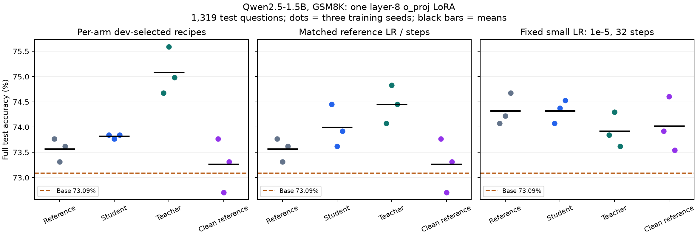
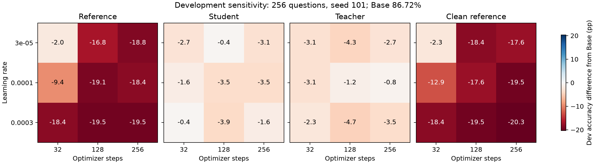
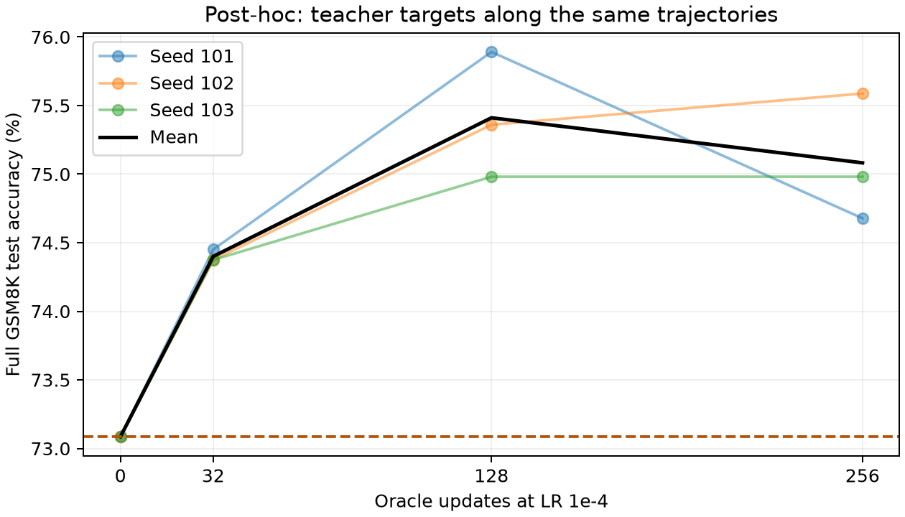

# GSM8K supervision targets: single-layer LoRA Oracle

Updated 2026-10-05 12:24:19 UTC. Deadline: 2026-10-05 13:17:24 UTC.

## Key findings

**Complete: all declared studies, the post-hoc fresh-question extension, full evaluations and cost measurements are finished.**

- **Teacher supervision gives a promising cumulative gain, not a confirmed stable improvement.** The dev-selected teacher recipe reaches **75.08%**, versus untrained Base **73.09%** (+2.00 pp). Its joint seed/question 95% interval is **[-0.03,+4.02] pp**, and its seven-comparison familywise interval is **[-0.76,+4.78] pp**. The preregistered stable-gain criterion is not met. Reference/student dev-selected recipes average 73.57%/73.82%.
- **Post-warmup Oracle headroom remains the main unresolved question.** Under teacher LR 1e-4, stopping at 32 updates gives **74.40%**. Continuing to 256 on the old pool gives **75.08%**, an incremental **+0.68 pp** (joint 95% CI **[-1.21,+2.55]**). Switching to 907 disjoint new questions gives **74.96%**, an incremental **+0.56 pp** (CI **[-1.16,+2.27]**). Both continuation checks are explicitly post-hoc. They do not establish a reliable advantage over stopping after warmup.
- **More questions in this control did not produce an additional observed gain.** Fresh-versus-repeated continuation is **-0.13 pp**, CI **[-1.79,+1.57]**. This is not equivalence and does not show that data quantity never matters: only one new 907-question pool and one fixed continuation recipe were tested, with the same student-success filter. It is also distinct from scaling offline predictor-gradient training data, which was not tested.
- **Small LR and target source interact.** At fixed **1e-5 × 32**, reference and student both reach **74.32% (+1.24 pp vs Base)**, while teacher reaches 73.92%. Reference/student nominal joint 95% lower bounds are +0.05 pp, but familywise intervals include zero. Self-generated answers are not necessary for the observed modest gain here. No trained grid candidate beats Base on dev; the selected recipes are finite-grid optima, not universal LR rules.
- **Generated targets are less sensitive within the tested grid.** Dev accuracy ranges span **17.58 pp** for reference, **3.52 pp** for student and **3.91 pp** for teacher. Reference training loss falls while dev performance deteriorates at longer training. Removing entire calculator-annotation spans does not solve this (selected mean 73.26%); that transformation also removes expressions, so it is not a pure formatting ablation.
- **The teacher gain costs more computation.** Dedicated median update times are **0.490/0.567/0.576 s** for reference/student/teacher, and the selected teacher recipe uses 256 updates versus 32 for the other primary arms. Supported-operator FLOPs and acquisition/search/evaluation costs are reported separately. These are Oracle costs, not measured predictor speedups.

**Next priority:** freeze a warmup-only control and establish a reproducible Oracle continuation advantage on independently held-out, harder or shifted data. Questions verified by the teacher but not solved in the student sampling attempts are one untested candidate. If that establishes headroom, compare the predictor with both Oracle and the no-further-update model under the same warmup, data and update budget, measuring synchronized wall time and FLOPs separately. The present results neither validate nor invalidate gradient-prediction fidelity.

**Research question:** can verified generated solutions improve the real-gradient SFT control before investing in a gradient predictor?

Every update uses true autograd gradients. No gradient predictor is trained or used here. This isolates SFT headroom; it does not measure predictor accuracy or establish that earlier predictor-training datasets were large enough.

Qwen2.5-1.5B-Instruct; only zero-indexed layer 8 o_proj LoRA, rank = alpha = 64. All arms start from the same base and paired LoRA initialization, with no preceding task warmup. Only one GPU is used at a time; execution began on physical GPU 2.

## Execution completed

All declared comparisons, full evaluations, dedicated cost measurements, exact teacher-prefix replay, and evidence audits are complete. Finished 2026-10-05 12:24:19 UTC, within the restarted five-hour budget. No experiment GPU worker remains active. [Completion audit](results/completion_audit.json).

## Targets and matching

| Source | Questions generated | Accepted questions | Generated tokens |
|---|---:|---:|---:|
| student | 1024 / 1024 | 912 | 578002 |
| teacher | 1024 / 1024 | 997 | 595235 |

Common accepted training questions: **907**. Raw-reference training uses exactly these same questions. Each generator supplies two temperature 0.7/top-p 0.95 candidates; retain the first normally terminated candidate whose complete boxed final answer verifies. Final-answer verification does not prove the reasoning process correct.

Generated targets use training questions only, without showing gold answers in the prompt. The current partition is newly fixed, but the GSM8K benchmark and official training pool have appeared in prior research; this is not a new unseen benchmark.

## Frozen design

| Component | Setting |
|---|---|
| Targets | Original reference; student 1.5B-generated; teacher 7B-generated |
| Search | Same LR grid 3e-5 / 1e-4 / 3e-4, checkpoints 32 / 128 / 256, seed 101 |
| Selection | Per-arm development accuracy, then fewer steps, then lower LR |
| Matched target control | All arms additionally use reference-selected LR and stopping point |
| Replication | Seeds 101 / 102 / 103; same target pool and split; paired initialization and question order |
| Optimization | AdamW, batch 32, microbatch ≤ 4, weight decay 0, clip 1, FP32 master/BF16 autocast, SDPA math |
| Evaluation | Complete dev 256 and test 1,319; greedy BF16 native-LoRA vLLM; full prompts; 2,048 new output tokens |

Inputs and retained supervision are never truncated. Equal optimizer steps and question exposures do not imply equal supervised-token or compute budgets. All per-run token counts and synchronized update times are saved separately from generation/search/evaluation wall time.

## Development selection

| Arm | LR | Steps | Dev correct / 256 |
|---|---:|---:|---:|
| Base, no training | — | 0 | 222 |
| reference | 3e-05 | 32 | 217 |
| student | 0.0003 | 32 | 221 |
| teacher | 0.0001 | 256 | 220 |

Selection chooses the best **trained** candidate within each finite grid. The zero-update Base remains a separate control; a selected training recipe need not outperform it. These are grid optima, not globally optimal learning rates.

Base scores **86.72% on the 256-question development split** and **73.09% on the 1,319-question official test**. Development comes from a disjoint part of the official training pool. The observed accuracy gap and dev/test ranking changes limit confidence in finite-grid selection; their cause is not established here. Hyperparameters remain dev-selected throughout.

Across the nine predefined settings per primary arm, development accuracy spans **17.58 pp** for reference targets, **3.52 pp** for student targets, and **3.91 pp** for teacher targets. Generated targets are less sensitive within this grid, even though no selected trained candidate exceeds the development Base. This is a development-set observation, not a test-set gain. [Complete development grid](results/development_grid.csv).

### Target lengths and formatting

The primary reference preserves the original rationale and calculator annotations; only the original `####` final-answer marker is normalized to `\boxed{}`. Every retained target in every arm already has a boxed answer.

| Target | Mean supervised tokens including EOS | Median | Calculator-marker targets |
|---|---:|---:|---:|
| reference | 119.7 | 108 | 897 / 907 |
| student | 273.2 | 264 | 0 / 907 |
| teacher | 282.0 | 271 | 0 / 907 |
| reference_clean | 89.7 | 81 | 0 / 907 |

The intersection contains problems the student can already solve in at least one of two sampled attempts. It excludes 90 questions verified only for the teacher, five verified only for the student, and 22 verified for neither. Thus this matched comparison does **not** test whether teacher supervision helps most on problems the student initially cannot solve.

Generated targets are sampled once from the unadapted student/teacher models, verified against training answers, and held fixed across every fit. This tests verified offline generated supervision, not online regeneration during adaptation or unverified self-training.

## Final results and interpretation

**All reported final versions contain the complete 1,319-question test.** Accuracy below conditions on the shared targets and split; three training seeds were used.

Base: **964/1319 (73.09%)**.

### Independently dev-selected recipes

| Arm | LR | Steps | Correct: seeds 101 / 102 / 103 | Mean accuracy | Mean gain vs Base |
|---|---:|---:|---|---:|---:|
| reference | 3e-05 | 32 | 973 / 967 / 971 | 73.57% | +0.48 pp |
| student | 0.0003 | 32 | 974 / 973 / 974 | 73.82% | +0.73 pp |
| teacher | 0.0001 | 256 | 985 / 997 / 989 | 75.08% | +2.00 pp |

### Matched LR and stopping point

All arms use reference-selected LR **3e-05**, **32 steps**. This comparison isolates target replacement at matched question exposure and optimizer settings; token budgets differ.

| Arm | Correct: seeds 101 / 102 / 103 | Mean accuracy | Mean difference vs reference |
|---|---|---:|---:|
| reference | 973 / 967 / 971 | 73.57% | +0.00 pp |
| student | 982 / 971 / 975 | 74.00% | +0.43 pp |
| teacher | 977 / 987 / 982 | 74.45% | +0.88 pp |

### Paired uncertainty

| Comparison | Mean difference | Joint seed/question 95% CI | Seven-comparison familywise 95% CI | All seeds positive? |
|---|---:|---|---|---|
| independently_tuned_reference_minus_base | +0.48 pp | [-0.88, +1.84] | [-1.39, +2.35] | True |
| independently_tuned_student_minus_base | +0.73 pp | [-0.91, +2.40] | [-1.54, +3.03] | True |
| independently_tuned_teacher_minus_base | +2.00 pp | [-0.03, +4.02] | [-0.76, +4.78] | True |
| matched_student_minus_reference | +0.43 pp | [-1.14, +2.00] | [-1.74, +2.60] | True |
| matched_teacher_minus_reference | +0.88 pp | [-0.76, +2.53] | [-1.36, +3.18] | True |
| independently_tuned_student_minus_reference | +0.25 pp | [-1.39, +1.90] | [-2.00, +2.50] | True |
| independently_tuned_teacher_minus_reference | +1.52 pp | [-0.51, +3.54] | [-1.29, +4.32] | True |

Intervals use 100,000 paired bootstrap draws. Questions are resampled jointly across methods and seeds; the joint intervals also resample training seeds. Only three seeds are available, and target-generation/split variability is not captured. Seven comparisons and the stable-gain rule were recorded before training/final scores. A nonsignificant difference does not establish equivalence.

[All final accuracy and costs](results/accuracy.csv) · [Paired comparisons](results/comparisons.json) · [Per-seed gains/losses](results/per_seed_comparisons.csv)

### Answer-extraction sensitivity

The primary score uses the saved `math_verify` full-response extraction and equivalence check. A separately saved strict score requires a correct answer in the last complete `\boxed{}`. The table below reuses the frozen dev-selected checkpoints. This descriptive diagnostic does not replace the primary metric, select recipes, or claim a new significant result.

| Version | Primary accuracy | Strict boxed-answer accuracy | Outputs with a complete final box |
|---|---:|---:|---:|
| Base | 73.09% | 71.95% | 97.80% |
| reference | 73.57% | 69.98% | 95.25% |
| student | 73.82% | 73.11% | 98.48% |
| teacher | 75.08% | 75.08% | 99.57% |

Teacher-target endpoints have identical primary and strict correct counts. Reference-target training reduces boxed-answer compliance relative to Base. Thus target choice changes output behavior as well as the primary task score; the strict-versus-primary difference should not be presented as a pure reasoning gain.

Among these frozen versions, **0** responses were primary-correct but strict-incorrect despite containing a complete final box. Complete raw outputs remain available for inspection. [Scoring diagnostic](results/scoring_diagnostic.json) · [Scorer implementation](scripts/evaluate.py).

### Training fit versus held-out behavior

Reference training at LR 3e-5 lowers its last-eight-update mean training loss from **0.526 at step 32** to **0.370 at step 256**, while dev accuracy drops from **217/256 to 174/256**. Its effective LoRA weight-change Frobenius norm grows from **0.151 to 2.113**. This is a concrete case where fitting the supervision more closely worsens held-out behavior; finite losses and gradients do not establish useful adaptation.

On the same initial question batch, token-mean loss is 0.564 for reference, 0.106 for student and 0.136 for teacher targets. These losses score different texts and lengths, so they cannot rank reasoning ability. Greater compatibility of generated targets with the model's output distribution is one plausible explanation for the different sensitivity, not an isolated causal result. [Training diagnostics](results/training_diagnostics.csv).

## Secondary control: reference calculator annotations

This secondary diagnostic was declared before the primary development scores. It removes **2,794 entire calculator-annotation spans** (`<<...>>`) from the same 907 reference targets. Text outside those spans and the boxed answers remain unchanged, but expressions inside the spans are removed. Some calculations occur only inside those annotations, so this is **not a strictly content-preserving or delimiter-only formatting control**. It also changes length. A negative result would show that this span-removal operation is insufficient, not that every formatting intervention is ineffective.

| Recipe | LR | Steps | Correct: seeds 101 / 102 / 103 | Mean accuracy |
|---|---:|---:|---|---:|
| Independently dev-selected | 3e-05 | 32 | 973 / 959 / 967 | 73.26% |
| Matched reference recipe | 3e-05 | 32 | 973 / 959 / 967 | 73.26% |

| Secondary comparison | Mean difference | Joint seed/question 95% CI | Four-comparison familywise 95% CI |
|---|---:|---|---|
| clean_independent_minus_base | +0.18 pp | [-1.26, +1.64] | [-1.67, +2.05] |
| clean_independent_minus_reference_independent | -0.30 pp | [-1.34, +0.76] | [-1.67, +1.09] |
| clean_matched_minus_reference_matched | -0.30 pp | [-1.34, +0.73] | [-1.67, +1.06] |
| clean_matched_minus_student_matched | -0.73 pp | [-2.30, +0.83] | [-2.73, +1.29] |

Supplemental training: 5 unique trajectories, 832 updates, 415.8 s synchronized optimization. These costs are additional to the primary-study cost table.

[Supplement protocol](configs/format_protocol.json) · [Complete results and costs](results/format_analysis.json) · [Stage wall times](results/format_stages.jsonl)

## Secondary control: fixed small learning rate

This fixed secondary control was declared before any current test generation. The earlier GSM8K study selected `1e-5 × 32` for warmup; here the same LR and update count are applied **from the original base**, to all four targets and all three seeds. There is no dev or test selection among these twelve fits. It covers a smaller LR than the primary grid.

| Target | Correct: seeds 101 / 102 / 103 | Mean accuracy | Mean gain vs Base |
|---|---|---:|---:|
| reference | 977 / 979 / 985 | 74.32% | +1.24 pp |
| student | 977 / 981 / 983 | 74.32% | +1.24 pp |
| teacher | 974 / 980 / 971 | 73.92% | +0.83 pp |
| reference_clean | 975 / 984 / 970 | 74.02% | +0.94 pp |

| Secondary comparison | Mean difference | Joint seed/question 95% CI | Seven-comparison familywise 95% CI |
|---|---:|---|---|
| reference_minus_base | +1.24 pp | [+0.05, +2.45] | [-0.40, +2.96] |
| student_minus_base | +1.24 pp | [+0.05, +2.40] | [-0.43, +2.86] |
| teacher_minus_base | +0.83 pp | [-0.38, +2.07] | [-0.83, +2.55] |
| reference_clean_minus_base | +0.94 pp | [-0.30, +2.20] | [-0.76, +2.68] |
| student_minus_reference | +0.00 pp | [-1.09, +1.09] | [-1.52, +1.57] |
| teacher_minus_reference | -0.40 pp | [-1.59, +0.76] | [-2.12, +1.26] |
| reference_clean_minus_reference | -0.30 pp | [-1.47, +0.83] | [-2.02, +1.31] |

Additional training cost: 12 fits × 32 updates = 384 updates, **203.5 s** synchronized optimization. Target generation and the Base evaluation are reused, not charged again. Each secondary family is reported separately from the frozen primary analysis; comparing the most favorable result across families is exploratory.

[Fixed-control protocol](configs/lowlr_protocol.json) · [All results and costs](results/lowlr_analysis.json) · [Stage wall times](results/lowlr_stages.jsonl)

## Post-hoc diagnostic: improvement after a possible warmup

Learning rates are constant within each fit. Here, "warmup-only" means stopping after the initial task updates; it is not a learning-rate ramp, and no predictor stage follows. The five warmup updates used by the separate timing microbenchmark are discarded instrumentation warmup.

**Post-hoc diagnostic:** added after the positive first two teacher-target test runs, not part of the frozen primary hypotheses. It examines the already selected LR 1e-4 along the same training trajectories. Stopping at 32 or 128 updates serves as a potential warmup-only/no-further-update control.

Seed 101 prefixes were saved during the original search. Seeds 102/103 were replayed through all 256 updates; their final A/B tensor hashes exactly reproduce the original trajectories. The saved 32/128-step prefixes therefore do not introduce new independent seeds.

| Stopping point | Correct: seeds 101 / 102 / 103 | Mean accuracy | Mean gain vs Base |
|---|---|---:|---:|
| Base, no updates | 964 | 73.09% | — |
| 32 updates | 982 / 981 / 981 | 74.40% | +1.31 pp |
| 128 updates | 1001 / 994 / 989 | 75.41% | +2.32 pp |
| 256 updates | 985 / 997 / 989 | 75.08% | +2.00 pp |

| Exploratory comparison | Mean difference | Joint seed/question 95% CI | Four-comparison familywise 95% CI |
|---|---:|---|---|
| step32_minus_base | +1.31 pp | [-0.40, +3.06] | [-0.88, +3.56] |
| step128_minus_base | +2.32 pp | [+0.38, +4.30] | [-0.18, +4.85] |
| step256_minus_step32 | +0.68 pp | [-1.21, +2.55] | [-1.74, +3.08] |
| step256_minus_step128 | -0.33 pp | [-2.07, +1.36] | [-2.58, +1.84] |

These intervals are exploratory, conditional on the teacher recipe chosen for this follow-up. The observed step32-to256 mean gain is +0.68 pp, with a joint95% interval spanning zero. This does not establish reliable post-warmup Oracle headroom, and no predictor is tested. Step128 has a higher observed test mean than step256, but this post-hoc curve must not replace the frozen dev-selected256-step primary recipe.

Reconstruction added 512 optimization updates and 301.7 s synchronized training. The original 256-step test outputs are reused; only six prefix versions are newly evaluated.

[Diagnostic protocol](configs/teacher_prefix_protocol.json) · [Exact replay audit](results/teacher_prefix_reproduction.json) · [Paired results](results/teacher_prefix_analysis.json)

**Coverage limitation:** all three trajectories have already seen every one of the **907 unique training questions by step 32**. The 32/128/256 stopping points correspond to 1,024/4,096/8,192 question exposures, approximately 1.13/4.52/9.03 passes over the same pool. Continuation adds **zero new unique questions**. This diagnostic measures further fitting of a fixed pool, not adaptation to a stream of new examples; lack of continuation gain would not rule out the latter. [Question-exposure audit](results/question_exposure.json).

## Post-hoc extension: fresh questions after warmup

**Post-hoc extension:** after discovering that step 32 already covers the original question pool, this control replaces the following 224 updates with a disjoint pool of 907 newly matched questions. LR remains 1e-4. The first 32 updates exactly reproduce the original warmup parameters, losses and gradient norms; AdamW state is retained. All three training seeds are reused, not new independent seeds.

The next 1,152 source questions in the fixed split permutation produced **1015 common-accepted questions** under the same two-candidate student/teacher verification rule. The first 907 in fixed candidate order were selected before training. No overlap with original candidates, dev or test is allowed. Only verified teacher solutions are used for continuation.

| Endpoint | Correct: seeds 101 / 102 / 103 | Mean accuracy |
|---|---|---:|
| Stop after 32 warmup updates | 982 / 981 / 981 | 74.40% |
| 256 total updates, repeated old pool | 985 / 997 / 989 | 75.08% |
| 256 total updates, fresh pool after warmup | 988 / 986 / 992 | 74.96% |

| Exploratory comparison | Mean difference | Joint seed/question 95% CI | Three-comparison familywise 95% CI |
|---|---:|---|---|
| fresh256_minus_base | +1.87 pp | [-0.15, +3.89] | [-0.58, +4.32] |
| fresh256_minus_warmup32 | +0.56 pp | [-1.16, +2.27] | [-1.54, +2.65] |
| fresh256_minus_repeated256 | -0.13 pp | [-1.79, +1.57] | [-2.20, +1.95] |

Additional work: **768 optimizer updates** (96 exact warmup replays plus 672 fresh-data continuation updates), **445.1 s** synchronized optimization, **4,608 generated candidates**, and **1,331,787 generated output tokens**. Three additional complete test versions; existing controls are reused.

This is an exploratory intervention on question diversity. Pools have the same size and acceptance rule, but contain different questions/solutions and token lengths, so it is not a pure novelty effect with content held constant. Both pools still exclude questions without a verified student solution. The endpoint and comparisons were fixed before fresh-data generation/training; no test result selects a new checkpoint.
The fresh branch sees **1,814 unique training questions overall**: 907 during warmup and 907 afterward. The fresh pool is itself revisited for approximately 7.90 passes during the 224 continuation updates. This is one pool switch at a fixed recipe, not a comprehensive data-scaling curve or a continuously new-example stream.

[Extension protocol](configs/fresh_protocol.json) · [Target audit](results/fresh_target_integrity.json) · [Warmup reproduction audit](results/fresh_warmup_audit.json) · [Full results](results/fresh_analysis.json)

## Costs and evidence

### Measured costs

Hardware: **one NVIDIA H200 at a time**. GPU 2 became shared during primary seed 102/103 replication; those timers include contention and are not controlled speed comparisons. Subsequent stages route to GPU 7 after releasing GPU 2. Across 19 unique primary-study training trajectories: **3,072 updates**, **2668.1 s** synchronized optimization, and **23,156,064 supervised tokens**. Checkpoints within one trajectory are not counted as separate training runs.

| Selected recipe | Steps | Mean update time / fitted seed (includes contention) | Mean supervised tokens / seed | Mean full sequence tokens / seed |
|---|---:|---:|---:|---:|
| reference | 32 | 29.1 s | 122,314 | 230,594 |
| student | 32 | 45.9 s | 279,562 | 387,841 |
| teacher | 256 | 379.0 s | 2,311,092 | 3,177,808 |

| Offline target source | Generated tokens, all candidates | Internal process wall time |
|---|---:|---:|
| student | 578,002 | 177.0 s |
| teacher | 595,235 | 125.9 s |

| Pipeline stage | Wall time including startup |
|---|---:|
| generate_teacher | 140.0 s |
| match_targets | 5.0 s |
| search_train | 1255.0 s |
| evaluate_dev | 1325.0 s |
| select | 5.0 s |
| replicate_train | 1450.0 s |
| evaluate_final | 2935.1 s |

Synchronized update time includes batch construction, forward, backward, clipping and optimizer update. It excludes model loading, target generation, checkpoint serialization and evaluation. Stage wall time includes process startup and up to five seconds of polling granularity. Generator internal wall time includes engine initialization, generation, verification and file writes up to the last progress record, and excludes final engine shutdown. Evaluation summary time includes generation, grading and output writes, but not engine initialization. Do not add overlapping internal and stage timers.

**The primary cost ledger records wall-clock time and tokens.** Any dedicated supported-operator FLOP estimate is reported separately. This experiment compares Oracle supervision targets; it does not benchmark predictor speedups. Generated-target acquisition is an additional offline cost. The two generation timings are single runs with different outputs and startup state, not a controlled model-size speed comparison. Equal steps match question exposure, but not padded computation or supervised tokens. Selected-recipe costs exclude the shared LR/stopping search; the ledger records the complete research search separately.

[Cost ledger](results/cost_ledger.json) · [Every training trajectory](results/training_costs.csv) · [Training audit](results/training_integrity.json) · [Grading audit](results/grading_integrity.json)

### Dedicated update timing and operator FLOPs

Synchronized elapsed time includes batch construction, forward, backward, clipping and AdamW update. Three repetitions, each with five unreported warmup updates and twenty measured updates. Same question sequence across targets per repetition; target order rotates. No external GPU compute process at per-run boundary checks. CPU/host remain shared. FLOPs are shape-based estimates for operators supported by torch.profiler (for example mm, addmm, bmm), not a complete FLOP count or a hardware counter. One fixed32-question batch is profiled; that batch does not estimate average dataset FLOPs. Profiling updates are excluded from timing samples. No checkpoints are written or changed; all fits are discarded.

| Target | Median update time | Repetition medians | Supported-operator TFLOPs, one matched batch | Peak allocated memory |
|---|---:|---|---:|---:|
| reference | 489.9 ms | 489.9 / 487.2 / 493.5 ms | 48.14 | 15.42 GiB |
| student | 567.1 ms | 560.4 / 567.2 / 567.1 ms | 84.35 | 15.81 GiB |
| teacher | 576.2 ms | 576.2 / 571.5 / 577.1 ms | 87.95 | 15.92 GiB |
| reference_clean | 484.5 ms | 484.8 / 484.5 / 484.0 ms | 41.29 | 15.03 GiB |

This profiles the **Oracle SFT update under different targets**, not a predictor-vs-Oracle speedup. End-to-end acquisition/search/evaluation costs are reported separately. [All measurements and operator coverage](results/dedicated_timing.json).

### Complete attempt inventory

| Phase | Unique training trajectories | Optimizer updates | Supervised tokens |
|---|---:|---:|---:|
| Primary target study | 19 | 3,072 | 23,156,064 |
| Reference annotation-span control | 5 | 832 | 2,388,630 |
| Fixed LR 1e-5 control | 12 | 384 | 2,346,963 |
| Fresh continuation branches, including warmup replay | 3 | 768 | 7,032,206 |

The scientific fits comprise **36 original trajectories plus three fresh-data branches, totaling 5,056 updates**. These include 96 warmup replay updates within the fresh-data branches. Exact teacher-prefix replay adds **512 updates** and no independent seeds; discarded timing/profiling fits add **308 updates**. Total executed optimizer updates: **5,876**.

**37 complete development versions** produce **9,472 scored outputs**; **40 complete test versions** produce **52,760 scored outputs**. Each test version evaluates all 1,319 questions. Base and the original 256-step teacher endpoints are reused across comparisons, not reevaluated or counted twice.

Offline acquisition generated **8,704 candidates** and **2,505,024 output tokens**. Artifacts occupy **0.22 GiB** at inventory time; **447.7 GiB** remain free. Compact adapters and raw evidence are retained; no full model copies or activation caches were created.

[Deduplicated inventory and output hashes](results/experiment_inventory.json). Timing boundaries overlap and must not be summed into an end-to-end total.

[Protocol](configs/protocol.json) · [Statistical plan](configs/statistics_plan.json) · [Source provenance](provenance/source_manifest.json)

Run directories retain configurations, adapter snapshots, question-order histories, token exposures and synchronized update timings. Generator records retain full prompts, all candidates, token IDs, finish reasons and verification decisions. Checkpoint selection is frozen before final generation.

## Incidents and limitations

- Initial command sandbox failed before any work ran; the user subsequently restarted the full five-hour budget at 08:17 UTC.
- The first orchestration attempt detected forked vLLM workers as multiple generators. It failed before launching another job; parent-process filtering repaired adoption. The failure record remains in provenance/pipeline_adoption_failure.json.
- Three seeds share the generated target pool and split. They do not measure variability from new target generation or data partitions.
- Matching on successful student/teacher generations restricts the training population. Final evaluation still uses the complete official test. Teacher-only hard-question supervision is not tested.
- This study tests a single model/task/module scope, not a general claim about SFT or predictor scalability.
- The Base prompts, predictions and correctness match all 1,319 historical 1.5B GSM8K Base outputs after alignment by normalized problem text. This checks baseline comparability; the current training targets and protocol are a new experiment. [Historical Base audit](results/historical_base_audit.json).
- External processes began sharing GPU 2 around 09:07 UTC. The live replication process was allowed to finish; subsequent GPU workers route to physical GPU 7 only after that process exits. Replication timers retain the contention overhead and must not be read as controlled speed comparisons. See [routing record](configs/gpu_routing.json) and [incident evidence](provenance/gpu_contention_incident.json).
