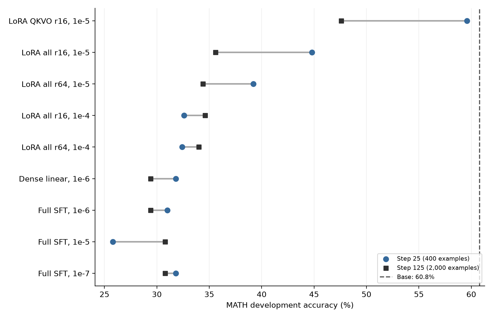
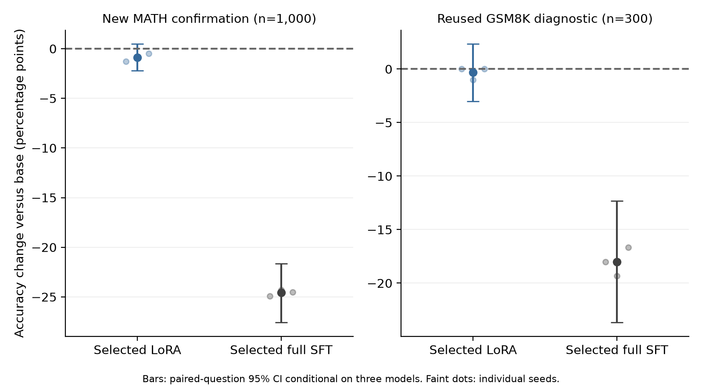

> **最终结论请看 [后续因果诊断完整报告](causal_followup/REPORT.md)（[PDF](causal_followup/REPORT.pdf)）。** 后续已通过三seed、1500道独立题确认了目标文本构造这一setup因素的修复。以下保留前阶段探索与阴性结果，不能代替最终结论。

# SFT 训练诊断：前阶段记录

## 前阶段结论（由后续因果证据补充）

**尚未定位当前大幅退化的主要因果机制；现有证据不支持“LoRA 本身不适合 SFT”，也没有证明某个已知setup缺陷就是当前退化的主因。** 已确认历史梯度累积与评测复现性问题，但token-mean修复在本轮开始前就已存在。本轮使用修复后的训练、统一推理并移除低秩约束后，多个配置仍然退化。参考文本CE下降而答案准确率下降，是直接观测到的现象，不等于已经解释了这一现象的成因。

本轮完成 **15 条实际训练轨迹**，主要统一协议下保存 **22,676 条完整生成评测记录**，另外有旧协议并发控制、独立HF生成和历史重评分。本轮没有验证出LoRA相对base的稳定数学收益，应保留base作为能力基线。 新MATH确认题上，三seed LoRA平均变化为 **-0.87 pp，95% CI [-2.20, +0.47]**；所选full SFT为 **-24.57 pp，95% CI [-27.57, -21.63]**。这些区间固定三份模型，只反映题目抽样不确定性；后文同时给出seed波动和分层重采样。

| 判断 | 证据强度 | 直接依据 |
| --- | --- | --- |
| 旧梯度累积归一化有缺陷 | 高 | 实际loss路径与合成梯度等价性复验 |
| 默认greedy评测存在不可复现性 | 高 | 历史独立base输出不一致；新协议完整重复通过 |
| 只按CE选模会选到数学能力更差的模型 | 高 | 同题、同轨迹CE下降而生成正确率显著下降 |
| 移除低秩约束就能解决当前失败 | 不成立于已测配置 | dense和full SFT直接对照同样退化 |
| 增大rank、加入MLP、切换FP32能自动修复 | 不成立于已测配置 | 模块/rank/LR矩阵及匹配计算精度对照 |
| 解答风格是唯一根因 | 证据不足 | 伴随长度变化，但历史风格干预未确认稳定收益 |
| LoRA普遍不适合SFT，或与full普遍等价 | 均无依据 | 当前单模型实验不能证明普遍命题；原始研究存在正反条件 |

## 1. 研究对象与公平比较

基座固定为Qwen2.5-1.5B-Instruct的同一snapshot；这是已有指令能力的模型，继续SFT和从base训练指令能力不是同一个问题。[^9] 所有主分支使用同一2,000道MATH原题、相同问题顺序和completion token-mean目标，batch4×accumulation4，125步cosine horizon、4步warmup。step25见400题，step125见2,000题；完整一轮均有462,407个实际监督tokens，逐步曝光已核对一致。

LoRA固定alpha16、dropout0，比较QKVO/r16与七类线性矩阵/r16/r64。dense更新相同七类矩阵的完整权重；full更新全部1,543,714,304个参数。LoRA和full分别使用不同LR范围，随后因full在初始范围严重下降，将下边界扩展到1e-7。扩展在任何新确认题评分之前完成，并有独立记录。

所有主分支的参数和AdamW状态为FP32，前向/反向使用BF16 autocast、eager attention；另设纯FP32训练对照。LoRA合并为FP32完整权重，和full/dense统一走FP32 vLLM/TRITON_ATTN推理。新结果不与旧BF16分数直接相减。初始32并发调整为128并发后，500条base输出逐字相同；128并发再独立重复一次，也逐字相同。新基线为304/500，而历史稳定BF16基线为291/500。

最佳LoRA落在本轮LR下界1e-5及最早保存点step25，说明搜索尚未包围最优点；更小LR、更早停止点仍可能改变结果。LR趋近零时也会趋近不更新的base，因此这里没有把已测full大幅退化当成full可达性能的上限。

统一clip阈值为1，但实际full/dense每步触发、LoRA主矩阵不触发。相同seed不保证不同模块集合的每个LoRA A矩阵相同；alpha固定时rank变化也改变alpha/r。因此这里是明确指定的训练配置比较，并非声称只剩“rank”一个数学变量。尚未扫描所有LR、clip、alpha、优化器或数据规模；未显著差异不意味着等价。完整细节见[实验方法](METHODS.md)。

## 2. 新的训练与调参结果

以下全部使用相同MATH dev500、相同FP32生成协议。CE列是固定dev64的诊断值，不是旧报告的dev500 CE。

| 配置 | 参数量/M | LR | Step25 / % | Step125 / % | CE64：25 → 125 |
| --- | --- | --- | --- | --- | --- |
| QKVO LoRA r16 | 4.36 | 1e-05 | 59.60 | 47.60 | 0.8365 → 0.7977 |
| All LoRA r16 | 18.46 | 1e-05 | 44.80 | 35.60 | 0.8191 → 0.7807 |
| All LoRA r64 | 73.86 | 1e-05 | 39.20 | 34.40 | 0.8219 → 0.7811 |
| All LoRA r16 | 18.46 | 1e-04 | 32.60 | 34.60 | 0.7617 → 0.7496 |
| All LoRA r64 | 73.86 | 1e-04 | 32.40 | 34.00 | 0.7617 → 0.7489 |
| Dense七类矩阵 | 1310.20 | 1e-06 | 31.80 | 29.40 | 0.7814 → 0.7606 |
| Full SFT | 1543.71 | 1e-06 | 31.00 | 29.40 | 0.7832 → 0.7620 |
| Full SFT | 1543.71 | 1e-05 | 25.80 | 30.80 | 0.8160 → 0.7428 |
| Full SFT（保守扩展） | 1543.71 | 1e-07 | 31.80 | 30.80 | 0.8432 → 0.8294 |



QKVO/r16/LR1e-5从base的60.8%降到step125的47.6%。有22题变对、88题变错，差值-13.20 pp，配对95% CI [-17.20, -9.20]，exact McNemar p=1.55e-10。对应CE64从0.8455降到0.7977。这个反例足以否定“CE下降就代表生成能力改善”。它不能单独证明风格或遗忘的具体机制。

加入MLP后的all-linear LoRA在参考CE上拟合得更快，但答案分数更差；扩大到r64、约7,386万个参数也没有恢复base。dense和full分支直接移除低秩限制，仍不能在上述常规LR下恢复生成能力。因此，当前证据不把“低秩容量不够”列为这些大幅退化的主要解释。它仍可能影响别的任务、训练量和最佳可达效果。

full LR1e-6/step25为31.00%，相对base -29.80 pp，95% CI [-34.20, -25.60]。这不是拿LoRA的LR直接套给full后的单点失败；本轮分别测试了多个LR，并补充更保守的full更新。模型选择保留base，而不是强制从一批更差的checkpoint里部署一个。

## 3. 计算精度与独立后端核查

下表仅改变训练计算精度，固定问题、顺序、方法、LR、step25和推理配置。

| 固定方法、数据、LR与step25 | 混合精度 % | 纯FP32 % | FP32−混合 Δpp | 95% CI |
| --- | --- | --- | --- | --- |
| Full / LR1e-6 | 31.00 | 33.00 | +2.00 | [-1.40, +5.60] |
| All LoRA r16 / LR1e-5 | 44.80 | 41.00 | -3.80 | [-7.00, -0.80] |

纯FP32没有恢复这两条轨迹的baseline准确率。它会改变结果，但现有证据不支持“AMP舍入是全部退化的原因”。FP32与混合精度的CE计算也不同，不能用FP32的更低CE代替答案评测。FP32描述模型/缓存dtype，不把可复现的GPU推理当成无限精度参考。

更保守的full LR1e-7仍出现大幅行为变化，因此另做零更新导出控制：完全不训练，只将base保存成与full相同的FP32模型目录，32题输出与原base逐字相同。full LR1e-7/step25加载后的混合精度CE64为0.8431789689756366，与训练日志完全一致；full LR1e-6/step25的加载CE也与其日志一致。这排除了这些已检查路径上的整体保存/加载偏移，不能扩展为所有后端都严格相同。

独立HF首token检查发现，full LR1e-7更新后，5个诊断prompt的最大logit变化约4.42–8.18；第0题以“To”开头的概率从0.622降到0.082。小LR数值并不自动保证小的行为变化。这里测的是5个具体prompt，不能作为全数据平均估计；同时也说明需要观察函数输出，而不能只比较相对W的更新范数。

对base、QKVO step125、all-linear step25和full step25，另用Transformers做8道有目的的FP32生成检查：前5道dev题加3道已观察到的失败题。主要错误在第二条推理路径上重现；个别答案和文本不同，说明浮点/后端细节仍影响边界样本。非零LoRA合并前后抽查24个位置，argmax一致；logits有小量浮点差异，不能声称每个token逐值相等。完整输出与误差见[独立后端审计](audits/hf_backend_audit.json)及[完成后的逐题后端比较](audits/hf_backend_comparison_final.json)。这8题不是随机benchmark，不用于估计总体准确率。

## 4. 冻结配置后的确认结果

开发期固定的LoRA候选为 **lora_qkvo16_lr1e-5_s43_step25**；full候选为 **full_lr1e-6_fp32_s43_step25**。每种方法再以seed44和45从同一基座重新训练，保持LR、模块、rank、计算精度和停止点。选择及时间记录见[冻结的选择记录](results/selection.json)。即使候选低于base，也保留用于诊断；“被选中”不等于“已推荐替代base”。

新MATH确认集来自官方test：排除可识别历史问题、历史problem_hash、MATH-500及当前训练/dev问题后，剩2,500题，从中预先随机抽1,000题。108份旧index-only预测文件已追溯，交集为零。[^12] 这是相对于可见实验记录的新题，不是预训练无污染证明，也不是完整官方test的无条件随机样本。GSM8K300在历史中已经使用，只称复用诊断集。

| 题集 | 方法 | Seed43 / 44 / 45 % | 均值 % | 对Base Δpp | 配对题目95% CI |
| --- | --- | --- | --- | --- | --- |
| MATH新确认1,000 | Base | — | 56.80 | — | — |
| MATH新确认1,000 | LoRA | 55.50 / 56.00 / 56.30 | 55.93 | -0.87 | [-2.20, +0.47] |
| MATH新确认1,000 | Full SFT | 31.90 / 32.50 / 32.30 | 32.23 | -24.57 | [-27.57, -21.63] |
| GSM8K复用诊断300 | Base | — | 73.00 | — | — |
| GSM8K复用诊断300 | LoRA | 73.00 / 72.00 / 73.00 | 72.67 | -0.33 | [-3.00, +2.33] |
| GSM8K复用诊断300 | Full SFT | 55.00 / 53.67 / 56.33 | 55.00 | -18.00 | [-23.67, -12.33] |



LoRA与full在新MATH上的平均配对差异为+23.70 pp，seed与题目分层bootstrap的95%区间为[+20.60, +26.90]。各方法相对base的分层区间分别为LoRA [-2.30, +0.53]、full [-27.67, -21.43]。只有3个seed，分层区间仍属探索性，不应把它当精确的训练随机性分布。

每个seed的错变对/对变错数量、配对CI、McNemar，以及复用dev的复验结果均保存在[确认统计](results/confirmation_analysis.json)。同一道题在三个seed上被回答三次，不意味着有三倍独立题量。主开发矩阵的多checkpoint比较另外提供Holm校正p值；表中普通95% CI不是同时置信区间。

## 5. 训练题、错误类型与评分敏感性

从共同训练文件预先随机抽128题，评估base和三个已完成一轮、确实见过这些题的模型。该评测不参与选模，直接检验参考CE的拟合是否转化为训练题自身的自由生成能力。

| 训练题生成，128题 | 正确数 | 准确率 % | 对Base Δpp | 95% CI |
| --- | --- | --- | --- | --- |
| base | 69 | 53.91 | +0.00 | [+0.00, +0.00] |
| full_lr1e-6_s43_step125 | 30 | 23.44 | -30.47 | [-39.84, -21.09] |
| lora_all16_lr1e-5_s43_step125 | 41 | 32.03 | -21.88 | [-31.25, -12.50] |
| lora_qkvo16_lr1e-5_s43_step125 | 58 | 45.31 | -8.59 | [-15.62, -1.56] |

三个SFT分支的训练题生成正确率都低于base。这里的“训练题准确率”必须与teacher-forced训练loss分开理解：这些配置连见过的题也答得更差，不能把现象简单描述为“记住训练题、只在新题失败”的经典过拟合。

在QKVO step125的base正确、SFT错误、且未截断的问题中固定随机抽3例，并保留原题、原文和人工核查：

| Dev index | 条件与正确答案 | SFT错误 | 解释边界 |
| --- | --- | --- | --- |
| 177 | 两人各从10道菜选一道，区分谁点什么；100种 | 使用无序可重复组合，回答55 | 明确漏掉题目条件，不是输出不够长 |
| 324 | 三个不确定的人各以2/5概率留下，至少两人留下；44/125 | 恰有两人留下时错误使用3×(2/5)^3，得到32/125 | 实际概率建模错误，有可解析最终答案 |
| 233 | 两条抛物线切点为(−7,−24) | 代入后丢掉变量，得到错误二次方程 | base也有不严谨的导数论证，只是最后答案正确 |

这些例子证明存在实际数学错误，但不用于估计错误类型比例。答案正确不代表推理过程完全正确。完整记录见[失败案例](audits/new_failure_cases.jsonl)。

| Dev模型 | 原评分 % | 最后boxed评分 % | 空解析 | 触顶2048题数 |
| --- | --- | --- | --- | --- |
| base | 60.80 | 60.80 | 0 | 35 |
| lora_qkvo16_lr1e-5_s43_step125 | 47.60 | 44.60 | 0 | 28 |
| lora_all16_lr1e-5_s43_step25 | 44.80 | 41.20 | 0 | 27 |
| full_lr1e-6_s43_step25 | 31.00 | 29.80 | 0 | 42 |

空解析、是否有最后boxed、输出截断都不是同一件事。完整文本解析可能接受正确但未boxed的答案，也可能从不完整输出中提取某个数字；严格boxed则可能拒绝格式不符但数学正确的回答。两种分数用于敏感性检查。不能将“parse不空”当成评分器绝无误判，也不能仅凭输出平均变短就断言推理能力下降的唯一原因。

## 6. 已确认的实现问题与数据问题

旧训练将各微批的平均loss再平均。若微批监督token数不同，它不等于有效batch的token均值。真实本机Qwen causal-loss路径的微型数值实验中，两微批分别有11/59个监督tokens：旧算法对整batch梯度的相对L2误差为1.0067、cosine0.7185；按有效token加权后，相对L2误差约9.15e-8。该结果确认实现语义，不能当成1.5B真实训练梯度误差估计。[^5]

重建旧seed42的微批顺序后，每token相对正确有效batch均值的权重比例为0.394–4.165。当前代码已修复该问题，本轮再次通过7项梯度、评估和缓存回归检查。两种归一化的历史真实训练对照，没有确认仅此修复就带来稳定泛化改善；旧默认推理还存在波动，不能复用旧小幅收益作为新证据。

本轮审计还确认：训练prompt与生成模板一致；prompt和padding不参与loss；completion与未被截断的EOS参与监督；采用模型内部标准causal shift；没有发现train/dev/确认题的规范化文本重叠。保存加载与初始零adapter检查通过。新运行使用单独目录，原有修改和历史结果未覆盖。

2,000条原始训练解答的平均长度230.9 tokens、中位数161；180题的问题含Asymptote图形源码，198条solution含图形源码，28条solution有多个boxed答案。3条训练样本在2048上限截断，dev500有1条截断；这与某些旧单层实验“零截断”的数据范围不同。数据问题需要明确记录，但不能仅由存在3条截断就认定其造成所有退化。也不应直接删去所有图形代码，因为部分代码包含必要题目信息。

历史selected训练集还偏向短解答、代数和较容易题；selector采用的单层/权重状态/优化器与下游全层SFT不同。selected优于random的某个条件分布结果，不能证明SFT优于base，更不能说明predictor本身解决了生成能力问题。历史真梯度也下降，说明不能把所有损失归咎于预测梯度。

## 7. 参数变化与容量解释

只看参数量或相对基础权重的更新范数，不能保证行为变化温和。下表仅抽查第13层q_proj矩阵，并不是全模型谱统计。

| Layer13 q_proj，step125 | 相对W更新范数 | 前16奇异值能量 | 90%能量所需rank | 转BF16后无变化的权重比例 |
| --- | --- | --- | --- | --- |
| lora_all16_lr1e-5_s43 | 0.000446 | 100.00% | 6 | 88.11% |
| lora_all64_lr1e-5_s43 | 0.000239 | 94.55% | 9 | 93.48% |
| full_lr1e-6_s43 | 0.000432 | 71.50% | 121 | 87.52% |
| full_lr1e-5_s43 | 0.002666 | 41.70% | 293 | 47.31% |

full的更新确实可以具有高于LoRA的有效rank，但本轮更高rank的变化没有自动转化为更好的答案准确率。这反对将当前退化直接解释为低秩容量不够；也不意味着在更大数据、更大分布变化或充分调参后，低秩约束永远没有代价。

这些更新转为BF16后，大量权重值会与base相同，且更新向量会显著失真。正因如此，本研究没有让full用舍入后的低精度checkpoint、却让LoRA保留专用高精度增量作为唯一比较。统一FP32权重推理和纯FP32训练补充，帮助明确计算路径的边界。抽查范围、完整谱能量及舍入误差见[权重几何](audits/weight_geometry.json)。

## 8. 历史风格消融与外部研究

历史已完成的稳定评测中，base为58.2% MATH dev、73.67% GSM8K诊断；原始BF16训练step25为57.2%/73.67%，原始FP32为59.2%/72.67%，自由改写FP32为59.8%/73.33%，只改公式定界符为59.4%/74.67%。对应小幅变化没有确认同时稳定改善域内和跨数据集表现。这些是旧训练/推理协议下的结果，只在该历史对照内部解释。

自由改写还将监督token量增加约1.84倍；最终答案等价检查无法保证中间推理正确。历史12例有目的抽查回退4例，不能据此估计总体错误率。公式定界符对照比自由改写更容易解释，但仍不足以证明“风格是唯一根因”。来源及原始汇总已保存于历史证据（仅原工作区保留：`audits/historical_sources/`）。

外部原始研究提供的是条件化证据。LoRA原论文在其任务上接近或超过full，QLoRA也展示了用低秩适配完成指令微调；它们反驳普遍不适用命题，但没有保证当前数学生成收益。[^1][^2] Biderman等研究在math/code的continued pretraining中观察到更持久的差距，而instruction finetuning中高rank能缩小差距；不能把CPT结论直接转移给SFT。[^3]

Thinking Machines的研究强调MLP覆盖、rank容量和分别调LR，但主要SFT实验看log loss，不能直接用来证明数学答案准确率等价。[^4] 本轮MLP分支CE更好而accuracy更差，正好说明评价指标必须对齐。官方PEFT文档定义参数选项，不能替代本任务的收益验证。[^8]

DFT等后续工作将token概率加权作为改进SFT泛化的一种方法，并报告数学任务收益及其他任务限制。[^10] 长CoT数据研究也观察到loss与泛化的分离。[^11] 这些可以支持下一轮的假设选择；本轮没有执行DFT、KL/replay或更换teacher，不把它们列为已验证修复。

## 9. 为什么CE下降而答案变差并不矛盾

CE要求参考token在给定正确前文下概率更高；greedy答案要求模型在自己生成的前文下，每一步选择合适的路径。一个简单构造就能说明两者并不单调：某一步正确token概率从0.45升到0.46，但错误候选从0.40升到0.50，第三候选从0.15降到0.04。参考token的CE改善，greedy却由正确变错误。多步推导还会叠加前缀分布变化。

这解释了为什么最低CE不能直接选出最强数学模型，但不是对本仓库所有错误的唯一机制证明。“优化目标、示范分布与生成行为不对齐”是待检验的解释，不能将CE与accuracy背离本身当成该机制已被因果证实。尚未严格区分风格迁移、能力干扰、数据质量和具体更新几何各贡献多少。尤其不能把“loss在下降”当成训练正确的充分证据，也不能把“accuracy下降”自动归因为代码bug。

## 10. 建议与结论边界

本轮没有验证出LoRA相对base的稳定数学收益，应保留base作为能力基线。 如果目标是提高数学答案准确率，后续选模应以独立开发集的生成正确率为主，base参与候选，CE用于监测；停止点与有效曝光一起记录。现有弱更新最多应被当成保守诊断锚点，未经确认不应包装成有效SFT方案。

工程上继续保留token-mean梯度累积、训练/评测fingerprint、显式decode参数、稳定推理和非零adapter重复检查。推理框架默认不保证复现，固定seed并不充分。[^6][^7] 若需要BF16部署，应单独验证实际服务路径，包括合并舍入与LoRA专用kernel；本报告的FP32比较不是一个部署精度保证。

研究上下一步优先改变有可解释性的监督目标或数据质量，而不是盲目继续增加rank或模块：可以做同问题、同有效token预算、经过程验证的示范对照，或明确的行为保持/目标加权对照。一次只改变一个主要因素，先在新开发集判别，再使用另一份未触碰的确认集。当前1,000题确认集已经使用，不能再次称为全新final test；GSM8K300从一开始就是复用诊断。

没有覆盖其他模型、完整超参数最优解、非数学能力、长期多epoch训练、所有alpha/clip设置、语义近重复或预训练污染。因此，结论是：**已确认这些SFT配置会退化，已确认历史实现与评测问题，但尚未证明当前退化主要由哪个因素造成；也不能据此断言LoRA本身不适合SFT。** 外部文献说明LoRA可以用于SFT；本地实验说明“能用于SFT”不等于“当前数据和目标一定能提高这个Instruct模型的数学能力”。

## 复现与产物

[完整方法](METHODS.md)、[初始计划](PLAN.md)、[所有分数CSV](results/metrics.csv)、[配对分析](results/analysis.json)、[新seed确认分析](results/confirmation_analysis.json)、[实际验证](audits/validation.json)、GPU定期记录（仅原工作区保留：`logs/gpu_periodic.jsonl`）与逐条命令（仅原工作区保留：`logs/commands.jsonl`）均随研究目录保存。训练数据、代码快照、adapter/完整权重和逐题预测也在目录内。checkpoint未保存优化器完整恢复状态；复验从base开始，不把adapter加载当精确续训。

LoRA长期保存A、B及adapter配置，共用固定版本基座。为统一推理路径临时生成的FP32合并权重在评测完成后已清理，保留来源与导出哈希；可从adapter重新构建。本轮共清理13份副本、约80.3 GB，逐文件确认13份adapter均仅含A/B张量。full/dense SFT对照继续保留完整训练权重。复验入口自动在LoRA评测结束后清理合并副本，详见[存储清理记录](audits/lora_export_cleanup.json)和[复验说明](README.md)。

使用原环境做统计，独立渲染环境生成图和文档，不改变训练依赖：

```bash
.venv/bin/python research/sft_diagnosis_20260908/scripts/analyze.py
.venv/bin/python research/sft_diagnosis_20260908/scripts/aggregate_confirmation.py
.venv/bin/python research/sft_diagnosis_20260908/scripts/build_report.py
research/sft_diagnosis_20260908/.renderenv/bin/python research/sft_diagnosis_20260908/scripts/render_report.py
```

重训时必须使用新的运行名/研究目录，并先检查空闲GPU；现有脚本有意拒绝覆盖已存在的训练输出。主队列曾从串行改为按GPU空闲情况调度，执行顺序不会改变已冻结的数据、超参数和评分协议；调整和未完成的旧重复输出保留为审计记录，不纳入主结果。

## 来源

[^1]: Hu et al. [LoRA: Low-Rank Adaptation of Large Language Models](https://arxiv.org/abs/2106.09685). 2021 / ICLR 2022.
[^2]: Dettmers et al. [QLoRA: Efficient Finetuning of Quantized LLMs](https://arxiv.org/abs/2305.14314). 2023 / NeurIPS 2023.
[^3]: Biderman et al. [LoRA Learns Less and Forgets Less](https://arxiv.org/html/2405.09673v2). 2024 / TMLR.
[^4]: Schulman and Thinking Machines Lab. [LoRA Without Regret](https://thinkingmachines.ai/blog/lora/). 2025-09-29.
[^5]: Hugging Face. [Fixing Gradient Accumulation](https://huggingface.co/blog/gradient_accumulation). 2024-10-16.
[^6]: vLLM. [Reproducibility](https://docs.vllm.ai/en/stable/usage/reproducibility/). stable documentation，访问2026-09-08.
[^7]: vLLM. [Batch Invariance](https://docs.vllm.ai/en/stable/features/batch_invariance/). stable documentation，访问2026-09-08.
[^8]: Hugging Face PEFT. [LoRA API](https://huggingface.co/docs/peft/en/package_reference/lora). 访问2026-09-08.
[^9]: Qwen Team. [Qwen2.5-1.5B-Instruct model card](https://huggingface.co/Qwen/Qwen2.5-1.5B-Instruct). 本轮固定snapshot 989aa7980e4cf806f80c7fef2b1adb7bc71aa306.
[^10]: Wu et al. [On the Generalization of SFT: A Reinforcement Learning Perspective with Reward Rectification](https://arxiv.org/html/2508.05629v3). 2026-02-27版本 / ICLR 2026.
[^11]: [On the Role of Reasoning Patterns in the Generalization Discrepancy of Long Chain-of-Thought Supervised Fine-Tuning](https://arxiv.org/html/2604.01702v1). 2026，预印本。
[^12]: 本地来源：[MATH确认集来源与哈希](audits/holdout_provenance.json)、[旧index-only预测来源解析](audits/index_only_provenance.json)、[重算历史审计](audits/history_recomputed/audit.json)。外部MATH文件revision为0530c78699ea5e8eb5530600900e1f328b48acad。

外部文献说明与下载哈希另见[来源清单](literature/SOURCES.md)及[literature/download_manifest.json](literature/download_manifest.json)。
