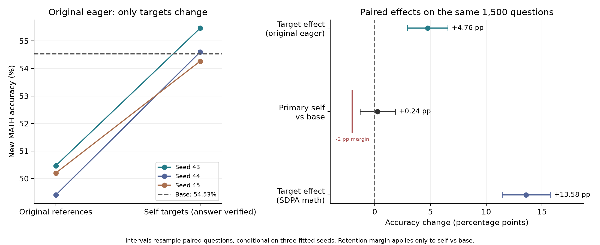
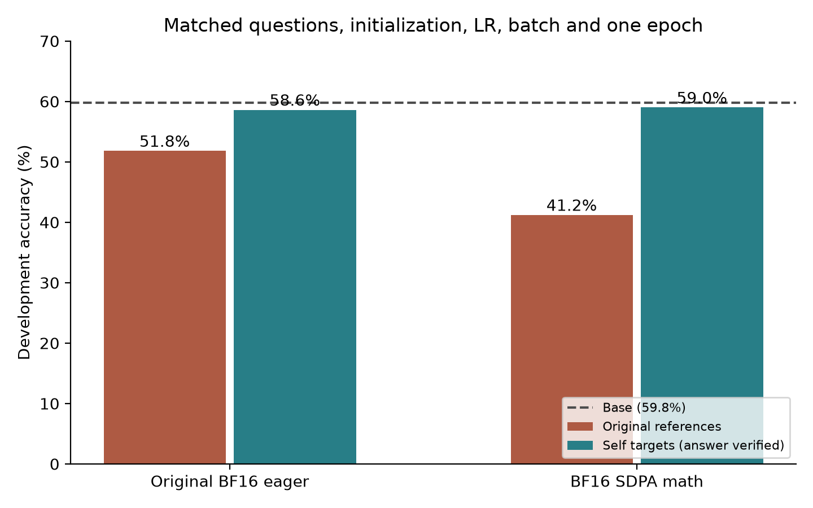
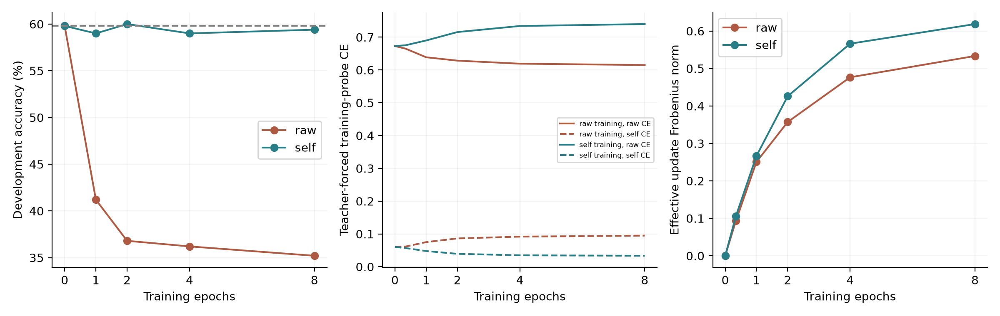

# LoRA SFT 因果诊断与修复研究

## 结论：证据支持 setup 分支

**已确认一个具体且可修复的 setup 因素：把原始 MATH 参考解答直接作为逐 token 监督目标，会在这组 LoRA SFT 配置下使固定生成协议下的数学答案准确率下降。对相同训练问题改用通过答案验证的模型自产解答，保留原始 eager attention 和相同训练参数，独立确认中恢复了 baseline 附近的表现。** 这支持目标文本构造的因果影响，不能归纳成“LoRA 本身不适合 SFT”。

这是监督目标构造这一整体干预的结论，涵盖文本内容、长度和 token 权重变化；没有证明纯文风是唯一机制。主要控制是同一批1175题的 raw/self 对照，不能将原2000题与筛选后的模型直接相减，把所有差异归给文本。

冻结方案后，在此前未使用的1500道 MATH test 题上，三个 seed 的平均准确率：原始目标 **50.02%**，自产目标 **54.78%**，base **54.53%**。

* 相对原始目标提升 **+4.76 pp，配对95% CI [+2.91, +6.56]**，三个 seed 方向一致。
* 相对 base 为 **+0.24 pp，CI [-1.33, +1.82]**，达到事先记录的“排除超过2 pp退化”标准。跨 seed/题目重采样区间为 [-1.51, +2.00]，同样通过该敏感性检查。
* **尚未证明超过 base 的数学能力提升，也没有证明所有推理步骤都正确。** 这里验证的是最终答案准确率的退化修复；不是精确等价或普适最优性的证明。

| 新确认1500题 | Seed43正确数 | Seed44正确数 | Seed45正确数 | 平均准确率 |
| --- | ---: | ---: | ---: | ---: |
| Base | 818 | 同一个固定base | 同一个固定base | 54.53% |
| 原始目标 / 原始 eager | 757 | 741 | 753 | 50.02% |
| 自产目标 / 原始 eager（主方案） | 832 | 819 | 814 | 54.78% |
| 原始目标 / SDPA math | 606 | 622 | 611 | 40.87% |
| 自产目标 / SDPA math | 829 | 815 | 806 | 54.44% |



三个 seed 的主方案对 raw 收益分别为 +5.00、+5.20、+4.07 pp；其逐题得失、区间和检验均在 [完整确认统计](results/target_replication_math_confirmation_new.json)。同一道题在三个 seed 下重复回答，不是三道独立题。主方案下“matched raw”和“原始 eager raw”是同一个比较，不能重复计算为两份独立证据。

## 具体怎么修改

使用 self_final.jsonl（仅原工作区保留：`data/self_targets/self_final.jsonl`） 替换训练 completion 的目标字段；保留冻结的 QKVO LoRA r16/alpha16、dropout0、batch16、LR1e-5、原始 eager，训练一轮。LR计划 horizon 仍为8轮，不能把 `epochs` 改为1而悄悄更改 cosine 日程。

```bash
.venv/bin/python research/sft_diagnosis_20260908/causal_followup/scripts/run_target_recipe.py --name reproduced_self_eager_s43 --gpu 1 --seed 43
```

入口核验冻结的数据与脚本哈希，拒绝覆盖旧目录。匹配 raw 对照只多加 `--target raw`。实际从头重训后224张 A/B与候选逐张量完全相同，最大误差0。[可执行复现说明](REPRODUCE.md)、[精确重训核查](audits/recipe_eager_training_reproduction.json)

主交付 adapter 是 factor_self_qkvo_b16_lr1e-05_eager_s43/exposure1175（仅原工作区保留：`results/dtype_training/factor_self_qkvo_b16_lr1e-05_eager_s43/exposure1175`）。Seed43是最先预设的种子，不是根据确认集挑出的赢家。LoRA保存 A/B与配置，推理使用固定基座；续训另保留 optimizer/RNG。完整训练和推理配置见冻结清单。

## 要回答的问题

研究目标是定位当前Qwen2.5-1.5B-Instruct的可干预setup因素，并给出具体修改和匹配证据。冻结确认已支持目标文本构造这一分支。[最初目标](OBJECTIVE.md)与[预先确认标准](CONFIRMATION_CRITERIA.md)保留。有限本机实验不能证明“LoRA普遍不适合SFT”，观察到很多失败也不能代替根因定位。

前一阶段报告保留在[原报告](../REPORT.md)，其阴性结果有价值，但其中 BF16 eager 训练与 FP32 生成的计算路径不一致，限制了归因。后续发现必须修正前面的解释，不能只挑支持某个结论的结果。

## 已得到的关键因果证据

在固定的 1175 道训练题上，只替换目标解答文本：一组用原始 MATH 参考解答，另一组用固定基座自主生成、最终答案通过验证且通过长度/停止过滤的解答。两组问题、顺序、seed43 的初始 A/B、batch16、LR1e-5、rank16、alpha16、dropout0、优化器、训练曝光与 LR 日程匹配。一轮均为 74 次 optimizer.step（最后一个有效 batch 为 7 条），实际第一次 LR 为零，此后正常更新；日程预设为 8 轮 horizon，不能与一轮 cosine 混淆。

所有下列分数均来自同一 BF16、未合并 adapter 的 vLLM 生成协议、同一 dev500。Base 为 299/500。

| 一轮训练 | 原始参考目标 | 自生成目标 | 更换目标的配对收益 | 95% CI |
| --- | ---: | ---: | ---: | --- |
| 原始 eager attention | 259/500 | 293/500 | +6.8 pp | [3.0, 10.6] |
| 显式 SDPA math | 206/500 | 295/500 | +17.8 pp | [13.4, 22.2] |



这不是“筛选后题目容易所以效果好”的单组比较：两种目标使用完全相同的筛选题。它检验的是**目标文本构造这一整体干预**，包含表达、推理内容、长度和每题 token 权重改变，尚未单独隔离纯文风。自生成目标一轮有 501728 个监督 tokens，原始目标为 183065，约 2.74 倍。没有假装两组 token 预算相同。

主方案eager一轮的有效权重增量范数，raw为0.24147，self为0.27403，self并没有更小。另一个SDPA组全部有效权重增量的Frobenius范数，raw 为 0.25055，self 为 0.26651；参数 A/B 的变化 L2 为 1.06186/1.05608。self 并不是通过几乎不更新而保持性能。两组有效更新方向余弦为 −0.17791。八轮对应有效增量为 0.53341/0.61864。范数不能完整决定行为，但这里直接排除了“self 的权重增量明显更小”这一解释。[逐层计算与匹配审计](audits/target_updates.json)

一轮 self/SDPA 相对 base 为 −0.8 pp，开发集 CI [−3.8, 2.2]，当时不能据此宣布非劣或提升能力。后续完整轨迹为 self 的295/300/295/297（1/2/4/8轮），raw为206/184/181/176。八轮目标差异 +24.2 pp，CI [20.0,28.6]。该延长对照采用SDPA math、seed43；主交付eager的一轮结论由独立确认支持，不把SDPA八轮结果冒充eager八轮结果。[逐题配对统计](results/target_intervention_analysis.json)



## 三个 seed 的开发期复验

下表仅用于开发期选择；独立确认结果在报告开头。三个seed内，四格初始A/B、问题顺序和每一步LR均逐项完全一致。[四格匹配审计](audits/four_cell_matching_all_seeds.json)

| Dev500 | Seed43 | Seed44 | Seed45 | 平均准确率 |
| --- | ---: | ---: | ---: | ---: |
| 原始目标 / 原始 eager | 259 | 259 | 248 | 51.07% |
| 自产目标 / 原始 eager（主方案） | 293 | 297 | 287 | 58.47% |
| 原始目标 / SDPA math | 206 | 209 | 209 | 41.60% |
| 自产目标 / SDPA math | 295 | 288 | 295 | 58.53% |

两种self配置的开发均值几乎相同，按确认前记录的规则优先保留原始eager，从而把主要修复限定为目标替换。没有把更精确的attention自动当作更好的SFT方案。

## 具体数据修改

1. 固定基座与推理协议，仅输入原有 2000 道训练问题，自主生成一次 greedy 解答；生成时不提供参考答案。
2. 用原有最终答案等价评分筛选，要求完整停止、有最终 boxed、不含解答中的 Asymptote 源码，原始与自生成两种目标均能在 2048 的完整训练序列中容纳。1186 条最终答案正确，自动过滤后 1180 对。
3. 预先固定 10 条随机样本加 2 条最长样本，人工检查推理；发现或保守排除 5 对，最终共同保留 1175 对。所有排除同时作用于 raw/self。
4. 训练数据为 self_final.jsonl（仅原工作区保留：`data/self_targets/self_final.jsonl`），匹配对照为 raw_final.jsonl（仅原工作区保留：`data/self_targets/raw_final.jsonl`）。保留生成原文、索引映射、人工检查和文件哈希。最终清单与检查理由（仅原工作区保留：`data/self_targets/review_and_final_manifest.json`）

自动答案正确不等于推理每一步都正确。这里只人工完整检查了 12 条，且其中有目的选取最长解答，5/12 不能当总体错误率。部分自动通过样本仍可能含错误推理。筛选后 Level 5 比例下降，因此该修改验证的是这个固定任务和选择范围；不是对原始 2000 题全部目标都完成高质量重写。

## 计算路径中的真实问题，以及失败的修复尝试

原训练器硬编码 eager attention。此环境的 BF16 eager 会把 attention QK 中间值提前舍入；真实模型固定 16 条样本上，相对纯 FP32 梯度，BF16 eager cosine 为 0.7201、相对 L2 为 0.8550，而显式 SDPA math 为 0.9963/0.0870。一个实际前缀 `2 \cdot 25 =` 后，正确下一 token `5` 的概率从 FP32 的 0.9999807 降为 eager BF16 的 0.0010145，SDPA math 为 0.9999814。[真实数值审计](audits/attention_math.json)

固定 dev 前 128 题，未训练基座 HF BF16 eager 为 41/128，HF BF16 SDPA 为 76/128；纯 FP32 HF 为 75/128。相同 BF16 dtype 不能保证相同算术路径。PyTorch 官方说明了低精度运算和 SDPA math 中间精度的差异，具体严重程度以本机实测为准。[PyTorch 数值精度说明](https://docs.pytorch.org/docs/main/notes/numerical_accuracy.html)

但是，**这项数值问题不是已证明的 SFT 准确率修复**。原 2000 题、同初始化/顺序、batch16/LR1e-5、一轮训练后，统一 BF16 vLLM 上 eager 为 192/500，SDPA math 为 174/500，都远低于 base299。上面的 1175 题四格对照也显示，更精确的 attention 会加重 raw 目标训练的下降。目标与 attention 存在交互，而不是一个数值开关单独解决全部问题。[一轮原数据对照](results/attention_one_epoch_comparison.json)

本机自动 SDPA 在真实第 5 个 batch 的 backward 出现非有限梯度，记录显示调用 cuDNN；强制 math/efficient 在同一前 6 个 batch 通过。当前研究的 SDPA 训练明确选择 math，并检查梯度有限，不能简单写 `attn_implementation='sdpa'` 就认为环境问题已处理。导入 vLLM 会关闭进程内 cuDNN SDPA 开关，训练进程并不导入它；不同诊断进程的默认开关必须分别记录。[后端审计](audits/sdpa_gradient_backend.json)、[导入副作用](audits/attention_backend_import_effects.json)

## 其他已验证和未奏效的路线

| 假设/路线 | 实际检查与结果 | 能得出的结论 |
| --- | --- | --- |
| LoRA 根本学不动 | 16 道训练题、all-linear r16、400 steps；匹配训练算术的生成 16/16，训练 CE 约 6.13e-5 | 此实现能够学会目标；不代表泛化改善 |
| 保存加载毁掉模型 | A/B、零 adapter、非零模型 reload、临时 FP32 导出、原生 HF 路径均留有审计 | 已测路径未发现整体保存错误；不同推理算术仍会改变结果 |
| mask/causal shift/累积梯度 | 真实 1.5B 两个不同长度样本，手工/模型 loss 完全一致；有效 batch 梯度相对误差 1.29e-5；checkpointing 一致 | 没有发现这些当前代码路径是退化来源 |
| 只要 full SFT | 前阶段 full/dense 多 LR 也大幅退化；纯 FP32 full 的原生 HF 复核 42/128，base75 | 移除低秩约束不自动修复；并非 full 最优上限证明 |
| DFT 自动解决 | stop-gradient token probability 加权；正确 SDPA math 路径一轮 191/500、八轮 166/500 | 本地该配置未修复，不能引用论文的收益当本地证据 |
| 只改变开头文风 | 固定 `To` 前缀使旧 QKVO125 从 238 到 265/500，仍低于其 FP32 base304 | 部分改善；不能解释全部退化 |
| 多训练会反弹 | 完成batch4/16/64 × LR1e-6/1e-5/1e-4全部八轮训练及终点评测，并继续原轨迹 | 大batch/低LR可以保持base附近；多数配置八轮仍明显下降，见下表 |

真实损失/梯度审计见 [real_model_numerical.json](audits/real_model_numerical.json)。tiny16 在纯 FP32 生成仅 14/16、匹配 AMP 为 16/16，说明训练/推理算术的影响可直接观察；它同时说明不能把 tiny memorization 当主要泛化结论。

## Batch × LR 与继续训练：完整结果

原2000题训练8轮，共16000条曝光。有效batch4/16/64分别为4000/1000/256次optimizer steps；比较的是相同样本曝光，不能误称步数相同。下表为500题生成正确数。

| 有效batch | LR1e-6 | LR1e-5 | LR1e-4 |
| --- | ---: | ---: | ---: |
| 4 | 176 | 178 | 139 |
| 16 | 248 | 170 | 171 |
| 64 | 305 | 182 | 180 |

**这张早期矩阵采用FP32参数/BF16 eager autocast训练、FP32合并vLLM推理，其算术路径不完全一致。** 所有行使用同一FP32基线304/500，但它们不能单独作为当前setup根因或最佳可达能力的证明。主要目标因果结论使用另外的统一BF16四格和冻结确认。

batch64/LR1e-6的305/500对base为+0.20 pp，CI [-1.60, +2.00]，没有证实提升。它的真实有效更新范数0.05868，CE64从0.84552降为0.84009；225/500条文本发生变化，10题变对、9题变错。因此调参能降低破坏性更新，不能说所有组合都失败，也不能把1题的增加说成数学能力提升。[全部矩阵统计](results/analysis.json)、[更新审计](audits/batch64_low_lr_update.json)

原一轮QKVO轨迹也做了精确接续：前125步A/B与旧checkpoint完全相同，随后明确重启LR再训7轮，最终170/500。不是把LR已经归零后的空跑当成延长训练。[前缀逐张量等价核查](results/training/qkvo_b16_lr1e-5_legacy_extend_s43/legacy_prefix_equivalence.json)

原2000题还补做了BF16底座的八轮对照：eager173/500、SDPA math180/500，均低于同协议base299。部分点有小幅反弹，但到已测八轮未恢复base；不能据此断言任意更长训练都无效。目标替换的匹配SDPA支路八轮则为self297、raw176，并有完整训练loss、生成轨迹和更新量记录。

## 评测与证据边界

早期 BF16 主协议固定 pinned snapshot、greedy、2048 new tokens、4096 context、TRITON attention、batch invariant、max_num_seqs128、关闭 prefix cache/async scheduling、未合并 BF16 LoRA 推理。Base 的两个完整500题独立运行文本和评分逐项相同。确认协议使用下述已核对的512并发版本，非零模型、原生HF和严格final-box检查均保留。

为加速后续收集，另将并发上限设为 512、每次提交 500 题。Base 与一轮 self/SDPA 非零 adapter 各完整重复 500 题，1000 条输出文本、样本哈希与评分全部一致，才把待运行任务转入该协议；旧协议输出不覆盖。新确认统一使用这条已实测一致的 BF16 路径。[批大小核查](audits/bf16_batch512_equivalence.json)

严格要求最后一个完整 boxed 中答案正确时，base 为 298/500；eager raw/self 为 250/293，SDPA raw/self 为 189/295。主要数据收益不依赖宽松答案提取。[评分敏感性](audits/target_scoring.json)

在 base 正确、eager raw 错误、eager self 正确、均未截断且题目不含图形代码的集合中，以固定 seed 随机抽 3 例：raw 出现错误约分组合数、对不同贝壳的反射固定点错误计数、把直角三角形算出最大角 120°。self 修复最终答案，但贝壳题仍把五条反射轴说成两条，不能声称完整过程均正确。这些条件抽样案例不估计错误类型比例。[原始文本](audits/target_repair_cases.jsonl)、[人工判断](audits/target_repair_cases_review.json)

开发集已反复用于诊断，普通配对 CI 不是对大量搜索的同时置信区间。新确认 1500 题来自尚未使用的官方 MATH test 剩余题，排除了可识别历史评测、前阶段 1000 题、训练/dev 的问题重合。它不是模型预训练无污染证明。本轮配置、数据、训练seed和checkpoint于2026-09-09 09:04:10 UTC冻结，随后才生成确认题；此后没有用确认题选择LR、目标、checkpoint或seed。[冻结记录](results/confirmation_frozen.json)

三个训练 seed 内分别保持 raw/self 的初始化和问题顺序匹配。题目 bootstrap 对三个已训练模型的平均差分计算；另外报告逐 seed、训练 seed 重采样敏感性。不能把一道题在三个 seed 下生成三次算成三道独立题。


独立确认的严格最后boxed评分同样支持目标效果：原始eager下self−raw为 +7.00 pp，CI [+5.09, +8.93]；主方案−base为 +0.31 pp，CI [-1.29, +1.91]。这不是宽松提取正确中间数字造成的主结果。[评分与两因素交互敏感性](results/confirmation_sensitivity.json)、[探索性题型/难度分层](results/confirmation_strata.json)

双方均未达到2048-token上限的诊断子集中，三个seed的self−raw仍分别为+4.65/+5.26/+3.96pp。该子集按生成结果筛选，仅用于辨别错误来源，不当作新的无偏总体效应估计。[未截断子集诊断](audits/confirmation_nontruncated.json)

## 文献如何支持、又不能支持什么

LoRA 原论文和 QLoRA 的指令微调结果与“LoRA 普遍不适合 SFT”的说法矛盾，但不同模型、任务和评价方法不能代替本地因果实验。[LoRA](https://arxiv.org/abs/2106.09685)、[QLoRA](https://arxiv.org/abs/2305.14314)

STaR 提供了验证模型自产推理再训练的先例；本研究目前只做一次生成与筛选，没有完整实现其迭代或 rationalization。[STaR](https://arxiv.org/abs/2203.14465)

Mind the Gap 研究在数学 SFT 中通过保留正确自生成解答、参考引导重写和回退原文来减小数据分布差异，并报告改写带来收益。这里的固定 matched-question 目标替换与该思路有关，但没有使用它的多采样、引导重写或 importance sampling，不声称复现论文全部方法。普通 CE 最大似然也不等同于直接最大化最终答案奖励。[Mind the Gap](https://arxiv.org/html/2509.15157v1)

DFT 提出 stop-gradient 概率权重并在其 NuminaMath/模型设置上报告改善；本地 2000 题 Instruct 模型分支失败，应完整保留。[DFT](https://arxiv.org/html/2508.05629v3)

## 资源与复现

用户要求释放 GPU7 后，该卡上的研究进程已停止并保留部分记录；新任务严格限制 GPU1/3。其他用户后来占用 GPU7 不代表本研究重新使用。调度器每 15 秒记录全卡占用，只在允许卡提交任务。资源日志（仅原工作区保留：`logs/two_gpu_monitor.jsonl`）

LoRA 长期 checkpoint 保存 A/B 与配置/tokenizer；为续训另保留最新 optimizer、RNG 和数据顺序状态，不保存重复完整基座。仅历史 FP32 统一对照临时生成完整权重，评测后清理；full-SFT 对照本身必须保存实际更新的完整参数。

本文、完整统计、训练/评测脚本、数据和排除清单、冻结源码/哈希、adapter、复现命令、失败路线与资源记录均已保留。研究完成后GPU1/3占用均为0 MiB，GPU7始终排除；调度已停止。[最终GPU释放记录](audits/final_gpu_release.json)[最终完整性检查](audits/final_frozen_integrity.json)、[证据清单](audits/evidence_inventory.json)

## 结论的边界与研究中的纠正

这次定位的是在指定模型、目标构造、优化器及曝光预算下可重复的因果因素，不是所有SFT任务的唯一机制。选择后的1175题本来就被base答对，所以自产目标没有证明注入了新数学知识；其价值是在匹配题目上展示原始参考目标会造成额外退化、目标替换能够缓解。筛题/样本量变化对原2000题实验的贡献、纯长度/文风/图形代码/推理内容各自的贡献尚未单独分解。

最终答案通过不等于过程正确。冻结训练集1175条的最后boxed答案已逐条再次核对通过，且没有据此改动冻结数据；但只人工完整检查了12条训练推理。三个条件抽取的修复案例也明确保留“答案正确但解释有错”的情况。

前阶段把BF16训练与FP32推理称为统一协议，不能消除训练/推理算术差异，已明确降低其归因证据等级。历史token-mean修复在本轮之前就存在，没有冒充这次新找到的根因。单独修attention、DFT、扩大rank/模块和full更新的失败均保留，不因目标替换成功而删除。

辅助运行出现过PATH缺少虚拟环境bin导致ninja不可见，以及共卡任务释放显存触发vLLM初始化profiling断言。这些失败没有被计为模型质量结果；原配置重试并保留失败日志。最后两份冻结对照在其他任务结束后各占一张允许GPU完成，没有调整模型或评分标准。

证据清单收录44个完成的训练目录（含seed复验和精确复跑，tiny控制另记），以及88,760条完成评测文件中的输出记录（含重复、多协议及复制的基线记录，非独立题数或新生成调用次数）。主adapter权重文件为17.46 MB。
