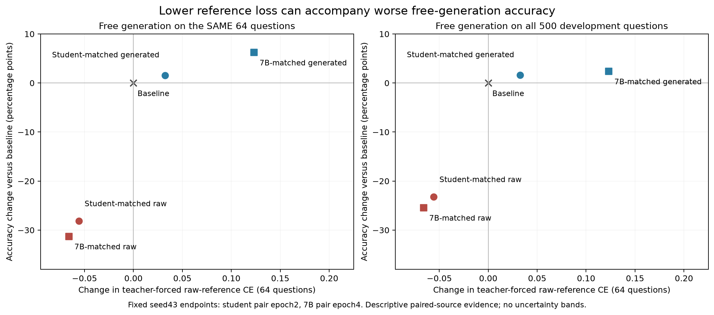

# 已完成证据的因果解释

**中间分析，更新至2026-09-10 09:31 UTC。主候选五seed完整MATH已完成，均值+0.804 pp，但跨seed/题目95%区间[-0.204,1.8161]跨零；其余家族、OOD及原生复核仍在执行，本文不是最终报告。** 数值以原始评分为主；严格最后答案框评分另列。pp 表示准确率百分点，区间默认逐题配对 bootstrap 95%，不自动包含自适应搜索校正。

## 1. 可以直接识别的设置问题：监督解答的构造

当前有足够证据说明，原始参考解答与所用训练配置的组合造成大幅退化，而 LoRA 本身并非没有学习能力。最直接的证据来自同问题、同顺序、同初始化、同优化参数、同样本曝光的目标替换。

| 比较 | 原始参考 | 生成解答 | 生成减原始 | 证据边界 |
|---|---:|---:|---:|---|
| 本轮1563道训练题，学生目标，seed43，固定epoch2，开发500 | 183/500 | 307/500 | +24.8 pp [20.6,29.2] | 单seed；改变整个目标文本 |
| 本轮1547道训练题，7B目标，seed43，固定epoch4，开发500 | 172/500 | 311/500 | +27.8 pp [23.4,32.2] | 单seed；改变整个目标文本 |
| 上轮1175道相同训练题，eager，三个seed，复用1500 | 757/741/753 | 832/819/814 | 均值+4.76 pp [2.91,6.56] | 独立训练seed，但评测材料已复用 |

本轮严格评分分别为177→307、169→311，差+26.0 pp [21.8,30.4]、+28.4 pp [24.0,32.8]。原始评分的最终109个探索配对经Holm校正后仍保留这两个大效应，校正p分别约9.7×10^-26、1.1×10^-28。另两个通过的是32B DFT在epoch2相对CE的退化，以及7B扩容生成目标在epoch3相对raw的改善；它们是中间checkpoint探索比较，不替代固定epoch4验证。它们也不是只提高训练集上的答案概率，而是改变了开发题的自由生成准确率。[本轮对照统计](results/post_sampling_primary_analysis.json)、[全局探索统计](results/development_pairs.json)、[上轮报告](../sft_diagnosis_20260908/causal_followup/REPORT.md)。

**识别到的是监督目标整体干预的效果，不是“文风”或“NLL”单独的因果效果。** 学生与7B目标token分别为745936、738631，对应raw参考为282937、272713。目标过程、长度、表达、tokenization一起改变；同问题和同优化步数不是同token或FLOP预算。不能把这组结果解释成“越长越好”“只要改格式就好”或“已经找到唯一内部机制”。

## 2. 为什么它不是纯评分或输出格式现象

严格评分的两个raw模型分别答对177、169题。将其全部缺失完整答案框或截断的输出无条件改判正确，最多为258、219题，仍低于同协议baseline298以及生成目标模型307、311。因而，**仅把已经标记的格式/截断输出修好，数学上不足以填平差距**。[上界核算](audits/raw_format_truncation_bounds.json)。

另有242、281条正常停止、完整boxed但判错的raw输出。固定抽取的四例可用整数、矩阵和代数计算直接反证：列出正确数列关系后把项数64写成65；矩阵点积算错；逆矩阵计算漏掉系数；改变变量定义使应为9的平方和变成1。这是实际求解错误的存在性证据，不是四例估计总体比例。[全文及核验](audits/raw_normal_boxed_review_decisions.json)。

对baseline及学生、7B、32B三个固定新目标模型，将生成预算2048延至4096，正确数分别299→299、307→308、311→312、265→264。严格评分32B为263→263，所谓少一题来自原评分器提取了循环文字中的偶然数字。1881条原正常停止文本完全一致，119条原截断文本前缀完全一致；在这些checkpoint和题目上，延长预算没有修复退化。[长度对照](results/long_budget_analysis.json)。

## 3. 修复损害不等于增加泛化能力

平衡抽取的256道已见训练题中，baseline答对128；学生三个seed151/146/155，7B为189/185/181。相对baseline的均值分别+8.85 pp [4.43,13.41]、+22.27 pp [16.15,28.26]，跨seed/题目区间也为正。LoRA可以在实际模型上学会已见问题并自由生成正确答案；这个刻意平衡的样本不代表全训练集准确率，也不能证明泛化。[已见题自由生成](results/train_free_generation_analysis.json)。

开发500题中，学生三个seed平均救回29道原错误题，同时丢掉26.67道原正确题；7B分别救回35.33、丢掉30。**小净收益是新增正确与新增错误相抵的可核算结果。** 这不等于已经证明一个特定参数层或优化器是遗忘的唯一原因。[保持/救回核算](results/coverage_conditioned_transfer.json)。

进一步的条件诊断中，43道baseline greedy错误但8次采样至少答对一次的题，学生/7B救回率24.81%/27.91%；51道8次都没有观察到正确的题，仅3.92%/2.61%。这支持当前监督更容易转化已有可解性，而不是广泛救回更难题的解释，但没有配平题目难度和覆盖，不能作为纯记忆机制的因果证明；0/8也不是概率为零。

旧1175条self监督全部来自baseline greedy已答对的问题，这是原数据构造的真实覆盖限制。本轮已补入原来greedy错误题、多解答及新问题，因此不能继续用“只训练正确题”解释本轮所有残余失败。

## 4. 针对具体解释做了哪些反证

下表均是固定端点开发比较，主要为seed43。区间跨零表示未能识别效果，不表示严格等价或普遍无效。

| 解释或干预 | 已完成结果 | 可以得出的结论 |
|---|---|---|
| 7B目标需要更大QKVO rank | r64相对r16：LR1e-5为297对293；LR5e-5为308对311 | 这两个设置未提供明确容量修复 |
| 更大的32B教师应更好 | 两学习率的QKVO16固定epoch4仅265/249；all-linear16为269/269 | 教师规模不能替代本地目标与训练效果验证；严格同题来源对照另行完成 |
| 32B的装饰性Markdown是主要问题 | 清理后272/268，对未清理265/249；仍低于299 | 有部分恢复信号，不能解释全部退化 |
| 只要选择学生NLL更低的同题解答 | 两LR最低NLL均比随机同题目标少6题：292对298、300对306 | 没有支持该具体NLL选择规则；不是所有兼容性假说的反证 |
| 完成cosine衰减就会修复 | 学生302对307；7B295对311 | 当前停止轮数与horizon不匹配不是已证明的修复点 |
| 沿原8轮horizon继续训练更久 | 7B从epoch4的311继续到epoch5–8为294/300/307/309 | 固定epoch8没有超过原epoch4；续训共享训练历史，不是额外seed |
| 增加同题不同解答 | 多解答295对重复294；严格两者294 | 当前多样性干预未识别净收益 |
| 增加学生目标问题数量 | 4149条扩容与同槽数旧题重复均296 | 当前学生扩容未提供收益；不是规模永远无效 |
| 保留原本greedy正确题的旧目标 | 学生/7B均296，对原307/311 | 保持这部分目标文本本身没有改善表现 |
| 对7B加CE+KL(base‖SFT) | KL0/.1/1为311/301/309；KL下降但自由生成保持率未改善 | teacher-forcing状态上的KL降低不等于自由生成能力保留 |
| 对7B改DFT及DFT+KL | KL0/.1/1为282/297/300，对应CE311/301/309 | DFT没有超越当前CE；KL缓解DFT损害不等于超过baseline的稳定收益 |
| 对高NLL的32B目标改DFT | 两LR268对265、272对249；严格264对263、270对245 | 大LR部分恢复，但仍低于baseline299/298 |
| 对学生目标改DFT | 两LR298对307、289对288 | 未找到一致修复 |

续训计划与端点见[原horizon续训计划](audits/teacher7_continuation_plan.json)、[epoch8汇总](results/evaluation/dev/teacher_all_lr5e5_extended_s43_epoch8/math_summary.json)。

原研究还完成了dense七类矩阵与full SFT、多学习率及三seed确认，具体结果见[前阶段报告](../sft_diagnosis_20260908/REPORT.md)。那些分支用raw目标与较早的算术/推理协议，均未形成超过baseline的修复。它们不应重复训练或当成当前生成目标+SDPA条件下的full对照；本轮没有完成这一新组合的full-vs-LoRA五seed矩阵，所以不能声称已排除所有低秩容量影响或证明LoRA与full最优效果相同。

对应可复算来源：[容量/多解答](results/teacher_followup_control_analysis.json)、[格式/调度/NLL/扩容](results/midnight_fixed_control_analysis.json)、[保留能力](results/retention_control_analysis.json)、[CE/DFT系数网格](results/objective_coefficient_grid.json)、[跨目标源DFT](results/dft_source_control_analysis.json)。

网格中DFT+KL1减DFT0的raw差+3.6 pp恰处统计边界：原定10000次bootstrap区间[0,7]，另一个事先固定重采样种子给[0.2,7.2]；离散精确bootstrap给[0.2,7.2]，精确McNemar p=0.0567。不同程序不必在离散边界一致。原结果全部保留，不挑选最有利的下界把边缘恢复包装成稳健结论。[数值边界审计](audits/objective_bootstrap_boundary.json)。

## 5. 为什么追加7B扩容的五seed验证

清理后旧核心1542题加新增2603题，共4145条；其中新题有609道baseline greedy错误。按相同位置数重复旧核心作为控制，再设置相同新增问题使用raw参考的控制。扩容与重复总token1989823/1974549，接近但不完全相等。所有保守排除和已知过程错误有记录，未经抽查的目标不视为证明正确。

| 固定seed43模型 | 开发500：扩容/重复/raw新增 | 复用1500：扩容/重复/raw新增 |
|---|---|---|
| epoch1..4有效更新平均 | 309 / 296 / 290 | 852 / 829 / 774 |
| 未平均epoch4 | 300 / 289 / 280 | 833 / 793 / 774 |

1500题上平均扩容减重复为+1.53 pp [-0.53,3.73]，未平均为+2.67 pp [0.60,4.80]。生成目标减raw分别+5.20 pp [3.13,7.27]、+3.93 pp [1.80,6.07]。九个事先列明配对的Holm敏感性只保留生成减raw的两个比较，不能声称覆盖或平均步骤已单独得到稳健证明。[1500完整分析](audits/coverage_math1500_analysis.json)、[严格评分及多重比较](audits/coverage_math1500_sensitivity.json)。

扩容平均模型852对baseline818，差+2.27 pp [0.27,4.27]；但对旧配方平均seed43的845，仅+0.47 pp [-1.47,2.40]。这项单seed结果为四个新seed重复提供了理由；它本身没有证明扩容是更好的配方。[五seed扩容前置计划](audits/teacher7_expansion_seed_replication_plan.json)。

补齐全部五seed后，开发集平均模型为309/301/300/298/303，未平均epoch4为300/302/309/308/299，baseline299。前者均值+0.64 pp，题目区间[-2.36,3.72]、seed/题目区间[-2.56,3.68]；后者+0.92 pp，两种区间[-1.96,3.84]、[-2.16,3.96]。平均减未平均为-0.28 pp，题目区间[-1.76,1.20]、seed/题目区间[-2.48,2.00]。严格评分baseline298，平均308/300/299/297/303，未平均300/301/308/307/298；结论同样没有全seed严格为正。全部5500个严格判断没有parser warning。[五seed开发分析](results/expanded_five_seed_development.json)。

扩容平均未通过事先固定的开发替换规则，因此原主候选不变。为完整比较扩容与平均两个因素，另在任何最终5000/OOD输出前登记了五个未平均扩容模型的补充评测。最初安排在原生复核后复用GPU1；用户允许三张卡后，以单独执行修订提前到GPU2，实际跨卡逐题复现已通过；其后在任何OOD输出前作共享队列执行修订，GPU2/3完成各自当前MATH后共同处理OOD，新派发任务结束上限15:00 UTC，研究硬截止仍15:16:40 UTC。模型和统计标准不变，不能事后替换原主检验。[原补充计划](audits/expanded_unaveraged_supplement_plan.json)、[三卡执行修订](audits/gpu2_additional_execution_amendment.json)。

## 6. 目标过程质量是实在的问题，但还不是量化的唯一病因

最终答案过滤和14B弱过程评分都会保留明确错误。已记录错误代数改写、错误因数分解、图形角色混淆、错误计数后跳到正确参考答案等反例。历史guided数据还有817条改写失败后回退raw参考，只有1183条接受改写，因此旧分支不能称作纯验证改写训练。

本轮对选定目标、扩容目标、外部OpenMath分别做分层审查及精确反例核验。外部12000条保持隔离：24条额外judge-sound抽样中，在6条long augmented MATH层发现4条实质错误。由于这是分层条件抽样，不能据此估计全数据错误率；也没有训练过滤前后配对模型，不能宣称过滤收益已被证明。[外部路线决定](audits/openmath_training_route_decision.json)、[精确反例](audits/openmath_judge_sound_review_decisions.json)。

同题32B目标NLL在全部1465题都高于7B，平均差0.3791 [0.3728,0.3856]；学生与7B共有1429题差0.00165、区间跨零。这是目标与学生分布差异的测量，不是高NLL致害的独立因果证明。Markdown清理后NLL反而上升，最低NLL同题选择也没有改善，因此不能把单一NLL阈值当作已验证修复。[逐目标NLL](audits/selected_target_nll.json)。

## 7. 数值、评测和证据设计的问题要分开

另外，按结果已知后的固定日志诊断，检查两个同题raw/生成对照的端点以及旧7B、扩容7B全部五seed，共13个运行、7920步。所有记录的裁剪前梯度范数有限且非零，最大0.7768；本地clip1实现的缩放系数在这些步骤均被上限截为1，故没有实际缩小梯度。**“频繁触发clip1限制学习”不能解释这些运行。** 这是现有日志的完整计数，不是新增优化器干预；梯度大小不能证明方向正确，也不等于AdamW的实际参数更新量。[逐步日志汇总](results/training_gradient_log_analysis.json)、[结果后诊断声明](audits/training_gradient_log_plan.json)。

旧研究的实际25步训练前缀复核显示，BF16 eager与FP32参考的后续梯度方向严重不一致；SDPA math更接近。该数值问题是真实历史发现，本轮复用已核实的SDPA训练协议。但旧raw在SDPA下甚至退化更多，说明注意力算术与目标来源有交互，不能称换backend已经解释或解决全部问题。

本轮所有主要比较使用相同BF16 baseline、prompt、LoRA加载方式、greedy与预算；不混用历史FP32的304/500和当前BF16的299/500。多次调度交接后baseline与非零adapter各500条文本、评分、长度、停止原因都逐项复现。最终主候选已用HF/PEFT原生推理复查全部五seed：baseline305/500，五seed304/297/306/300/285，均值−1.32 pp，seed/题目95%区间[-4.52,2.00]，未稳定超过baseline。[当前版本桥接](audits/evaluator_version_bridge.json)、[最终原生前置方案](audits/final_native_protocol_plan.json)。

500题上只有数题的差异本来就难以检出。现有五seed平均模型在500题的效应区间半宽约2.9–3.0 pp；更大样本可减少题目抽样误差，却不能消除选模偏差。开发500是MATH train的历史留出，不是官方MATH-500；1500与完整5000均有历史复用，只有本轮预留878道数学OOD在选模前没有模型输出。最终报告必须保留这些界限。[精度核算](audits/validation_precision.json)、[数据契约](audits/final_data_contract.json)。

目前既不能从一组不显著结果证明LoRA在任何设置下不能SFT，也不能把开发最优seed当作稳定成功。最终证据将按固定五seed、完整MATH、等权数学OOD、严格评分及原生后端分别报告，主标准不在看到结果后放宽。

## 8. 一个实际反向的诊断指标：参考解答CE

训练记录中的`dev_ce`是在固定64道开发题的原始参考解答上做teacher forcing。本次核对其全部问题/解答与500题开发集的严格对应，再读取同一checkpoint在同64题的自由生成结果，没有新增训练或选择其他端点。

| 固定模型 | 64题参考CE | 同64题正确数 | 全500题正确数 |
|---|---:|---:|---:|
| Baseline | 0.8105 | 47 | 299 |
| 学生配对raw，epoch2 | 0.7548 | 29 | 183 |
| 学生生成目标，epoch2 | 0.8430 | 48 | 307 |
| 7B配对raw，epoch4 | 0.7443 | 27 | 172 |
| 7B生成目标，epoch4 | 0.9335 | 51 | 311 |

两个raw模型的参考CE都下降，自由生成准确率却大幅下降；两个生成目标模型的参考CE都上升，自由生成更好。**这给出“参考解答似然不是当前任务准确率的可靠替代指标”的直接反例。** 它不是所有验证loss无用的定理，也不证明用户历史上实际用loss选错了checkpoint。CE来自训练协议的HF/BF16 teacher forcing，准确率来自统一vLLM自由生成；这里只比较固定设置中两个不同指标的实际关系，不把它当作纯backend消融。日志最后一个训练step的CE也没有被误当作全训练集平均。[对齐审计](audits/loss_accuracy_alignment.json)。

新增HF原生自由生成复核使用同64题：baseline47，学生raw32、生成目标47，7B raw28、生成目标50；参考CE仍为上表固定值。因此两个raw目标模型的CE下降与生成准确率下降也在HF内同时出现。学生生成目标在HF这64题只与baseline持平，7B提高，不能宣称两者都提高。teacher forcing与自回归的batch/cache仍不同，这一对齐检验的是指标对应关系，不是算术路径完全等价。

同128题的原生目标干预已完成：baseline74，学生raw51/生成76，7B raw42/生成80；生成减raw为+19.53 pp [10.16,28.91]和+29.69 pp [21.09,38.28]。严格评分学生raw48/生成76，差+21.88 pp [12.50,32.03]，教师计数不变。两个后端各640条严格评分都没有warning。生成目标相对各自HF baseline的区间仍跨零，并且只有seed43；这是跨已测后端的目标损害证据，不能替代五seed泛化确认。[完整原生控制](results/native_target_control_analysis.json)、[最终复核](audits/native_target_control_final_review.json)。

## 9. 其余已完成的诊断没有被省略

逐题等权的`example_mean`也已在旧自产目标集上完成：seed43、LR1e-5，epoch1–4为292/298/297/304，baseline299；固定epoch4差+1.0 pp，配对区间[-2.2,4.2]，救回36题、丢失31题，开发比较Holm校正p为1。该单seed结果没有建立稳定超baseline收益，也没有独立证明目标长度权重是主要病因。它使用旧自产目标，没有完成当前raw/生成目标×两种权重的交叉控制，因此不能单独分解当前目标替换中的长度/题目权重贡献。token平均与逐题平均是不同的合法目标；这里不能把两者区别称为实现错误。[完整开发统计](results/dev_analysis.json)、[固定端点](results/evaluation/dev/greedy_example_lr1e5_s43_epoch4/math_summary.json)。

初始QKVO16学习率筛查也已完成，不能把1e-4当作尚未测试的方向。以下同一目标来源内问题、seed43、结构和训练规则相同，只有学习率不同；端点为epoch4，完整轨迹也保留。Baseline299/500，均为探索性单seed，不能挑中间最高点作独立验证。

| 目标来源 | LR | epoch1/2/3/4正确数 |
| --- | --- | --- |
| 学生生成 | 1e-05 | 299/307/297/288 |
| 学生生成 | 5e-05 | 294/288/295/290 |
| 学生生成 | 0.0001 | 299/301/287/291 |
| 7B生成 | 1e-05 | 303/303/298/293 |
| 7B生成 | 5e-05 | 300/302/304/311 |
| 7B生成 | 0.0001 | 299/303/294/298 |
| 旧greedy自生成 | 5e-05 | 296/298/301/294 |
| 旧greedy自生成 | 0.0001 | 299/280/297/282 |

较大的1e-4在本次两个生成来源的固定epoch4仍未高于baseline；这不证明所有更高学习率都无效。较早研究的旧self低学习率运行保留在前目录，未虚构为当前同名运行。[完整来源目录](audits/initial_learning_rate_screen_catalog.json)。

将LoRA从QKVO扩至all-linear、保持r16的六个单seed配置，其开发500题完整轨迹如下。Baseline为299；不能挑中间最高点充当独立确认，也不能从六个有限配置推导所有容量设置都无效。

| 目标来源 | 学习率 | epoch1 / 2 / 3 / 4正确数 |
|---|---|---|
| 学生 | 1e-5 | 306 / 303 / 298 / 297 |
| 学生 | 5e-5 | 297 / 297 / 290 / 291 |
| 通用7B | 1e-5 | 291 / 291 / 290 / 292 |
| 通用7B | 5e-5 | 298 / 297 / 303 / 299 |
| 通用32B | 1e-5 | 275 / 271 / 260 / 269 |
| 通用32B | 5e-5 | 265 / 271 / 253 / 269 |

数学专用7B教师的固定epoch4在两学习率为303/298；这仍是单seed、目标整体变化的结果，没有提供五seed稳定修复。以上既有输出的路径及哈希汇总在[补充控制目录](audits/completed_auxiliary_control_catalog.json)，没有重新训练。

对学生模型的有效更新缩放至0.25/0.50/0.75，epoch2正确数为299/289/300，未缩放为307；epoch4为299/297/294，未缩放为288。零更新的299及全部文本复现baseline。这说明减小一个已训练更新有时能恢复退化，却没有在该网格内超过较好的未缩放端点；这些派生权重不是新增训练seed。平均模型另做有效更新谱审计：所查旧配方五seed及扩容seed43虽以rank64存储，前16个奇异方向占超过99%的平方谱能量。但未实际压缩并推理，不能据此断言rank16输出等价或排除容量效应。[谱审计](audits/average_effective_update_spectrum.json)。

随机解码也做了三训练seed复查：同256题、每题8次、temperature0.7/top-p0.95、固定解码seed。Baseline的每次抽样平均准确率57.23%，学生seed43/44/45为59.08/58.11/58.25%，平均差+1.25 pp；题目区间[-0.26,2.82]、seed/题目区间[-0.39,2.91]。三个点估计都为正，区间仍跨零；同256题的greedy正确数为baseline162、学生160/161/155，三项解码方式处理效应差的区间也都跨零。这不能证明greedy掩盖了一个已建立的稳定收益。每题8次的均值估计单次抽样准确率，并非“8次任意一次答对”的成功率；该开发复查接在seed43试点后，不是预留OOD确认。[全部三seed及复现记录](audits/sampling_seed_stability.json)。

较早的2048条学生轨迹扩容，与同曝光槽数重复控制相比为299对309，差-2.0 pp [-4.6,0.6]；它与后续4149条扩容是不同干预，均未遗漏。完整原始和严格结果见[初期覆盖对照](results/post_sampling_primary_analysis.json)。上述探索共同约束若干具体修复假说，不能把不显著结果累加为LoRA普遍无效的证明。

## 补充：实际评分分歧及语义歧义未恢复可靠提升

完整MATH完成后，逐条读完baseline与冻结主方案五seed的全部47条raw/strict分歧（35道题），并注明事后、非盲，由本助手进行数学复核。Baseline20条中16个正确无框答案、2个错误、2个歧义；SFT合计27条中2个正确、19个错误、6个歧义。正确最终答案不保证推导有效。8个歧义中4个源于未完成或相互矛盾，另4个源于方框运算符与答案标记冲突。仅改47条、逐条作最不利/最有利赋值时，完整5000均值收益+0.760至+0.824pp，其余3500为+0.143至+0.234pp；两种配对95%区间均跨零。

进一步检查index4060全部21个输出：题目定义方框为约数个数算子，目标值为d(d(11)×d(20))=6，但通常最终答案也用方框标记。7份boxed12若按答案标记解释是错误12，若按题目算子字面解释则为正确6，虽然其过程只明确计算了内层乘积；其他14份boxed8/60/66在两种解释下都错。最初“21份均错”的审查过强，已保存原记录并作[明确语义修订](audits/math_operator_semantics_revision.json)，不能将这种歧义当成确定false-accept。

追加分析对baseline和所有SFT统一采用同一方框解释，再对其他4条歧义求界。答案标记解释：完整5000效应+0.780至+0.828pp，seed/题目区间分别[−0.228,+1.788]和[−0.180,+1.840]；其余3500为+0.171至+0.240pp。字面约数算子解释：完整5000为+0.776至+0.824pp，seed/题目区间分别[−0.232,+1.784]和[−0.1801,+1.836]；其余3500为+0.166至+0.234pp。两种一致解释下，所有区间仍跨零，3500题seed44在最有利情形都仅持平。评分偏差与表示歧义确实存在，但这些局部修订仍未恢复可靠提升。其他一致评分未全面验证，不能称为无误差新标准，也不能替换冻结的成功条件。

证据：[47条完整数学复核](audits/math_scoring_disagreement_review_decisions.json)、[47条敏感性](results/math_manual_disagreement_sensitivity.json)、[方框算子题21模型](audits/math4060_operator_gold_review.json)、[两种统一解释的追加敏感性](results/math4060_followup_sensitivity.json)。全部7个完整MATH评分比较超时案例也已读完，独立数学界限支持原先判错；已与最终完整清单逐条绑定；主13条与补充2条评分warning全部复核，无未审核条目，原评分保留。

## 11. 完整OOD揭示严格评分的格式效应

主方案完整MATH的五seed均值为+0.804 pp，但seed/题目95%区间[-0.204,1.816]；五seed平均救回413.8个原错误，同时丢失373.6个原正确，净增40.2/5000。预留数学OOD主宏平均−1.914 pp，五seed全部负；严格宏平均却+4.233 pp，五seed全部正。差异主要来自SVAMP baseline262/300在严格规则下变为206/300，而主方案250/253/244/249/251完全不变。全21模型、4个OOD的74份raw/strict分歧全文复核确认，SVAMP56个baseline分歧中54个是明确正确但无框答案，2个存在题面时序问题；两个补充模型无框答案也正确。严格要求box会改变测量目标，不能把这部分分差当作通用推理改善。

全部74份中61份最终答案可确认正确、9份错误、4份未解决；有些正确答案仍含错误推导。Minerva还出现平方能量表达式被strict误接受，Olympiad存在含错误成员的答案列表被strict接受。具体反例说明不能把任一解析器视作数学真值。原评分与冻结成功标准不变，独立的事后敏感性只处理已复核分歧和另查出的3个正确百分数答案，其他一致判分仍未经全面认证。[全部OOD分歧复核](audits/ood_scoring_disagreement_review.json)、[覆盖清单](audits/ood_scoring_disagreement_inventory.json)、[敏感性声明](audits/ood_manual_sensitivity_plan.json)。

固定规则另抽10个跨任务恢复/损失案例，完整阅读baseline与seed43的20份过程，存在真实修复也存在算术、角色和约束错误导致的损失。SVAMP107的所谓恢复实际上是gold30与题面Zachary15减John45的方向冲突，不能当推理能力增加。[固定案例复核](audits/final_transition_review_decisions.json)。这些观察不证明残余瓶颈的唯一原因；当前生成目标+SDPA的五seed全参数训练对照仍未完成，因此不能声称已排除所有容量或优化交互。
