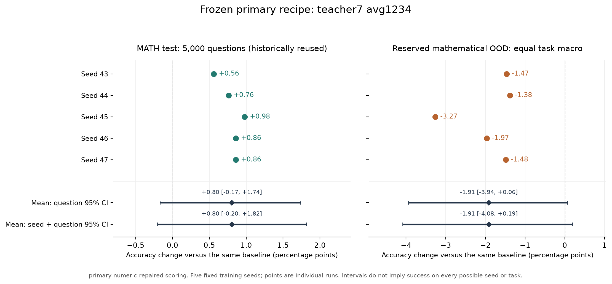
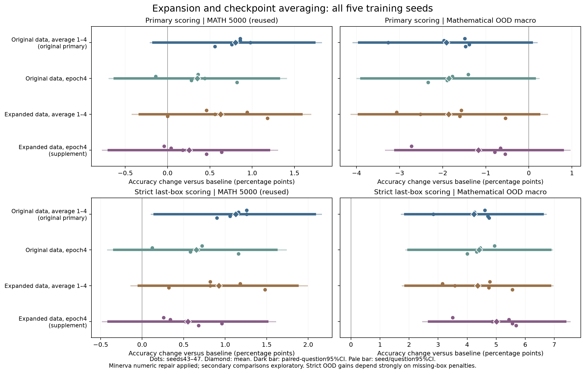

# Qwen2.5-1.5B-Instruct 的 LoRA SFT：失败原因与五seed验证

**本轮已用受控目标替换识别出原设置的监督构造问题，但固定主配方没有同时通过全部预设的五seed MATH/OOD标准。因此不能宣布已经修复为稳定的一般性提升，也不能把有限失败改写成“LoRA不能SFT”。**

研究开始：2026-09-09 15:16:40 UTC。报告生成：2026-09-10 12:43:04 UTC，已用21.44小时，硬截止2026-09-10 15:16:40 UTC。初期上限为两张GPU，使用GPU1/3；用户随后明确允许三张卡，于2026-09-10 06:27:57 UTC登记[执行修订](audits/gpu2_additional_execution_amendment.json)后增加GPU2，最多同时三张，原时间截止不变。逐题输出、未合并adapter、配置、数据哈希和失败记录均保留。

## 对问题的直接回答

本轮证据支持**原始参考解答监督存在可由受控实验定位的问题**：它与当前优化协议的组合造成了可重复的自由生成损害。但你追问的是此前修复之后为何仍没有稳定超过baseline。对这一更进一步的问题，目标替换的恢复证据只解释了原方案的大幅退化；它并未单独证明残余泛化瓶颈的唯一原因，也未给出已验证充分的修复配方。下文分别报告已定位的干预效应与最终多seed泛化结果。

最明确的原因不是“LoRA参数没有更新”，而是**当前原始参考解答监督与训练配置的组合，优化了参考文本的模仿，却大幅损害自由生成答题；替换监督可以修复大部分损害，但残余泛化收益必须另行验证**。两个同题控制的生成目标减raw为+24.8与+27.8个百分点，严格评分更大，并有上轮不同题集三seed同方向证据。格式/截断输出的乐观上界仍不足以弥补差距。

这里能精确识别的是目标构造这一整体干预。长度、推导内容、表达和tokenization同时改变，不能声称已隔离出唯一的“文风”“NLL”或某层参数机制。学习确实发生：已见题自由生成明显改善；开发新题上，救回原错误题与丢掉原正确题相抵。增加rank、更大教师、DFT、KL、最低NLL选择、多解答及扩容等具体干预的证据分别列出，未成功分支没有丢弃。

正式冻结主候选为**旧7B目标，epoch1–4平均**。完整MATH5000上五seed为**2822/2832/2843/2837/2837**，baseline **2794**；均值差**+0.80 pp**，题目区间[-0.17, +1.74]，seed/题目区间[-0.20, +1.82]。预留数学OOD等权宏平均差**-1.91 pp**，两种区间[-3.94, +0.06]、[-4.08, +0.19]。以下给出所有seed、任务、对照和严格敏感性。

完整MATH的实际变化并非完全不学习：五个seed平均救回baseline答错的413.8题，同时丢掉baseline原本答对的373.6题，净增仅40.2/5000。也就是说，提升与损失大部分相抵；同一模型换到Olympiad及SVAMP时，五个seed的主评分均低于baseline。这个逐题分解精确描述了当前没有稳定净收益的表现，但尚不能单独把相抵归因于容量、目标token权重或某个优化机制。

区间跨零表示当前证据不足以确定正向收益，不能据此断言真实效应恰好为零。有限配方、任务和seed的失败也不构成LoRA普遍不能SFT的证明。

评分器的敏感性在OOD上尤其大：主方案严格宏平均为+4.23 pp，而主评分为−1.91 pp。逐条复核确认，SVAMP baseline的56个raw/strict分歧中，54个是明确的正确无框答案，另2个有题面时序歧义；五个主候选的SVAMP分数在两种规则下完全不变。因此不能将严格评分的正增益解释成一般推理能力提升。完整74条分歧复核后，即使另行补回3份正确百分数答案、并给4条歧义最有利于SFT的赋值，主方案OOD宏平均仍为−1.69 pp，五个seed仍全部低于baseline；不利边界为−1.94 pp。两种seed/题目区间仍跨零，因此这是未显示正向泛化的证据，不是确证总体负效应。逐题向量和重新抽样的边界分析见后文；冻结的原始分数均保留。

## 研究设计与可外推范围

学生与baseline都是已经经过指令后训练的Qwen2.5-1.5B-Instruct，固定snapshot `989aa7980e4cf806f80c7fef2b1adb7bc71aa306`。本轮70个未续训运行的零B及同seed/同结构初始权重核对通过，续训分支单独标记，见[初始化审计](audits/initialization_all_current.json)。旧研究的mask、causal shift、真实梯度累积、保存加载及attention算术证据直接复用，本轮只审计新增路径，避免重做已完成的实验。[前轮报告](../sft_diagnosis_20260908/causal_followup/REPORT.md)。

报告中的逐题数学复核由本助手执行，保留原文、计算或反例及文件哈希；不是独立人类盲评。事后追加的审查明确标注结果已知，正确最终答案不自动代表推导有效。未解决的歧义保留并做边界分析，不通过选择有利裁定更改成功标准。

开发500题来自官方MATH train的历史留出，**不是官方MATH-500**。本轮用于选模的1500题和完整test5000均有历史复用；不能称为独立未触及测试。预先固定的补充分析排除本轮选模1500题，保留3500题，它仍有历史复用。新增OOD878题在配方冻结前没有模型输出：Minerva272、Olympiad266、SVAMP300按任务准确率等权平均，AMC23的40题只作补充。它们衡量数学及定量推理迁移，不代表非数学通用能力，也不是每个数据集全部官方协议的复现。下载版本、文件哈希及原始来源见[固定下载记录](audits/ood_downloads.json)。

两候选的开发选择规则在四个扩容seed训练前固定：扩容五seed只有在原始及严格评分下都全部高于开发baseline、且均值都高于旧平均时，才取代旧候选。三个五seed家族无论被选与否都完成最终评测；权重、数据、端点、脚本及协议在任何本轮完整5000/OOD输出前冻结。[规则](audits/final_selection_rule.json)、[实际决定](audits/final_selection_decision.json)、[冻结方案](results/confirmation_plan.json)。

训练主要使用QKVO LoRA r16/alpha16/dropout0，冻结BF16基座、FP32 A/B与AdamW状态、SDPA math，microbatch4、有效batch16、completion token-mean CE、clip1、weight decay0.01、64条样本warmup、8轮cosine horizon并固定在epoch4停止。平均模型通过拼接因子实现四个有效更新BA的数学平均，推理rank64；不是分别平均A/B，也不是预测投票。数学等式和BF16运行时数值等价须区别。[详细方法](METHODS.md)、[复现](REPRODUCE.md)。

主推理协议固定BF16、vLLM TRITON、未合并LoRA、batch-invariant、greedy、2048新token、4096总context、每批最多500题。所有对照共享baseline协议，不混用历史FP32的304/500与当前BF16的299/500。MATH等任务的主评分复用完整文本解析，严格最后完整boxed评分作敏感性；Minerva的191道数值题在两种评分中都使用下文的前置数值修复；全部parser warning逐条复核而不挑有利评分。

## 固定五seed的完整结果

下列计数依次为seed43/44/45/46/47。区间以题目为配对单位；跨seed区间共享题目抽样，避免把同一题的五次回答当成五道独立题。主判断要求完整MATH与OOD宏平均各自五seed全正、题目及seed/题目95%区间下界都严格大于零。有限五seed不是所有可能seed的保证；OOD宏平均为正也不保证每个benchmark都提升，因此各任务与各seed逐项列出。宏平均的题目区间在三个固定任务内重采样题目；seed/题目区间还重采样这五个训练seed。两者都不包含从所有数学任务中抽选benchmark的不确定性。非主家族与对照的区间保持探索性，不能替代主标准。

### 主评分（Minerva数值已按前置方案修正）

| 集合 | 配方 | Baseline | 五seed正确数 | 均值Δ pp | 题目95%CI | seed/题目95%CI |
| --- | --- | --- | --- | --- | --- | --- |
| math_reused5000 | 旧7B目标，epoch1–4平均（主） | 2794/5000 | 2822/2832/2843/2837/2837 | +0.80 | [-0.17, +1.74] | [-0.20, +1.82] |
| math_reused5000 | 扩容7B目标，epoch1–4平均 | 2794/5000 | 2853/2794/2822/2841/2817 | +0.63 | [-0.33, +1.58] | [-0.42, +1.69] |
| math_reused5000 | 旧7B目标，未平均epoch4 | 2794/5000 | 2835/2808/2816/2787/2812 | +0.35 | [-0.62, +1.32] | [-0.69, +1.40] |
| ood_minerva | 旧7B目标，epoch1–4平均（主） | 57/272 | 60/60/62/65/61 | +1.69 | [-1.84, +5.44] | [-2.06, +5.51] |
| ood_minerva | 扩容7B目标，epoch1–4平均 | 57/272 | 57/63/58/56/56 | +0.37 | [-3.24, +4.12] | [-3.53, +4.34] |
| ood_minerva | 旧7B目标，未平均epoch4 | 57/272 | 53/53/57/59/57 | -0.44 | [-4.19, +3.31] | [-4.34, +3.53] |
| ood_olympiad | 旧7B目标，epoch1–4平均（主） | 55/266 | 51/49/40/43/49 | -3.23 | [-6.84, +0.38] | [-7.29, +0.68] |
| ood_olympiad | 扩容7B目标，epoch1–4平均 | 55/266 | 56/47/49/43/55 | -1.88 | [-5.79, +2.03] | [-6.24, +2.41] |
| ood_olympiad | 旧7B目标，未平均epoch4 | 55/266 | 50/50/49/46/50 | -2.26 | [-6.02, +1.43] | [-6.24, +1.58] |
| ood_svamp | 旧7B目标，epoch1–4平均（主） | 262/300 | 250/253/244/249/251 | -4.20 | [-7.47, -1.07] | [-7.73, -0.93] |
| ood_svamp | 扩容7B目标，epoch1–4平均 | 262/300 | 256/250/245/249/249 | -4.07 | [-7.47, -0.80] | [-7.67, -0.60] |
| ood_svamp | 旧7B目标，未平均epoch4 | 262/300 | 251/255/252/254/255 | -2.87 | [-5.93, +0.20] | [-6.20, +0.33] |
| ood_amc23 | 旧7B目标，epoch1–4平均（主） | 10/40 | 8/12/9/10/11 | +0.00 | [-12.00, +12.00] | [-12.50, +12.50] |
| ood_amc23 | 扩容7B目标，epoch1–4平均 | 10/40 | 13/12/14/12/14 | +7.50 | [-3.50, +19.50] | [-4.00, +20.00] |
| ood_amc23 | 旧7B目标，未平均epoch4 | 10/40 | 7/12/12/10/11 | +1.00 | [-11.00, +12.50] | [-11.50, +13.50] |

| 数学OOD宏平均 | 五seedΔ pp | 均值Δ pp | 题目95%CI | seed/题目95%CI | 每seed为正 |
| --- | --- | --- | --- | --- | --- |
| 旧7B目标，epoch1–4平均 | -1.47/-1.38/-3.27/-1.97/-1.48 | -1.91 | [-3.94, +0.06] | [-4.08, +0.19] | 未通过 |
| 扩容7B目标，epoch1–4平均 | -0.54/-1.60/-2.52/-3.07/-1.57 | -1.86 | [-3.94, +0.24] | [-4.13, +0.43] | 未通过 |
| 旧7B目标，未平均epoch4 | -2.34/-1.89/-1.86/-1.77/-1.40 | -1.85 | [-3.89, +0.14] | [-3.99, +0.23] | 未通过 |

主标准：primary_every_seed_above_base：通过；primary_mean_ci_above_zero：未通过；primary_seed_question_ci_above_zero：未通过；ood_every_seed_above_base：未通过；ood_mean_ci_above_zero：未通过；ood_seed_question_ci_above_zero：未通过。

### 严格最后答案框评分

| 集合 | 配方 | Baseline | 五seed正确数 | 均值Δ pp | 题目95%CI | seed/题目95%CI |
| --- | --- | --- | --- | --- | --- | --- |
| math_reused5000 | 旧7B目标，epoch1–4平均（主） | 2774/5000 | 2819/2827/2837/2832/2837 | +1.13 | [+0.15, +2.08] | [+0.11, +2.16] |
| math_reused5000 | 扩容7B目标，epoch1–4平均 | 2774/5000 | 2848/2790/2815/2833/2815 | +0.92 | [-0.04, +1.87] | [-0.14, +1.99] |
| math_reused5000 | 旧7B目标，未平均epoch4 | 2774/5000 | 2832/2803/2808/2780/2810 | +0.65 | [-0.34, +1.62] | [-0.42, +1.73] |
| ood_minerva | 旧7B目标，epoch1–4平均（主） | 57/272 | 60/60/62/65/61 | +1.69 | [-1.84, +5.44] | [-2.06, +5.51] |
| ood_minerva | 扩容7B目标，epoch1–4平均 | 57/272 | 57/64/58/56/57 | +0.51 | [-3.16, +4.26] | [-3.38, +4.56] |
| ood_minerva | 旧7B目标，未平均epoch4 | 57/272 | 54/53/57/59/58 | -0.29 | [-4.04, +3.46] | [-4.26, +3.68] |
| ood_olympiad | 旧7B目标，epoch1–4平均（主） | 55/266 | 51/48/39/43/48 | -3.46 | [-7.07, +0.15] | [-7.52, +0.45] |
| ood_olympiad | 扩容7B目标，epoch1–4平均 | 55/266 | 55/47/48/43/55 | -2.03 | [-5.94, +1.88] | [-6.47, +2.26] |
| ood_olympiad | 旧7B目标，未平均epoch4 | 55/266 | 50/50/49/46/50 | -2.26 | [-6.02, +1.43] | [-6.24, +1.58] |
| ood_svamp | 旧7B目标，epoch1–4平均（主） | 206/300 | 250/253/244/249/251 | +14.47 | [+9.40, +19.47] | [+9.20, +19.67] |
| ood_svamp | 扩容7B目标，epoch1–4平均 | 206/300 | 256/250/245/249/249 | +14.60 | [+9.47, +19.67] | [+9.20, +19.87] |
| ood_svamp | 旧7B目标，未平均epoch4 | 206/300 | 251/255/252/254/255 | +15.80 | [+10.73, +20.73] | [+10.60, +21.00] |
| ood_amc23 | 旧7B目标，epoch1–4平均（主） | 10/40 | 8/12/9/10/11 | +0.00 | [-12.00, +12.00] | [-12.50, +12.50] |
| ood_amc23 | 扩容7B目标，epoch1–4平均 | 10/40 | 13/12/14/12/14 | +7.50 | [-3.50, +19.50] | [-4.00, +20.00] |
| ood_amc23 | 旧7B目标，未平均epoch4 | 10/40 | 7/12/12/10/11 | +1.00 | [-11.00, +12.50] | [-11.50, +13.50] |

| 数学OOD宏平均 | 五seedΔ pp | 均值Δ pp | 题目95%CI | seed/题目95%CI | 每seed为正 |
| --- | --- | --- | --- | --- | --- |
| 旧7B目标，epoch1–4平均 | +4.76/+4.71/+2.83/+4.25/+4.61 | +4.23 | [+1.87, +6.60] | [+1.73, +6.72] | 通过 |
| 扩容7B目标，epoch1–4平均 | +5.56/+4.74/+3.58/+3.15/+4.78 | +4.36 | [+1.88, +6.86] | [+1.76, +6.94] | 通过 |
| 旧7B目标，未平均epoch4 | +4.01/+4.33/+4.36/+4.45/+4.94 | +4.42 | [+1.98, +6.86] | [+1.88, +6.93] | 通过 |

主标准：primary_every_seed_above_base：通过；primary_mean_ci_above_zero：通过；primary_seed_question_ci_above_zero：通过；ood_every_seed_above_base：通过；ood_mean_ci_above_zero：通过；ood_seed_question_ci_above_zero：通过。

主/严格逐题统计与所有控制差见[主分析](results/confirmation_analysis.json)、[严格分析](results/confirmation_analysis_strict.json)。图片的CSV、SVG、PDF及源哈希均在figures目录。

### 主候选与两个固定对照的直接配对差

这些是次要比较，未校正全部探索历史；相对baseline为正不等于显著优于另一个SFT配方。

主评分。

| 集合 | 主候选减对照 | 均值Δ pp | 题目95%CI | seed/题目95%CI |
| --- | --- | --- | --- | --- |
| math_reused5000 | 旧7B目标，epoch1–4平均 减 扩容7B目标，epoch1–4平均 | +0.18 | [-0.44, +0.80] | [-0.67, +0.99] |
| math_reused5000 | 旧7B目标，epoch1–4平均 减 旧7B目标，未平均epoch4 | +0.45 | [-0.08, +0.98] | [-0.29, +1.18] |
| 数学OOD宏平均 | 旧7B目标，epoch1–4平均 减 扩容7B目标，epoch1–4平均 | -0.05 | [-1.31, +1.18] | [-1.64, +1.50] |
| 数学OOD宏平均 | 旧7B目标，epoch1–4平均 减 旧7B目标，未平均epoch4 | -0.06 | [-1.11, +0.98] | [-1.49, +1.32] |

严格评分。

| 集合 | 主候选减对照 | 均值Δ pp | 题目95%CI | seed/题目95%CI |
| --- | --- | --- | --- | --- |
| math_reused5000 | 旧7B目标，epoch1–4平均 减 扩容7B目标，epoch1–4平均 | +0.20 | [-0.40, +0.83] | [-0.63, +1.02] |
| math_reused5000 | 旧7B目标，epoch1–4平均 减 旧7B目标，未平均epoch4 | +0.48 | [-0.06, +1.00] | [-0.28, +1.20] |
| 数学OOD宏平均 | 旧7B目标，epoch1–4平均 减 扩容7B目标，epoch1–4平均 | -0.13 | [-1.39, +1.11] | [-1.69, +1.43] |
| 数学OOD宏平均 | 旧7B目标，epoch1–4平均 减 旧7B目标，未平均epoch4 | -0.18 | [-1.24, +0.86] | [-1.64, +1.20] |

### Minerva数值评分的前置修复

在任何OOD模型输出前发现，58条科学计数法参考如4.5e33被通用LaTeX解析器当作含欧拉常数的表达式；默认比较还会接受10^-19与2×10^-19。191道数值题现按安全科学计数法解析、有限实数、相对容差1e-4及绝对容差0比较，并要求最后完整boxed；81道符号题沿用原始/严格两种相应规则。所有数据、生成代码和旧分数保留，新的分析向量单独保存。191道数值参考的等价表示/错误值控制及15组表示、单位及下溢测试通过。

相对1e-4采用[Qwen官方评测的数值比较约定](https://github.com/QwenLM/Qwen2.5-Math/blob/615096eceb14e653ba791d862a21b326a1d26e12/evaluation/grader.py)，不是完整复现原[Minerva附录F.5](https://arxiv.org/html/2206.14858v2#A6.SS5)的提取、单位与近零分支。另预置1%和5%容差诊断及全部旧评分敏感性，它们不被用于事后放宽成功标准。这是本轮新增OOD准备时发现的评分问题，不能解释研究开始前的MATH退化。[修复方案](audits/minerva_numeric_scoring_amendment.json)、[数值契约](audits/minerva_numeric_contract.json)、[修正评分](audits/scoring_minerva_numeric_corrected.json)。

主评分，所选主配方的评分敏感性。

| Minerva评分 | Minerva baseline | Minerva五seed | OOD宏均值Δ pp | 题目95%CI | seed/题目95%CI | 每seed为正 |
| --- | --- | --- | --- | --- | --- | --- |
| legacy_saved_scoring | 55 | 55/55/57/58/54 | -2.38 | [-4.34, -0.41] | [-4.49, -0.29] | 未通过 |
| 0.01 | 70 | 72/70/71/74/71 | -2.28 | [-4.42, -0.19] | [-4.58, -0.05] | 未通过 |
| 0.05 | 76 | 82/81/80/83/78 | -1.89 | [-4.01, +0.21] | [-4.17, +0.36] | 未通过 |

严格评分，所选主配方的评分敏感性。

| Minerva评分 | Minerva baseline | Minerva五seed | OOD宏均值Δ pp | 题目95%CI | seed/题目95%CI | 每seed为正 |
| --- | --- | --- | --- | --- | --- | --- |
| legacy_saved_scoring | 54 | 55/55/57/58/54 | +3.89 | [+1.56, +6.23] | [+1.43, +6.37] | 通过 |
| 0.01 | 70 | 72/70/71/74/71 | +3.87 | [+1.42, +6.37] | [+1.25, +6.46] | 通过 |
| 0.05 | 76 | 82/81/80/83/78 | +4.26 | [+1.80, +6.74] | [+1.63, +6.86] | 通过 |

### 排除当前选模1500题后的3500题与重叠敏感性

原始评分，baseline 1976/3500。

| 配方 | 五seed正确数 | 均值Δ pp | 题目95%CI | seed/题目95%CI | 每seed为正 |
| --- | --- | --- | --- | --- | --- |
| 旧7B目标，epoch1–4平均 | 1977/1978/1986/1987/1994 | +0.24 | [-0.92, +1.38] | [-0.94, +1.42] | 通过 |
| 扩容7B目标，epoch1–4平均 | 2001/1952/1977/1999/1987 | +0.21 | [-0.94, +1.33] | [-1.08, +1.46] | 未通过 |
| 旧7B目标，未平均epoch4 | 1976/1976/1992/1951/1969 | -0.09 | [-1.26, +1.06] | [-1.33, +1.15] | 未通过 |

严格评分，baseline 1959/3500。

| 配方 | 五seed正确数 | 均值Δ pp | 题目95%CI | seed/题目95%CI | 每seed为正 |
| --- | --- | --- | --- | --- | --- |
| 旧7B目标，epoch1–4平均 | 1975/1973/1982/1982/1995 | +0.64 | [-0.53, +1.78] | [-0.57, +1.85] | 通过 |
| 扩容7B目标，epoch1–4平均 | 1996/1950/1973/1994/1986 | +0.59 | [-0.58, +1.73] | [-0.73, +1.86] | 未通过 |
| 旧7B目标，未平均epoch4 | 1975/1973/1987/1946/1967 | +0.30 | [-0.89, +1.47] | [-0.97, +1.54] | 未通过 |

该3500题集合在本轮完整5000输出前固定。另报告保守移除三个字符相似候选后的4997题敏感性；三条不是三条已确认泄漏，部分是负号归一化的假匹配。语义去重也不能证明无预训练污染。完整5000中所有可对照的历史1500输出已逐题核查全文、评分、长度与停止原因，见[重放审计](audits/final_math_overlap_replay.json)。

主评分，保守重叠排除后的所选主候选。

| 集合 | 题数 | Baseline | 均值Δ pp | 题目95%CI | seed/题目95%CI | 每seed为正 |
| --- | --- | --- | --- | --- | --- | --- |
| math_reused5000 | 4997 | 2793 | +0.80 | [-0.17, +1.75] | [-0.20, +1.78] | 通过 |

严格评分，保守重叠排除后的所选主候选。

| 集合 | 题数 | Baseline | 均值Δ pp | 题目95%CI | seed/题目95%CI | 每seed为正 |
| --- | --- | --- | --- | --- | --- | --- |
| math_reused5000 | 4997 | 2773 | +1.12 | [+0.14, +2.07] | [+0.13, +2.11] | 通过 |

开发500题的435个可识别实数参考以及完整MATH的4387个实数参考另做了“非零值乘2、零值加1”的错误答案测试。开发集未见误接受，完整MATH仅index2854会把2/2004!误判为正确1/2004!。该题不在本轮1500选模集合中；保留完整5000原主分数，并在任何最终输出前固定去除此题的4999题及再合并三个保守重叠候选的4996题敏感性。这只是具体负例测试，不是通用评分器正确性的证明。[负例审计](audits/math_numeric_negative_controls.json)、[前置敏感性](audits/math_numeric_grader_sensitivity_plan.json)。

主评分、所选主候选。

| 排除方案 | 题数 | Baseline | 均值Δ pp | 题目95%CI | seed/题目95%CI | 每seed为正 |
| --- | --- | --- | --- | --- | --- | --- |
| numeric_false_accept_candidate | 4999 | 2794 | +0.80 | [-0.18, +1.76] | [-0.19, +1.82] | 通过 |
| numeric_plus_conservative_overlap | 4996 | 2793 | +0.80 | [-0.16, +1.77] | [-0.19, +1.81] | 通过 |

严格评分、所选主候选。

| 排除方案 | 题数 | Baseline | 均值Δ pp | 题目95%CI | seed/题目95%CI | 每seed为正 |
| --- | --- | --- | --- | --- | --- | --- |
| numeric_false_accept_candidate | 4999 | 2774 | +1.13 | [+0.15, +2.08] | [+0.13, +2.15] | 通过 |
| numeric_plus_conservative_overlap | 4996 | 2773 | +1.12 | [+0.16, +2.10] | [+0.12, +2.14] | 通过 |

### 原生HF/PEFT后端复核

所选主候选的全部五seed与baseline在同500道复用开发题上重新自由生成。比较各自后端内部的adapter−base；HF与vLLM的batch、dtype细节及后端共同变化，不能把差异归于其中一项。

原始评分：HF baseline 305/500，vLLM baseline 299/500。

| seed | HF正确数 | HF Δ pp | vLLM正确数 | vLLM Δ pp |
| --- | --- | --- | --- | --- |
| 43 | 304 | -0.20 | 301 | +0.40 |
| 44 | 297 | -1.60 | 302 | +0.60 |
| 45 | 306 | +0.20 | 301 | +0.40 |
| 46 | 300 | -1.00 | 301 | +0.40 |
| 47 | 285 | -4.00 | 296 | -0.60 |

HF平均效应-1.32 pp，题目区间[-4.20, +1.64]、seed/题目区间[-4.52, +2.00]；全部seed为正：未通过。HF减vLLM的处理效应差-1.56 pp，题目区间[-4.52, +1.40]。跨零不能证明后端等价。

严格评分：HF baseline 303/500，vLLM baseline 298/500。

| seed | HF正确数 | HF Δ pp | vLLM正确数 | vLLM Δ pp |
| --- | --- | --- | --- | --- |
| 43 | 303 | +0.00 | 300 | +0.40 |
| 44 | 298 | -1.00 | 302 | +0.80 |
| 45 | 306 | +0.60 | 300 | +0.40 |
| 46 | 300 | -0.60 | 300 | +0.40 |
| 47 | 285 | -3.60 | 296 | -0.40 |

HF平均效应-0.92 pp，题目区间[-3.80, +2.00]、seed/题目区间[-4.08, +2.36]；全部seed为正：未通过。HF减vLLM的处理效应差-1.24 pp，题目区间[-4.24, +1.76]。跨零不能证明后端等价。

原生baseline前128题与先前原生记录逐项重放，所有adapter加载后的FP32 A/B逐位核对。[原生分析](audits/final_native_comparison.json)、[严格原生分析](audits/final_native_comparison_strict.json)、[baseline重放](audits/final_native_baseline_replay.json)。

## 为什么原方案退化：受控证据与尚未识别的因素

### 1. 可以直接识别的设置问题：监督解答的构造

当前有足够证据说明，原始参考解答与所用训练配置的组合造成大幅退化，而 LoRA 本身并非没有学习能力。最直接的证据来自同问题、同顺序、同初始化、同优化参数、同样本曝光的目标替换。

| 比较 | 原始参考 | 生成解答 | 生成减原始 | 证据边界 |
|---|---:|---:|---:|---|
| 本轮1563道训练题，学生目标，seed43，固定epoch2，开发500 | 183/500 | 307/500 | +24.8 pp [20.6,29.2] | 单seed；改变整个目标文本 |
| 本轮1547道训练题，7B目标，seed43，固定epoch4，开发500 | 172/500 | 311/500 | +27.8 pp [23.4,32.2] | 单seed；改变整个目标文本 |
| 上轮1175道相同训练题，eager，三个seed，复用1500 | 757/741/753 | 832/819/814 | 均值+4.76 pp [2.91,6.56] | 独立训练seed，但评测材料已复用 |

本轮严格评分分别为177→307、169→311，差+26.0 pp [21.8,30.4]、+28.4 pp [24.0,32.8]。原始评分的最终109个探索配对经Holm校正后仍保留这两个大效应，校正p分别约9.7×10^-26、1.1×10^-28。另两个通过的是32B DFT在epoch2相对CE的退化，以及7B扩容生成目标在epoch3相对raw的改善；它们是中间checkpoint探索比较，不替代固定epoch4验证。它们也不是只提高训练集上的答案概率，而是改变了开发题的自由生成准确率。[本轮对照统计](results/post_sampling_primary_analysis.json)、[全局探索统计](results/development_pairs.json)、[上轮报告](../sft_diagnosis_20260908/causal_followup/REPORT.md)。

**识别到的是监督目标整体干预的效果，不是“文风”或“NLL”单独的因果效果。** 学生与7B目标token分别为745936、738631，对应raw参考为282937、272713。目标过程、长度、表达、tokenization一起改变；同问题和同优化步数不是同token或FLOP预算。不能把这组结果解释成“越长越好”“只要改格式就好”或“已经找到唯一内部机制”。

### 2. 为什么它不是纯评分或输出格式现象

严格评分的两个raw模型分别答对177、169题。将其全部缺失完整答案框或截断的输出无条件改判正确，最多为258、219题，仍低于同协议baseline298以及生成目标模型307、311。因而，**仅把已经标记的格式/截断输出修好，数学上不足以填平差距**。[上界核算](audits/raw_format_truncation_bounds.json)。

另有242、281条正常停止、完整boxed但判错的raw输出。固定抽取的四例可用整数、矩阵和代数计算直接反证：列出正确数列关系后把项数64写成65；矩阵点积算错；逆矩阵计算漏掉系数；改变变量定义使应为9的平方和变成1。这是实际求解错误的存在性证据，不是四例估计总体比例。[全文及核验](audits/raw_normal_boxed_review_decisions.json)。

对baseline及学生、7B、32B三个固定新目标模型，将生成预算2048延至4096，正确数分别299→299、307→308、311→312、265→264。严格评分32B为263→263，所谓少一题来自原评分器提取了循环文字中的偶然数字。1881条原正常停止文本完全一致，119条原截断文本前缀完全一致；在这些checkpoint和题目上，延长预算没有修复退化。[长度对照](results/long_budget_analysis.json)。

### 3. 修复损害不等于增加泛化能力

平衡抽取的256道已见训练题中，baseline答对128；学生三个seed151/146/155，7B为189/185/181。相对baseline的均值分别+8.85 pp [4.43,13.41]、+22.27 pp [16.15,28.26]，跨seed/题目区间也为正。LoRA可以在实际模型上学会已见问题并自由生成正确答案；这个刻意平衡的样本不代表全训练集准确率，也不能证明泛化。[已见题自由生成](results/train_free_generation_analysis.json)。

开发500题中，学生三个seed平均救回29道原错误题，同时丢掉26.67道原正确题；7B分别救回35.33、丢掉30。**小净收益是新增正确与新增错误相抵的可核算结果。** 这不等于已经证明一个特定参数层或优化器是遗忘的唯一原因。[保持/救回核算](results/coverage_conditioned_transfer.json)。

进一步的条件诊断中，43道baseline greedy错误但8次采样至少答对一次的题，学生/7B救回率24.81%/27.91%；51道8次都没有观察到正确的题，仅3.92%/2.61%。这支持当前监督更容易转化已有可解性，而不是广泛救回更难题的解释，但没有配平题目难度和覆盖，不能作为纯记忆机制的因果证明；0/8也不是概率为零。

旧1175条self监督全部来自baseline greedy已答对的问题，这是原数据构造的真实覆盖限制。本轮已补入原来greedy错误题、多解答及新问题，因此不能继续用“只训练正确题”解释本轮所有残余失败。

### 4. 针对具体解释做了哪些反证

下表均是固定端点开发比较，主要为seed43。区间跨零表示未能识别效果，不表示严格等价或普遍无效。

| 解释或干预 | 已完成结果 | 可以得出的结论 |
|---|---|---|
| 7B目标需要更大QKVO rank | r64相对r16：LR1e-5为297对293；LR5e-5为308对311 | 这两个设置未提供明确容量修复 |
| 更大的32B教师应更好 | 两学习率的QKVO16固定epoch4仅265/249；all-linear16为269/269 | 教师规模不能替代本地目标与训练效果验证；严格同题来源对照另行完成 |
| 32B的装饰性Markdown是主要问题 | 清理后272/268，对未清理265/249；仍低于299 | 有部分恢复信号，不能解释全部退化 |
| 只要选择学生NLL更低的同题解答 | 两LR最低NLL均比随机同题目标少6题：292对298、300对306 | 没有支持该具体NLL选择规则；不是所有兼容性假说的反证 |
| 完成cosine衰减就会修复 | 学生302对307；7B295对311 | 当前停止轮数与horizon不匹配不是已证明的修复点 |
| 沿原8轮horizon继续训练更久 | 7B从epoch4的311继续到epoch5–8为294/300/307/309 | 固定epoch8没有超过原epoch4；续训共享训练历史，不是额外seed |
| 增加同题不同解答 | 多解答295对重复294；严格两者294 | 当前多样性干预未识别净收益 |
| 增加学生目标问题数量 | 4149条扩容与同槽数旧题重复均296 | 当前学生扩容未提供收益；不是规模永远无效 |
| 保留原本greedy正确题的旧目标 | 学生/7B均296，对原307/311 | 保持这部分目标文本本身没有改善表现 |
| 对7B加CE+KL(base‖SFT) | KL0/.1/1为311/301/309；KL下降但自由生成保持率未改善 | teacher-forcing状态上的KL降低不等于自由生成能力保留 |
| 对7B改DFT及DFT+KL | KL0/.1/1为282/297/300，对应CE311/301/309 | DFT没有超越当前CE；KL缓解DFT损害不等于超过baseline的稳定收益 |
| 对高NLL的32B目标改DFT | 两LR268对265、272对249；严格264对263、270对245 | 大LR部分恢复，但仍低于baseline299/298 |
| 对学生目标改DFT | 两LR298对307、289对288 | 未找到一致修复 |

续训计划与端点见[原horizon续训计划](audits/teacher7_continuation_plan.json)、[epoch8汇总](results/evaluation/dev/teacher_all_lr5e5_extended_s43_epoch8/math_summary.json)。

原研究还完成了dense七类矩阵与full SFT、多学习率及三seed确认，具体结果见[前阶段报告](../sft_diagnosis_20260908/REPORT.md)。那些分支用raw目标与较早的算术/推理协议，均未形成超过baseline的修复。它们不应重复训练或当成当前生成目标+SDPA条件下的full对照；本轮没有完成这一新组合的full-vs-LoRA五seed矩阵，所以不能声称已排除所有低秩容量影响或证明LoRA与full最优效果相同。

对应可复算来源：[容量/多解答](results/teacher_followup_control_analysis.json)、[格式/调度/NLL/扩容](results/midnight_fixed_control_analysis.json)、[保留能力](results/retention_control_analysis.json)、[CE/DFT系数网格](results/objective_coefficient_grid.json)、[跨目标源DFT](results/dft_source_control_analysis.json)。

网格中DFT+KL1减DFT0的raw差+3.6 pp恰处统计边界：原定10000次bootstrap区间[0,7]，另一个事先固定重采样种子给[0.2,7.2]；离散精确bootstrap给[0.2,7.2]，精确McNemar p=0.0567。不同程序不必在离散边界一致。原结果全部保留，不挑选最有利的下界把边缘恢复包装成稳健结论。[数值边界审计](audits/objective_bootstrap_boundary.json)。

### 5. 为什么追加7B扩容的五seed验证

清理后旧核心1542题加新增2603题，共4145条；其中新题有609道baseline greedy错误。按相同位置数重复旧核心作为控制，再设置相同新增问题使用raw参考的控制。扩容与重复总token1989823/1974549，接近但不完全相等。所有保守排除和已知过程错误有记录，未经抽查的目标不视为证明正确。

| 固定seed43模型 | 开发500：扩容/重复/raw新增 | 复用1500：扩容/重复/raw新增 |
|---|---|---|
| epoch1..4有效更新平均 | 309 / 296 / 290 | 852 / 829 / 774 |
| 未平均epoch4 | 300 / 289 / 280 | 833 / 793 / 774 |

1500题上平均扩容减重复为+1.53 pp [-0.53,3.73]，未平均为+2.67 pp [0.60,4.80]。生成目标减raw分别+5.20 pp [3.13,7.27]、+3.93 pp [1.80,6.07]。九个事先列明配对的Holm敏感性只保留生成减raw的两个比较，不能声称覆盖或平均步骤已单独得到稳健证明。[1500完整分析](audits/coverage_math1500_analysis.json)、[严格评分及多重比较](audits/coverage_math1500_sensitivity.json)。

扩容平均模型852对baseline818，差+2.27 pp [0.27,4.27]；但对旧配方平均seed43的845，仅+0.47 pp [-1.47,2.40]。这项单seed结果为四个新seed重复提供了理由；它本身没有证明扩容是更好的配方。[五seed扩容前置计划](audits/teacher7_expansion_seed_replication_plan.json)。

补齐全部五seed后，开发集平均模型为309/301/300/298/303，未平均epoch4为300/302/309/308/299，baseline299。前者均值+0.64 pp，题目区间[-2.36,3.72]、seed/题目区间[-2.56,3.68]；后者+0.92 pp，两种区间[-1.96,3.84]、[-2.16,3.96]。平均减未平均为-0.28 pp，题目区间[-1.76,1.20]、seed/题目区间[-2.48,2.00]。严格评分baseline298，平均308/300/299/297/303，未平均300/301/308/307/298；结论同样没有全seed严格为正。全部5500个严格判断没有parser warning。[五seed开发分析](results/expanded_five_seed_development.json)。

扩容平均未通过事先固定的开发替换规则，因此原主候选不变。为完整比较扩容与平均两个因素，另在任何最终5000/OOD输出前登记了五个未平均扩容模型的补充评测。最初安排在原生复核后复用GPU1；用户允许三张卡后，以单独执行修订提前到GPU2，实际跨卡逐题复现已通过；其后在任何OOD输出前作共享队列执行修订，GPU2/3完成各自当前MATH后共同处理OOD，新派发任务结束上限15:00 UTC，研究硬截止仍15:16:40 UTC。模型和统计标准不变，不能事后替换原主检验。[原补充计划](audits/expanded_unaveraged_supplement_plan.json)、[三卡执行修订](audits/gpu2_additional_execution_amendment.json)。

### 6. 目标过程质量是实在的问题，但还不是量化的唯一病因

最终答案过滤和14B弱过程评分都会保留明确错误。已记录错误代数改写、错误因数分解、图形角色混淆、错误计数后跳到正确参考答案等反例。历史guided数据还有817条改写失败后回退raw参考，只有1183条接受改写，因此旧分支不能称作纯验证改写训练。

本轮对选定目标、扩容目标、外部OpenMath分别做分层审查及精确反例核验。外部12000条保持隔离：24条额外judge-sound抽样中，在6条long augmented MATH层发现4条实质错误。由于这是分层条件抽样，不能据此估计全数据错误率；也没有训练过滤前后配对模型，不能宣称过滤收益已被证明。[外部路线决定](audits/openmath_training_route_decision.json)、[精确反例](audits/openmath_judge_sound_review_decisions.json)。

同题32B目标NLL在全部1465题都高于7B，平均差0.3791 [0.3728,0.3856]；学生与7B共有1429题差0.00165、区间跨零。这是目标与学生分布差异的测量，不是高NLL致害的独立因果证明。Markdown清理后NLL反而上升，最低NLL同题选择也没有改善，因此不能把单一NLL阈值当作已验证修复。[逐目标NLL](audits/selected_target_nll.json)。

### 7. 数值、评测和证据设计的问题要分开

另外，按结果已知后的固定日志诊断，检查两个同题raw/生成对照的端点以及旧7B、扩容7B全部五seed，共13个运行、7920步。所有记录的裁剪前梯度范数有限且非零，最大0.7768；本地clip1实现的缩放系数在这些步骤均被上限截为1，故没有实际缩小梯度。**“频繁触发clip1限制学习”不能解释这些运行。** 这是现有日志的完整计数，不是新增优化器干预；梯度大小不能证明方向正确，也不等于AdamW的实际参数更新量。[逐步日志汇总](results/training_gradient_log_analysis.json)、[结果后诊断声明](audits/training_gradient_log_plan.json)。

旧研究的实际25步训练前缀复核显示，BF16 eager与FP32参考的后续梯度方向严重不一致；SDPA math更接近。该数值问题是真实历史发现，本轮复用已核实的SDPA训练协议。但旧raw在SDPA下甚至退化更多，说明注意力算术与目标来源有交互，不能称换backend已经解释或解决全部问题。

本轮所有主要比较使用相同BF16 baseline、prompt、LoRA加载方式、greedy与预算；不混用历史FP32的304/500和当前BF16的299/500。多次调度交接后baseline与非零adapter各500条文本、评分、长度、停止原因都逐项复现。最终主候选已用HF/PEFT原生推理复查全部五seed：baseline305/500，五seed304/297/306/300/285，均值−1.32 pp，seed/题目95%区间[-4.52,2.00]，未稳定超过baseline。[当前版本桥接](audits/evaluator_version_bridge.json)、[最终原生前置方案](audits/final_native_protocol_plan.json)。

500题上只有数题的差异本来就难以检出。现有五seed平均模型在500题的效应区间半宽约2.9–3.0 pp；更大样本可减少题目抽样误差，却不能消除选模偏差。开发500是MATH train的历史留出，不是官方MATH-500；1500与完整5000均有历史复用，只有本轮预留878道数学OOD在选模前没有模型输出。最终报告必须保留这些界限。[精度核算](audits/validation_precision.json)、[数据契约](audits/final_data_contract.json)。

目前既不能从一组不显著结果证明LoRA在任何设置下不能SFT，也不能把开发最优seed当作稳定成功。最终证据已按固定五seed、完整MATH、等权数学OOD、严格评分及原生后端分别报告，主标准保持不变。

### 8. 一个实际反向的诊断指标：参考解答CE

训练记录中的`dev_ce`是在固定64道开发题的原始参考解答上做teacher forcing。本次核对其全部问题/解答与500题开发集的严格对应，再读取同一checkpoint在同64题的自由生成结果，没有新增训练或选择其他端点。

| 固定模型 | 64题参考CE | 同64题正确数 | 全500题正确数 |
|---|---:|---:|---:|
| Baseline | 0.8105 | 47 | 299 |
| 学生配对raw，epoch2 | 0.7548 | 29 | 183 |
| 学生生成目标，epoch2 | 0.8430 | 48 | 307 |
| 7B配对raw，epoch4 | 0.7443 | 27 | 172 |
| 7B生成目标，epoch4 | 0.9335 | 51 | 311 |

两个raw模型的参考CE都下降，自由生成准确率却大幅下降；两个生成目标模型的参考CE都上升，自由生成更好。**这给出“参考解答似然不是当前任务准确率的可靠替代指标”的直接反例。** 它不是所有验证loss无用的定理，也不证明用户历史上实际用loss选错了checkpoint。CE来自训练协议的HF/BF16 teacher forcing，准确率来自统一vLLM自由生成；这里只比较固定设置中两个不同指标的实际关系，不把它当作纯backend消融。日志最后一个训练step的CE也没有被误当作全训练集平均。[对齐审计](audits/loss_accuracy_alignment.json)。

新增HF原生自由生成复核使用同64题：baseline47，学生raw32、生成目标47，7B raw28、生成目标50；参考CE仍为上表固定值。因此两个raw目标模型的CE下降与生成准确率下降也在HF内同时出现。学生生成目标在HF这64题只与baseline持平，7B提高，不能宣称两者都提高。teacher forcing与自回归的batch/cache仍不同，这一对齐检验的是指标对应关系，不是算术路径完全等价。

同128题的原生目标干预已完成：baseline74，学生raw51/生成76，7B raw42/生成80；生成减raw为+19.53 pp [10.16,28.91]和+29.69 pp [21.09,38.28]。严格评分学生raw48/生成76，差+21.88 pp [12.50,32.03]，教师计数不变。两个后端各640条严格评分都没有warning。生成目标相对各自HF baseline的区间仍跨零，并且只有seed43；这是跨已测后端的目标损害证据，不能替代五seed泛化确认。[完整原生控制](results/native_target_control_analysis.json)、[最终复核](audits/native_target_control_final_review.json)。

### 9. 其余已完成的诊断没有被省略

逐题等权的`example_mean`也已在旧自产目标集上完成：seed43、LR1e-5，epoch1–4为292/298/297/304，baseline299；固定epoch4差+1.0 pp，配对区间[-2.2,4.2]，救回36题、丢失31题，开发比较Holm校正p为1。该单seed结果没有建立稳定超baseline收益，也没有独立证明目标长度权重是主要病因。它使用旧自产目标，没有完成当前raw/生成目标×两种权重的交叉控制，因此不能单独分解当前目标替换中的长度/题目权重贡献。token平均与逐题平均是不同的合法目标；这里不能把两者区别称为实现错误。[完整开发统计](results/dev_analysis.json)、[固定端点](results/evaluation/dev/greedy_example_lr1e5_s43_epoch4/math_summary.json)。

初始QKVO16学习率筛查也已完成，不能把1e-4当作尚未测试的方向。以下同一目标来源内问题、seed43、结构和训练规则相同，只有学习率不同；端点为epoch4，完整轨迹也保留。Baseline299/500，均为探索性单seed，不能挑中间最高点作独立验证。

| 目标来源 | LR | epoch1/2/3/4正确数 |
| --- | --- | --- |
| 学生生成 | 1e-05 | 299/307/297/288 |
| 学生生成 | 5e-05 | 294/288/295/290 |
| 学生生成 | 0.0001 | 299/301/287/291 |
| 7B生成 | 1e-05 | 303/303/298/293 |
| 7B生成 | 5e-05 | 300/302/304/311 |
| 7B生成 | 0.0001 | 299/303/294/298 |
| 旧greedy自生成 | 5e-05 | 296/298/301/294 |
| 旧greedy自生成 | 0.0001 | 299/280/297/282 |

较大的1e-4在本次两个生成来源的固定epoch4仍未高于baseline；这不证明所有更高学习率都无效。较早研究的旧self低学习率运行保留在前目录，未虚构为当前同名运行。[完整来源目录](audits/initial_learning_rate_screen_catalog.json)。

将LoRA从QKVO扩至all-linear、保持r16的六个单seed配置，其开发500题完整轨迹如下。Baseline为299；不能挑中间最高点充当独立确认，也不能从六个有限配置推导所有容量设置都无效。

| 目标来源 | 学习率 | epoch1 / 2 / 3 / 4正确数 |
|---|---|---|
| 学生 | 1e-5 | 306 / 303 / 298 / 297 |
| 学生 | 5e-5 | 297 / 297 / 290 / 291 |
| 通用7B | 1e-5 | 291 / 291 / 290 / 292 |
| 通用7B | 5e-5 | 298 / 297 / 303 / 299 |
| 通用32B | 1e-5 | 275 / 271 / 260 / 269 |
| 通用32B | 5e-5 | 265 / 271 / 253 / 269 |

数学专用7B教师的固定epoch4在两学习率为303/298；这仍是单seed、目标整体变化的结果，没有提供五seed稳定修复。以上既有输出的路径及哈希汇总在[补充控制目录](audits/completed_auxiliary_control_catalog.json)，没有重新训练。

对学生模型的有效更新缩放至0.25/0.50/0.75，epoch2正确数为299/289/300，未缩放为307；epoch4为299/297/294，未缩放为288。零更新的299及全部文本复现baseline。这说明减小一个已训练更新有时能恢复退化，却没有在该网格内超过较好的未缩放端点；这些派生权重不是新增训练seed。平均模型另做有效更新谱审计：所查旧配方五seed及扩容seed43虽以rank64存储，前16个奇异方向占超过99%的平方谱能量。但未实际压缩并推理，不能据此断言rank16输出等价或排除容量效应。[谱审计](audits/average_effective_update_spectrum.json)。

随机解码也做了三训练seed复查：同256题、每题8次、temperature0.7/top-p0.95、固定解码seed。Baseline的每次抽样平均准确率57.23%，学生seed43/44/45为59.08/58.11/58.25%，平均差+1.25 pp；题目区间[-0.26,2.82]、seed/题目区间[-0.39,2.91]。三个点估计都为正，区间仍跨零；同256题的greedy正确数为baseline162、学生160/161/155，三项解码方式处理效应差的区间也都跨零。这不能证明greedy掩盖了一个已建立的稳定收益。每题8次的均值估计单次抽样准确率，并非“8次任意一次答对”的成功率；该开发复查接在seed43试点后，不是预留OOD确认。[全部三seed及复现记录](audits/sampling_seed_stability.json)。

较早的2048条学生轨迹扩容，与同曝光槽数重复控制相比为299对309，差-2.0 pp [-4.6,0.6]；它与后续4149条扩容是不同干预，均未遗漏。完整原始和严格结果见[初期覆盖对照](results/post_sampling_primary_analysis.json)。上述探索共同约束若干具体修复假说，不能把不显著结果累加为LoRA普遍无效的证明。

### 补充：实际评分分歧及语义歧义未恢复可靠提升

完整MATH完成后，逐条读完baseline与冻结主方案五seed的全部47条raw/strict分歧（35道题），并注明事后、非盲，由本助手进行数学复核。Baseline20条中16个正确无框答案、2个错误、2个歧义；SFT合计27条中2个正确、19个错误、6个歧义。正确最终答案不保证推导有效。8个歧义中4个源于未完成或相互矛盾，另4个源于方框运算符与答案标记冲突。仅改47条、逐条作最不利/最有利赋值时，完整5000均值收益+0.760至+0.824pp，其余3500为+0.143至+0.234pp；两种配对95%区间均跨零。

进一步检查index4060全部21个输出：题目定义方框为约数个数算子，目标值为d(d(11)×d(20))=6，但通常最终答案也用方框标记。7份boxed12若按答案标记解释是错误12，若按题目算子字面解释则为正确6，虽然其过程只明确计算了内层乘积；其他14份boxed8/60/66在两种解释下都错。最初“21份均错”的审查过强，已保存原记录并作[明确语义修订](audits/math_operator_semantics_revision.json)，不能将这种歧义当成确定false-accept。

追加分析对baseline和所有SFT统一采用同一方框解释，再对其他4条歧义求界。答案标记解释：完整5000效应+0.780至+0.828pp，seed/题目区间分别[−0.228,+1.788]和[−0.180,+1.840]；其余3500为+0.171至+0.240pp。字面约数算子解释：完整5000为+0.776至+0.824pp，seed/题目区间分别[−0.232,+1.784]和[−0.1801,+1.836]；其余3500为+0.166至+0.234pp。两种一致解释下，所有区间仍跨零，3500题seed44在最有利情形都仅持平。评分偏差与表示歧义确实存在，但这些局部修订仍未恢复可靠提升。其他一致评分未全面验证，不能称为无误差新标准，也不能替换冻结的成功条件。

证据：[47条完整数学复核](audits/math_scoring_disagreement_review_decisions.json)、[47条敏感性](results/math_manual_disagreement_sensitivity.json)、[方框算子题21模型](audits/math4060_operator_gold_review.json)、[两种统一解释的追加敏感性](results/math4060_followup_sensitivity.json)。全部7个完整MATH评分比较超时案例也已读完，独立数学界限支持原先判错；已与最终完整清单逐条绑定；主13条与补充2条评分warning全部复核，无未审核条目，原评分保留。

### 11. 完整OOD揭示严格评分的格式效应

主方案完整MATH的五seed均值为+0.804 pp，但seed/题目95%区间[-0.204,1.816]；五seed平均救回413.8个原错误，同时丢失373.6个原正确，净增40.2/5000。预留数学OOD主宏平均−1.914 pp，五seed全部负；严格宏平均却+4.233 pp，五seed全部正。差异主要来自SVAMP baseline262/300在严格规则下变为206/300，而主方案250/253/244/249/251完全不变。全21模型、4个OOD的74份raw/strict分歧全文复核确认，SVAMP56个baseline分歧中54个是明确正确但无框答案，2个存在题面时序问题；两个补充模型无框答案也正确。严格要求box会改变测量目标，不能把这部分分差当作通用推理改善。

全部74份中61份最终答案可确认正确、9份错误、4份未解决；有些正确答案仍含错误推导。Minerva还出现平方能量表达式被strict误接受，Olympiad存在含错误成员的答案列表被strict接受。具体反例说明不能把任一解析器视作数学真值。原评分与冻结成功标准不变，独立的事后敏感性只处理已复核分歧和另查出的3个正确百分数答案，其他一致判分仍未经全面认证。[全部OOD分歧复核](audits/ood_scoring_disagreement_review.json)、[覆盖清单](audits/ood_scoring_disagreement_inventory.json)、[敏感性声明](audits/ood_manual_sensitivity_plan.json)。

固定规则另抽10个跨任务恢复/损失案例，完整阅读baseline与seed43的20份过程，存在真实修复也存在算术、角色和约束错误导致的损失。SVAMP107的所谓恢复实际上是gold30与题面Zachary15减John45的方向冲突，不能当推理能力增加。[固定案例复核](audits/final_transition_review_decisions.json)。这些观察不证明残余瓶颈的唯一原因；当前生成目标+SDPA的五seed全参数训练对照仍未完成，因此不能声称已排除所有容量或优化交互。

### 严格相同问题的生成器来源对照

raw评分。

| 处理减对照 | 处理正确数 | 对照正确数 | Δ pp | 配对95%CI |
| --- | --- | --- | --- | --- |
| Same1465 questions/order, seed43, LR1e-5 and fixedepoch4:32B versus7B generator targets | 268 | 293 | -5.00 | [-9.00, -1.00] |
| Same1429 questions/order, seed43, LR1e-5 and fixedepoch4:7B versus sampled-student targets | 296 | 296 | +0.00 | [-3.20, +3.20] |
| Same1429 questions/order, seed43, LR5e-5 and fixedepoch4:7B versus sampled-student targets | 294 | 291 | +0.60 | [-3.20, +4.20] |

strict评分。

| 处理减对照 | 处理正确数 | 对照正确数 | Δ pp | 配对95%CI |
| --- | --- | --- | --- | --- |
| Same1465 questions/order, seed43, LR1e-5 and fixedepoch4:32B versus7B generator targets | 267 | 293 | -5.20 | [-9.20, -1.20] |
| Same1429 questions/order, seed43, LR1e-5 and fixedepoch4:7B versus sampled-student targets | 295 | 296 | -0.20 | [-3.40, +3.00] |
| Same1429 questions/order, seed43, LR5e-5 and fixedepoch4:7B versus sampled-student targets | 293 | 291 | +0.40 | [-3.20, +4.00] |

学生/7B共有1429题；32B/7B共有1465题。全部问题顺序及来源行逐项核对；32B/7B目标token734689/675695，相差约8.7%，不是长度完全匹配。教师参数规模、过程、内容及表达共同变化，因而是来源整体干预。[数据契约](audits/matched_generator_data_contract.json)、[配对结果](results/matched_generator_control_analysis.json)。

## 文献提供的约束与本地实验证据的区别

[Qwen2.5技术报告](https://arxiv.org/abs/2412.15115)描述规模化指令后训练，包括数学监督；本地Instruct不是未学过数学的Base，官方数字与本地协议不同，也不能把分数接近当能力上限。[STaR](https://arxiv.org/abs/2203.14465)、[RFT](https://arxiv.org/abs/2308.01825)、[Mind the Gap](https://arxiv.org/abs/2509.15157)启发正确轨迹与覆盖干预，但本轮不是这些完整算法的大规模复现。

[S3FT](https://arxiv.org/abs/2502.08130)已有其他模型任务上的LoRA监督训练正结果。[DFT附录A.6/Table9](https://arxiv.org/html/2508.05629v3)报告Qwen2.5-Math-1.5B、LoRA r8/alpha16的Math500为Base31.66、SFT41.47、DFT64.85；它使用数学Base、100k监督、16次随机解码及4096token，不能替代本地Instruct五seed、greedy证据。这些结果反对“任何LoRA都不能SFT”的概括，不能保证本任务成功。普通CE对logits的梯度为p减one-hot，不能仅凭某种逆概率重写认定本地梯度爆炸。

[ASFT](https://arxiv.org/html/2509.23753v3)使用DFT与forward KL；其医疗问答较优系数不是本地数学已知最优值。本轮在任何对应DFT结果前固定CE/DFT×KL0/.1/1网格，完整报告不成功的比较。[SmartAD](https://aclanthology.org/2026.findings-acl.1349.pdf)更接近同一1.5B-Instruct与2000 MATH问题，但Table2的数学CoT Prompt48.2高于CoT Distill44.2和SmartAD44.4；不能把多任务平均或工具能力的收益说成纯数学SFT已超过baseline。

[OpenMathInstruct-2](https://arxiv.org/abs/2410.01560)主要研究Llama-8B Base且其Table3过滤未改善，不能作为当前小Instruct数据配方的保证。[过程监督研究](https://arxiv.org/abs/2501.07301)也要求区别正确结果与正确推导。[LoRA Learns Less and Forgets Less](https://arxiv.org/abs/2405.09673)、[LoRA Without Regret](https://thinkingmachines.ai/blog/lora/)涉及容量、遗忘和优化；loss改善不能直接转换为这里的自由生成准确率。论文、网页摘录与版本记录见[literature](literature/NOTES.md)。

[CFT论文Table6](https://arxiv.org/html/2510.10974v1#A4.T6)另报告Qwen2.5-3B的MATH未微调34.6、LoRA SFT41.9、LoRA CFT49.0；其逐token反事实续写标注与超参搜索提供尚未测试的监督分配假说，未在本轮实现，也没有本地1.5B-Instruct五seed证据。有限候选续写失败不证明所有替代推导都失败。公开同1.5B模型的单次100题提升或提取器分数分歧也不满足本任务标准，具体核查见[补查记录](literature/late_crosscheck/NOTES.md)。

## 运行审计、资源与复现

本轮曾发生一次GPU1交接竞态，导致同一张GPU上的生成和训练短暂并行，仍只使用GPU1/3。正式生成重新串行执行；对应2048条旧部分输出全文、评分、长度完全一致，受影响训练的初始及四epoch全部adapter张量、曝光顺序也与独占重跑逐位一致。正式覆盖分析使用串行重跑，不把这件本轮事故当作原现象原因。

另一次评测启动因PATH未包含现有ninja而在生成前失败，修复路径后baseline与非零adapter各500题完整复放。新CPU冻结守卫也曾把仅调度不同的两个已验证版本误要求为同一源码哈希；修正只涉及审计守卫，保留旧脚本/日志，并核对AST仅队列分支不同以及1000条复放完全一致。训练或推理数值代码没有因此改变。[串行复跑](audits/affected_training_serial_replay_result.json)、[路径恢复](audits/evaluation_path_startup_recovery.json)、[版本桥接](audits/evaluator_version_bridge.json)。

实际清单记录完成训练71项，未执行排队计划23项，训练失败0项，派生模型19项，评测汇总392份。计数包含数值重放和共享训练历史的续训标记；checkpoint数、平均模型数与独立seed数不可混同。记录的GPU命令、训练manifest及最终自身进程分配审计通过；whole-device资源日志包含其他用户负载，不能当成本研究独占FLOPs。最终推理期间的[在线快照](audits/shared_load_final_snapshot.json)确认同卡还存在其他用户分配；该快照不能重建全部历史起止，也没有单独识别共享负载对速度或分数的因果效应。[机器可读清单](results/experiment_inventory.json)、[CSV](results/experiment_inventory.csv)、[资源审计](audits/resource_scope_final.json)。

最终模型及其路径以[固定manifest](results/confirmation_manifest.json)为准，训练数据和每个文件的哈希见[方案](results/confirmation_plan.json)。直接加载对应adapter目录即可获得该冻结模型；平均adapter是有效更新平均后的单模型。评测命令、依赖环境、全部派生与原生步骤见[复现说明](REPRODUCE.md)。本报告的范围、未成功分支与数据复用限制均适用于模型使用；不能将其包装为普遍的LoRA不可能性证明。

在任何实际OOD输出前，另作[队列执行修订](audits/balanced_ood_execution_runtime_amendment.json)：GPU2和GPU3各自正在运行的MATH子进程自然完成后，共同处理冻结OOD任务，原16模型优先，五个补充模型随后。GPU1原生复核持续运行。只暂停并退役CPU调度父进程，没有中断当时的GPU推理；新派发工作截止15:00 UTC，研究硬截止仍为15:16:40。原主调度器的benchmark返回码-15保留，实际完成情况由[执行核对](audits/final_campaign_execution_reconciliation.json)连接原MATH正常退出、替代OOD完成以及原生/收集器正常退出的证据，不将原返回码伪装成零。

第一次实际MATH交接还发现CPU进程读取器的错误：已正常退出的子进程仍可读取PID出生时间、父进程及退出码，但读取其`/proc/environ`被拒绝，旧读取器错误地返回“进程丢失”。当时没有派发任何OOD任务。保留旧源码和错误状态后，以[单独修订](audits/balanced_ood_zombie_read_amendment.json)让退出进程只通过UID、出生时间、父进程和内核退出码验证，存活父进程仍检查环境；实际退出0和错误出生时间拒绝检查通过。随后继续原冻结队列，未中断GPU1/2推理，也未重跑已完成MATH。这是本轮调度记录读取错误，不是原SFT精度问题。[实际进程检查](audits/balanced_ood_zombie_read_contract.json)。

## 补充：扩容与checkpoint平均的五seed对照

原主方案的16个模型与成功标准保持不变。看到扩容seed43–46的开发结果、但在seed47结果与任何完整5000/OOD输出出现前，另登记五个扩容未平均epoch4模型。该补充没有新增训练；最初计划在原生复核完成后复用GPU1，原登记最晚09:00 UTC启动；实际原生rank64耗时高于早期rank16估计，在任何补充GPU输出前通过[独立时间修订](audits/expanded_supplement_execution_amendment.json)将启动上限延至10:30 UTC，14:00 UTC结束上限不变。随后用户明确将上限改为三张卡，实际依据[GPU2执行修订](audits/gpu2_additional_execution_amendment.json)，在GPU2先完成原生目标控制，再执行本组baseline/非零adapter复放及五个模型，原GPU1/GPU3主任务持续运行。所有实际跨卡复放必须逐项一致；冻结分析器沿用的gpu1文件名只是显式标记actual_gpu=2的兼容记录，实际证据在[GPU2复放](audits/expanded_supplement_gpu2_protocol_replay.json)。之后，在任何实际OOD输出前登记[共享队列修订](audits/balanced_ood_execution_runtime_amendment.json)：GPU2已开始的五模型MATH和GPU3的原16模型MATH均自然完成，再共同处理原16模型的OOD，最后处理补充OOD。新派发工作结束上限改为15:00 UTC，硬截止仍为15:16:40 UTC；这取代早期14:00 UTC的执行余量，未改变模型或统计标准。完整MATH/OOD评估的模型数因此最多为21，这一范围扩展单独留档，没有改写原16模型计划。它用于补全“旧/扩容数据 × 平均/未平均”的比较；区间为次要、未校正的探索结果，不替换原主检验。旧数据与扩容数据都固定四轮，因此扩容同时改变问题覆盖、总曝光和优化步数；这组五seed家族差异不是单独控制覆盖的因果效应。将新增问题与同槽数旧题重复进行匹配的控制只在seed43完成，具体证据见前文。

[补充前置计划](audits/expanded_unaveraged_supplement_plan.json)、[权重冻结](audits/expanded_unaveraged_supplement_frozen.json)、[终态与复核](audits/expanded_supplement_final_review.json)。

五个新增模型均完成完整MATH及四个OOD；实际GPU2重放baseline和固定非零adapter各500题，全文、评分、长度与停止原因均与GPU3记录一致。原16个模型的生成与评分没有重写。

### 主评分，Minerva数值已修复

| 集合 | Baseline | 五seed正确数 | 均值Δ pp | 题目95%CI | seed/题目95%CI |
| --- | --- | --- | --- | --- | --- |
| math_reused5000 | 2794/5000 | 2817/2826/2803/2796/2792 | +0.26 | [-0.70, +1.20] | [-0.77, +1.30] |
| ood_minerva | 57/272 | 59/61/56/65/56 | +0.88 | [-2.57, +4.34] | [-2.87, +4.71] |
| ood_olympiad | 55/266 | 54/51/55/49/44 | -1.65 | [-5.26, +1.88] | [-5.64, +2.33] |
| ood_svamp | 262/300 | 256/255/253/254/251 | -2.73 | [-5.73, +0.13] | [-5.87, +0.33] |
| ood_amc23 | 10/40 | 10/13/15/13/16 | +8.50 | [-1.00, +18.51] | [-3.00, +20.01] |

数学OOD宏平均：五seed差为-0.55/-0.79/-1.12/-0.66/-2.72 pp，均值-1.17 pp，题目区间[-3.10, +0.79]，seed/题目区间[-3.33, +0.95]；每seed严格为正：否。

| 集合 | 直接对照 | 均值Δ pp | 题目95%CI | seed/题目95%CI |
| --- | --- | --- | --- | --- |
| MATH5000 | 扩容epoch4 减 旧数据epoch4 | -0.10 | [-0.76, +0.55] | [-0.90, +0.73] |
| MATH5000 | 扩容平均 减 扩容epoch4 | +0.37 | [-0.17, +0.91] | [-0.44, +1.14] |
| MATH5000 | 旧数据平均 减 旧数据epoch4 | +0.45 | [-0.08, +0.98] | [-0.29, +1.18] |
| MATH5000 | 扩容平均 减 旧数据平均 | -0.18 | [-0.80, +0.44] | [-0.99, +0.67] |
| 数学OOD宏平均 | 扩容epoch4 减 旧数据epoch4 | +0.69 | [-0.54, +1.94] | [-1.04, +2.44] |
| 数学OOD宏平均 | 扩容平均 减 扩容epoch4 | -0.69 | [-1.84, +0.42] | [-2.44, +1.06] |
| 数学OOD宏平均 | 旧数据平均 减 旧数据epoch4 | -0.06 | [-1.11, +0.98] | [-1.49, +1.32] |
| 数学OOD宏平均 | 扩容平均 减 旧数据平均 | +0.05 | [-1.18, +1.31] | [-1.50, +1.64] |

对应描述性条件：math_all_seeds_positive：否；math_question_ci_positive：否；math_seed_question_ci_positive：否；ood_all_seeds_positive：否；ood_question_ci_positive：否；ood_seed_question_ci_positive：否。这些条件的列示不把补充检验升级为原主检验。

Minerva评分敏感性。

| 评分 | Minerva baseline | Minerva五seed | OOD宏均值Δ pp | 题目95%CI | seed/题目95%CI |
| --- | --- | --- | --- | --- | --- |
| legacy_saved_scoring | 55 | 51/54/51/58/51 | -1.71 | [-3.57, +0.13] | [-3.75, +0.31] |
| 0.01 | 70 | 70/71/71/77/69 | -1.27 | [-3.30, +0.74] | [-3.45, +0.92] |
| 0.05 | 76 | 78/75/76/82/72 | -1.39 | [-3.38, +0.65] | [-3.61, +0.88] |

### 严格评分，Minerva数值已修复

| 集合 | Baseline | 五seed正确数 | 均值Δ pp | 题目95%CI | seed/题目95%CI |
| --- | --- | --- | --- | --- | --- |
| math_reused5000 | 2774/5000 | 2808/2822/2800/2791/2787 | +0.55 | [-0.40, +1.51] | [-0.48, +1.60] |
| ood_minerva | 57/272 | 60/62/56/65/56 | +1.03 | [-2.43, +4.49] | [-2.79, +4.85] |
| ood_olympiad | 55/266 | 54/51/54/48/44 | -1.80 | [-5.34, +1.73] | [-5.71, +2.11] |
| ood_svamp | 206/300 | 255/255/252/254/251 | +15.80 | [+10.80, +20.67] | [+10.67, +20.87] |
| ood_amc23 | 10/40 | 10/13/15/13/15 | +8.00 | [-1.50, +18.50] | [-3.00, +19.50] |

数学OOD宏平均：五seed差为+5.69/+5.56/+4.86/+5.44/+3.50 pp，均值+5.01 pp，题目区间[+2.69, +7.38]，seed/题目区间[+2.47, +7.54]；每seed严格为正：是。

| 集合 | 直接对照 | 均值Δ pp | 题目95%CI | seed/题目95%CI |
| --- | --- | --- | --- | --- |
| MATH5000 | 扩容epoch4 减 旧数据epoch4 | -0.10 | [-0.76, +0.55] | [-0.93, +0.73] |
| MATH5000 | 扩容平均 减 扩容epoch4 | +0.37 | [-0.16, +0.91] | [-0.44, +1.15] |
| MATH5000 | 旧数据平均 减 旧数据epoch4 | +0.48 | [-0.06, +1.00] | [-0.28, +1.20] |
| MATH5000 | 扩容平均 减 旧数据平均 | -0.20 | [-0.83, +0.40] | [-1.02, +0.63] |
| 数学OOD宏平均 | 扩容epoch4 减 旧数据epoch4 | +0.59 | [-0.64, +1.84] | [-1.15, +2.35] |
| 数学OOD宏平均 | 扩容平均 减 扩容epoch4 | -0.65 | [-1.79, +0.48] | [-2.37, +1.09] |
| 数学OOD宏平均 | 旧数据平均 减 旧数据epoch4 | -0.18 | [-1.24, +0.86] | [-1.64, +1.20] |
| 数学OOD宏平均 | 扩容平均 减 旧数据平均 | +0.13 | [-1.11, +1.39] | [-1.43, +1.69] |

对应描述性条件：math_all_seeds_positive：是；math_question_ci_positive：否；math_seed_question_ci_positive：否；ood_all_seeds_positive：是；ood_question_ci_positive：是；ood_seed_question_ci_positive：是。这些条件的列示不把补充检验升级为原主检验。

Minerva评分敏感性。

| 评分 | Minerva baseline | Minerva五seed | OOD宏均值Δ pp | 题目95%CI | seed/题目95%CI |
| --- | --- | --- | --- | --- | --- |
| legacy_saved_scoring | 54 | 52/55/50/58/50 | +4.54 | [+2.24, +6.86] | [+2.08, +7.02] |
| 0.01 | 70 | 71/72/71/77/69 | +4.91 | [+2.50, +7.38] | [+2.34, +7.48] |
| 0.05 | 76 | 79/76/76/82/72 | +4.79 | [+2.31, +7.27] | [+2.18, +7.42] |

### 相同MATH排除规则的补充敏感性

沿用原主方案早已固定的3500/4997/4999/4996题索引，不根据补充输出选择排除项。

raw。

| 排除方案 | 题数 | Baseline | 五seed正确数 | 均值Δ pp | 题目95%CI | seed/题目95%CI |
| --- | --- | --- | --- | --- | --- | --- |
| exclude_current1500 | 3500 | 1976 | 1984/1998/1969/1970/1938 | -0.12 | [-1.26, +0.99] | [-1.37, +1.14] |
| exclude_overlap3 | 4997 | 2793 | 2816/2825/2801/2795/2791 | +0.25 | [-0.71, +1.20] | [-0.76, +1.25] |
| exclude_numeric2854 | 4999 | 2794 | 2817/2826/2803/2796/2792 | +0.26 | [-0.70, +1.21] | [-0.76, +1.30] |
| exclude_overlap3_and_numeric2854 | 4996 | 2793 | 2816/2825/2801/2795/2791 | +0.25 | [-0.72, +1.21] | [-0.78, +1.28] |

strict。

| 排除方案 | 题数 | Baseline | 五seed正确数 | 均值Δ pp | 题目95%CI | seed/题目95%CI |
| --- | --- | --- | --- | --- | --- | --- |
| exclude_current1500 | 3500 | 1959 | 1977/1994/1968/1965/1934 | +0.25 | [-0.91, +1.38] | [-1.02, +1.51] |
| exclude_overlap3 | 4997 | 2773 | 2807/2821/2798/2790/2786 | +0.55 | [-0.42, +1.50] | [-0.46, +1.56] |
| exclude_numeric2854 | 4999 | 2774 | 2808/2822/2800/2791/2787 | +0.55 | [-0.42, +1.50] | [-0.45, +1.58] |
| exclude_overlap3_and_numeric2854 | 4996 | 2773 | 2807/2821/2798/2790/2786 | +0.55 | [-0.41, +1.51] | [-0.48, +1.58] |

[完整补充分析](results/expanded_unaveraged_supplement_analysis.json)、[MATH敏感性](results/expanded_supplement_math_sensitivity.json)、[评分warning复核](audits/supplement_scoring_warning_review.json)、[实际GPU2协议重放](audits/expanded_supplement_gpu2_protocol_replay.json)、[保留旧文件名的兼容记录](audits/expanded_supplement_gpu1_protocol_replay.json)。

## 补充诊断：后端、验证迁移与错误实例

### 原始目标退化是否只出现在vLLM

在固定seed43的同128题上，补测两个原始目标模型和对应7B生成目标模型，复用已核对的原生baseline与学生生成目标输出。用户允许三张卡后，这组额外控制提前到GPU2执行；既有baseline与学生模型先在GPU2各重放128题，并要求与GPU1记录逐项一致，见[跨卡复放](audits/gpu2_native_protocol_replay.json)。每个后端内部比较相同模型；这不是新五seed验证。以下所有区间仅表示题目抽样不确定性，单seed不能估计训练seed的总体变化。

raw评分。

| 后端 | 目标来源 | Baseline/128 | 原始目标/128 | 生成目标/128 | 生成减原始 pp | 题目95%CI |
| --- | --- | --- | --- | --- | --- | --- |
| native | 学生生成 | 74 | 51 | 76 | +19.53 | [+10.16, +28.91] |
| native | 7B生成 | 74 | 42 | 80 | +29.69 | [+21.09, +38.28] |
| vllm | 学生生成 | 78 | 47 | 78 | +24.22 | [+15.62, +32.81] |
| vllm | 7B生成 | 78 | 45 | 86 | +32.03 | [+23.44, +41.41] |

| 来源 | HF减vLLM的目标干预效应差 pp | 题目95%CI |
| --- | --- | --- |
| 学生 | -4.69 | [-12.50, +2.34] |
| 7B | -2.34 | [-10.16, +5.47] |

strict评分。

| 后端 | 目标来源 | Baseline/128 | 原始目标/128 | 生成目标/128 | 生成减原始 pp | 题目95%CI |
| --- | --- | --- | --- | --- | --- | --- |
| native | 学生生成 | 74 | 48 | 76 | +21.88 | [+12.50, +32.03] |
| native | 7B生成 | 74 | 42 | 80 | +29.69 | [+21.09, +38.28] |
| vllm | 学生生成 | 78 | 45 | 78 | +25.78 | [+17.19, +34.38] |
| vllm | 7B生成 | 78 | 44 | 86 | +32.81 | [+24.22, +42.19] |

| 来源 | HF减vLLM的目标干预效应差 pp | 题目95%CI |
| --- | --- | --- |
| 学生 | -3.91 | [-11.72, +3.91] |
| 7B | -3.12 | [-10.94, +4.69] |

该对照可以检验原始目标损害是否跨这两个已测推理配置存在；不能把HF/vLLM差异归于单独一个kernel、adapter dtype或batch配置。完整模型身份、逐题配对与warning记录见[原生目标控制](results/native_target_control_analysis.json)。

原生复核支持目标替换这一整体干预：学生来源恢复19.53 pp，题目95%区间[10.16,28.91]；7B来源恢复29.69 pp，[21.09,38.28]。严格最后答案框下分别为21.88 pp [12.50,32.03]和29.69 pp [21.09,38.28]。两组HF减vLLM干预效应差的区间均跨零，不能据此证明后端等价。相对各自HF baseline的学生/7B生成目标区间仍跨零，而且只有seed43，因此这不是一般性提升的五seed证据。

预先固定的代数案例98在HF中为baseline9、raw教师0、生成目标教师9。完整检查确认，raw错写倒数和的通分分子，并从零分母作无效推断；比值(2,2,-1)满足原条件，平方和为9。baseline与生成目标的完整推导均成立。旧vLLM raw答案是1，说明同题退化跨后端存在，但错误轨迹不相同。此例展示已有能力的损害及保留，不能估计全体错误率。[逐式核验](audits/native_target_case98_review.json)。

同64题的原生检查也保留了参考CE的反例：两个raw模型CE均低于baseline，但HF正确数为32/28，baseline47；学生生成目标CE更高且正确数同为47，7B生成目标CE更高且为50。不要把“所有生成目标在HF同64题都提高了准确率”写入结论。

### 同一HF框架、同64题上的参考CE与自由生成

参考CE与原生自由生成使用相同64题及checkpoint。teacher forcing与自回归、batch/cache仍不同，因此它检验loss代理与实际生成收益的对应关系，不是两个数值执行路径完全等价的证明。

| 模型 | 原始参考CE | HF正确/64 | HF严格/64 | vLLM正确/64 | vLLM严格/64 |
| --- | --- | --- | --- | --- | --- |
| Baseline | 0.810498 | 47 | — | 47 | — |
| 学生原始目标 | 0.754769 | 32 | 30 | 29 | 28 |
| 学生生成目标 | 0.842982 | 47 | 47 | 48 | 48 |
| 7B原始目标 | 0.744332 | 28 | 28 | 27 | 26 |
| 7B生成目标 | 0.933527 | 50 | 50 | 51 | 51 |

### 梯度是否被clip1限制

在结果已知后，按[日志诊断声明](audits/training_gradient_log_plan.json)检查两个同题raw/生成目标对照的固定端点，以及旧7B和扩容7B全部五seed的训练日志。记录值来自`clip_grad_norm_`返回的裁剪前总范数，覆盖端点前每一步，包括最初LR0的一步；本地PyTorch使用`1/(norm+1e-6)`并将系数上限设为1。13个实际运行的7920步均为有限、非零范数，最大0.7768，安全低于触发阈值，因此这些步骤没有被clip1缩小。这排除了“这批模型因为频繁触发clip1而学不动”的具体解释。它不证明梯度方向正确，也不将梯度范数当作AdamW实际权重更新量。

| 训练来源 | 截至epoch | 步数 | 范数中位 | P95 | 最大 | 触发裁剪步数 |
| --- | --- | --- | --- | --- | --- | --- |
| 学生同题raw，seed43 | 2 | 196 | 0.1309 | 0.1987 | 0.2977 | 0 |
| 学生生成，seed43 | 2 | 196 | 0.0476 | 0.0606 | 0.0718 | 0 |
| 7B同题raw，seed43 | 4 | 388 | 0.1625 | 0.2387 | 0.2678 | 0 |
| 旧7B生成，seed43 | 4 | 388 | 0.0686 | 0.0959 | 0.1274 | 0 |
| 旧7B生成，seed44 | 4 | 388 | 0.0687 | 0.0949 | 0.1183 | 0 |
| 旧7B生成，seed45 | 4 | 388 | 0.0700 | 0.0972 | 0.1396 | 0 |
| 旧7B生成，seed46 | 4 | 388 | 0.0677 | 0.0951 | 0.1202 | 0 |
| 旧7B生成，seed47 | 4 | 388 | 0.0688 | 0.0935 | 0.1437 | 0 |
| 扩容7B，seed43 | 4 | 1040 | 0.0711 | 0.1000 | 0.7037 | 0 |
| 扩容7B，seed44 | 4 | 1040 | 0.0721 | 0.0996 | 0.4056 | 0 |
| 扩容7B，seed45 | 4 | 1040 | 0.0727 | 0.1015 | 0.7768 | 0 |
| 扩容7B，seed46 | 4 | 1040 | 0.0712 | 0.0974 | 0.5469 | 0 |
| 扩容7B，seed47 | 4 | 1040 | 0.0719 | 0.0989 | 0.6017 | 0 |

逐epoch值、全部history/exposure/source哈希见[日志分析](results/training_gradient_log_analysis.json)及[CSV](results/training_gradient_log_analysis.csv)。没有新增训练或据此更换主模型。

### 主方案全部评分分歧的逐题复核

在完整MATH的raw/strict分数已知后，额外声明并读完baseline与主方案五seed的全部47条评分分歧，覆盖35道题；不是盲评。最终答案正确与推导有效分别处理：例如某些正确无框答案仍含错误推导，不能因此计为有效证明。4条输出因未完成或自相矛盾保留歧义，另4条因题目方框算子与答案标记冲突保留歧义，共8条；不选择有利解释。其他raw/strict一致的判断并未得到全面数学认证。

| 模型 | 分歧数 | 答案正确 | 答案错误 | 保留歧义 |
| --- | --- | --- | --- | --- |
| Baseline | 20 | 16 | 2 | 2 |
| 主方案seed43 | 3 | 0 | 3 | 0 |
| 主方案seed44 | 7 | 0 | 5 | 2 |
| 主方案seed45 | 8 | 0 | 7 | 1 |
| 主方案seed46 | 7 | 2 | 3 | 2 |
| 主方案seed47 | 2 | 0 | 1 | 1 |

| 敏感性 | 题目 | 歧义赋值 | Baseline | 五seed正确 | 平均Δ pp | 题目95%CI | seed/题目95%CI |
| --- | --- | --- | --- | --- | --- | --- | --- |
| 仅47分歧，独立歧义边界 | full5000 | 不利边界 | 2792 | 2819/2826/2836/2833/2836 | +0.760 | [-0.21, +1.70] | [-0.24, +1.77] |
| 仅47分歧，独立歧义边界 | full5000 | 有利边界 | 2790 | 2819/2828/2837/2835/2837 | +0.824 | [-0.14, +1.76] | [-0.18, +1.84] |
| 仅47分歧，独立歧义边界 | remaining3500 | 不利边界 | 1976 | 1975/1972/1981/1983/1994 | +0.143 | [-1.02, +1.27] | [-1.06, +1.34] |
| 仅47分歧，独立歧义边界 | remaining3500 | 有利边界 | 1974 | 1975/1974/1982/1985/1995 | +0.234 | [-0.93, +1.37] | [-0.97, +1.43] |
| 方框统一为答案标记 | full5000 | 不利边界 | 2791 | 2819/2826/2836/2833/2836 | +0.780 | [-0.18, +1.71] | [-0.23, +1.79] |
| 方框统一为答案标记 | full5000 | 有利边界 | 2789 | 2819/2827/2836/2834/2836 | +0.828 | [-0.13, +1.76] | [-0.18, +1.84] |
| 方框统一为答案标记 | remaining3500 | 不利边界 | 1975 | 1975/1972/1981/1983/1994 | +0.171 | [-0.99, +1.30] | [-1.03, +1.37] |
| 方框统一为答案标记 | remaining3500 | 有利边界 | 1973 | 1975/1973/1981/1984/1994 | +0.240 | [-0.92, +1.37] | [-0.96, +1.43] |
| 方框统一为约数算子 | full5000 | 不利边界 | 2792 | 2819/2827/2837/2834/2837 | +0.776 | [-0.19, +1.71] | [-0.23, +1.78] |
| 方框统一为约数算子 | full5000 | 有利边界 | 2790 | 2819/2828/2837/2835/2837 | +0.824 | [-0.14, +1.76] | [-0.18, +1.84] |
| 方框统一为约数算子 | remaining3500 | 不利边界 | 1976 | 1975/1973/1982/1984/1995 | +0.166 | [-0.99, +1.30] | [-1.03, +1.37] |
| 方框统一为约数算子 | remaining3500 | 有利边界 | 1974 | 1975/1974/1982/1985/1995 | +0.234 | [-0.93, +1.37] | [-0.97, +1.43] |

边界对baseline歧义与SFT歧义作相反赋值，以包住平均效应；各模型共享同一个baseline和配对题目。每个边界均用冻结的`compare()`重新计算bootstrap，不能把单题改判导致的均值变化直接平移整个区间。这些是事后、局部人工复核的敏感性分析，不能替代原先冻结的raw/strict成功标准。

额外追查index4060的全部21个实际输出发现：题目将方框定义为约数个数算子，目标值为d(d(11)×d(20))=6；但通常推理提示又将方框用作最终答案标记。7份最终boxed12在答案标记解释下是错误12，在字面约数算子解释下却等于正确6，即使其过程错误地只计算了内层乘积。其他14份boxed8/60/66在两种解释下都错。最初将21份一概判错的审查过强，已保留旧记录并作[语义修订](audits/math_operator_semantics_revision.json)。追加分析对baseline及全部模型一致采用每种约定，再对其余4条输出歧义计算边界；不能给baseline与SFT分别挑有利约定。原始数据、评分及主成功标准全部保留。

[逐条判断与独立数学检查](audits/math_scoring_disagreement_review_decisions.json)、[47条敏感性](results/math_manual_disagreement_sensitivity.json)、[方框运算题21模型全文复核](audits/math4060_operator_gold_review.json)、[追加敏感性](results/math4060_followup_sensitivity.json)。

### OOD评分分歧与格式造成的表面正增益

全四个OOD、21个固定模型的raw/strict分歧共74个输出，已逐一读取完整文本并独立检查算术/推导；61个最终答案可确认正确、9个错误、4个因题面或未完成回答而保留不确定。SVAMP有56个baseline和2个补充模型输出被严格评分拒绝：56个baseline中54个明确正确但没有box，另2个存在题面时序问题；两个补充输出也正确且无box。主候选五个seed在SVAMP的raw/strict分数完全相同，因此严格OOD正增益主要来自对baseline的格式惩罚。Minerva有5个正确的线性期望表达式被原抽取拒绝，但strict还错误接受一个平方能量表达式；Olympiad也存在strict误接受含错误成员的答案列表。不存在一种解析器在全部实际案例上都可靠。人工敏感性只修正本次明确复核的分歧，其余一致判分仍未经全面认证；不改变冻结指标。

| 人工敏感性 | 歧义赋值 | 配方 | OOD宏均值Δ pp | 题目95%CI | seed/题目95%CI | 五seedΔ pp |
| --- | --- | --- | --- | --- | --- | --- |
| 仅判分分歧 | 不利边界 | 旧7B，平均 | -1.989 | [-4.01, -0.01] | [-4.16, +0.11] | -1.467/-1.51/-3.392/-1.968/-1.609 |
| 仅判分分歧 | 不利边界 | 扩容7B，平均 | -1.861 | [-3.94, +0.22] | [-4.13, +0.41] | -0.667/-1.478/-2.644/-3.071/-1.444 |
| 仅判分分歧 | 不利边界 | 旧7B，未平均 | -1.830 | [-3.86, +0.16] | [-3.97, +0.29] | -2.339/-1.895/-1.863/-1.772/-1.282 |
| 仅判分分歧 | 不利边界 | 扩容7B，未平均 | -1.195 | [-3.13, +0.76] | [-3.34, +0.92] | -0.424/-0.792/-1.248/-0.786/-2.723 |
| 仅判分分歧 | 有利边界 | 旧7B，平均 | -1.742 | [-3.77, +0.28] | [-3.97, +0.40] | -1.245/-1.287/-3.17/-1.746/-1.262 |
| 仅判分分歧 | 有利边界 | 扩容7B，平均 | -1.638 | [-3.75, +0.47] | [-3.94, +0.64] | -0.444/-1.256/-2.421/-2.849/-1.222 |
| 仅判分分歧 | 有利边界 | 旧7B，未平均 | -1.608 | [-3.69, +0.44] | [-3.78, +0.54] | -2.117/-1.672/-1.641/-1.549/-1.06 |
| 仅判分分歧 | 有利边界 | 扩容7B，未平均 | -0.947 | [-2.91, +1.04] | [-3.12, +1.22] | -0.202/-0.569/-1.026/-0.438/-2.501 |
| 另含已确认百分数答案 | 不利边界 | 旧7B，平均 | -1.940 | [-3.96, +0.04] | [-4.11, +0.13] | -1.467/-1.51/-3.147/-1.968/-1.609 |
| 另含已确认百分数答案 | 不利边界 | 扩容7B，平均 | -1.861 | [-3.94, +0.22] | [-4.13, +0.41] | -0.667/-1.478/-2.644/-3.071/-1.444 |
| 另含已确认百分数答案 | 不利边界 | 旧7B，未平均 | -1.830 | [-3.86, +0.16] | [-3.97, +0.29] | -2.339/-1.895/-1.863/-1.772/-1.282 |
| 另含已确认百分数答案 | 不利边界 | 扩容7B，未平均 | -1.170 | [-3.11, +0.79] | [-3.31, +0.96] | -0.424/-0.669/-1.248/-0.786/-2.723 |
| 另含已确认百分数答案 | 有利边界 | 旧7B，平均 | -1.693 | [-3.73, +0.34] | [-3.90, +0.43] | -1.245/-1.287/-2.925/-1.746/-1.262 |
| 另含已确认百分数答案 | 有利边界 | 扩容7B，平均 | -1.638 | [-3.75, +0.47] | [-3.94, +0.64] | -0.444/-1.256/-2.421/-2.849/-1.222 |
| 另含已确认百分数答案 | 有利边界 | 旧7B，未平均 | -1.608 | [-3.69, +0.44] | [-3.78, +0.54] | -2.117/-1.672/-1.641/-1.549/-1.06 |
| 另含已确认百分数答案 | 有利边界 | 扩容7B，未平均 | -0.923 | [-2.89, +1.07] | [-3.10, +1.24] | -0.202/-0.447/-1.026/-0.438/-2.501 |

全部74条实际分歧及另行复核的3个正确百分数输出只进入事后敏感性；没有改动冻结分数或成功标准。两个边界覆盖四个已知歧义，不涵盖所有尚未审查的一致判分、参考质量或任务抽样不确定性。修正后raw/strict逐题向量完全一致已程序核对。区间从逐题向量重新抽样计算，未按点差平移。

[逐例完整审查](audits/ood_scoring_disagreement_review.json)、[全模型覆盖清单](audits/ood_scoring_disagreement_inventory.json)、[分析声明](audits/ood_manual_sensitivity_plan.json)、[重新计算结果](results/ood_manual_scoring_sensitivity.json)。

### 当前选模1500题与其余3500题

两部分题目在最终推理前已固定；下面的直接差分析是在观察到前两个主模型的5000题结果后增加的描述性诊断，不能当作预注册主检验。该差异可能涉及题目构成、抽样及适应性选模，不能仅凭分数差证明哪一种造成了差异。各已完成家族的全部五seed一起报告，未挑选收益较大的seed。

raw评分。

| 配方 | 题数 | Baseline | 五seed正确 | 救回原错误 | 丢失原正确 | 均值Δ pp | seed/题目95%CI |
| --- | --- | --- | --- | --- | --- | --- | --- |
| 旧7B，平均 | 1500 | 818 | 845/854/857/850/843 | 127/133/138/131/138 | 100/97/99/99/113 | +2.12 | [+0.31, +3.95] |
| 旧7B，平均 | 3500 | 1976 | 1977/1978/1986/1987/1994 | 278/281/282/280/281 | 277/279/272/269/263 | +0.24 | [-0.94, +1.42] |
| 扩容7B，平均 | 1500 | 818 | 852/842/845/842/830 | 133/132/143/137/122 | 99/108/116/113/110 | +1.61 | [-0.27, +3.47] |
| 扩容7B，平均 | 3500 | 1976 | 2001/1952/1977/1999/1987 | 290/263/289/291/283 | 265/287/288/268/272 | +0.21 | [-1.08, +1.46] |
| 旧7B，未平均 | 1500 | 818 | 859/832/824/836/843 | 143/131/131/133/131 | 102/117/125/115/106 | +1.39 | [-0.56, +3.33] |
| 旧7B，未平均 | 3500 | 1976 | 1976/1976/1992/1951/1969 | 298/281/302/271/286 | 298/281/286/296/293 | -0.09 | [-1.33, +1.15] |
| 扩容7B，未平均 | 1500 | 818 | 833/828/834/826/854 | 128/126/137/140/150 | 113/116/121/132/114 | +1.13 | [-0.80, +3.00] |
| 扩容7B，未平均 | 3500 | 1976 | 1984/1998/1969/1970/1938 | 307/300/286/286/260 | 299/278/293/292/298 | -0.12 | [-1.37, +1.14] |

| 配方 | 1500减3500效应差 pp | 题目95%CI | seed/题目95%CI |
| --- | --- | --- | --- |
| 旧7B，平均 | +1.88 | [-0.20, +3.87] | [-0.30, +3.96] |
| 扩容7B，平均 | +1.41 | [-0.70, +3.47] | [-0.85, +3.58] |
| 旧7B，未平均 | +1.48 | [-0.67, +3.60] | [-0.89, +3.77] |
| 扩容7B，未平均 | +1.25 | [-0.84, +3.30] | [-1.15, +3.60] |

strict评分。

| 配方 | 题数 | Baseline | 五seed正确 | 救回原错误 | 丢失原正确 | 均值Δ pp | seed/题目95%CI |
| --- | --- | --- | --- | --- | --- | --- | --- |
| 旧7B，平均 | 1500 | 815 | 844/854/855/850/842 | 127/134/138/132/138 | 98/95/98/97/111 | +2.27 | [+0.48, +4.11] |
| 旧7B，平均 | 3500 | 1959 | 1975/1973/1982/1982/1995 | 293/294/295/293/297 | 277/280/272/270/261 | +0.64 | [-0.57, +1.85] |
| 扩容7B，平均 | 1500 | 815 | 852/840/842/839/829 | 134/132/142/136/122 | 97/107/115/112/108 | +1.69 | [-0.20, +3.56] |
| 扩容7B，平均 | 3500 | 1959 | 1996/1950/1973/1994/1986 | 304/276/302/304/296 | 267/285/288/269/269 | +0.59 | [-0.73, +1.86] |
| 旧7B，未平均 | 1500 | 815 | 857/830/821/834/843 | 142/130/130/131/132 | 100/115/124/112/104 | +1.47 | [-0.49, +3.43] |
| 旧7B，未平均 | 3500 | 1959 | 1975/1973/1987/1946/1967 | 313/294/315/284/300 | 297/280/287/297/292 | +0.30 | [-0.97, +1.54] |
| 扩容7B，未平均 | 1500 | 815 | 831/828/832/826/853 | 128/127/137/141/150 | 112/114/120/130/112 | +1.27 | [-0.67, +3.15] |
| 扩容7B，未平均 | 3500 | 1959 | 1977/1994/1968/1965/1934 | 319/312/299/297/269 | 301/277/290/291/294 | +0.25 | [-1.02, +1.51] |

| 配方 | 1500减3500效应差 pp | 题目95%CI | seed/题目95%CI |
| --- | --- | --- | --- |
| 旧7B，平均 | +1.63 | [-0.46, +3.62] | [-0.58, +3.75] |
| 扩容7B，平均 | +1.10 | [-1.00, +3.17] | [-1.14, +3.27] |
| 旧7B，未平均 | +1.16 | [-0.98, +3.28] | [-1.21, +3.45] |
| 扩容7B，未平均 | +1.02 | [-1.07, +3.07] | [-1.36, +3.41] |

baseline全文相同率、按原对错分组的救回/丢失率及逐文件哈希见[完整迁移诊断](results/math_validation_transfer.json)。文本相同率只能检查输出是否被原样复用，不能证明两个运行的内部执行等价。

### 相同题型、难度构成下的1500与3500差距

这项诊断在主候选五seed完整MATH已完成后追加并留有[声明](audits/validation_case_mix_plan.json)。对同一主候选，在每个分层分别计算1500及3500上的adapter减baseline效应，再以完整5000题的分层占比作为共同权重。表中差为选模1500的效应减其余3500；正数表示前者收益较大。题目在各分层及两部分内独立重采样，保留每题五个模型的对应关系；第二种区间再共享抽取训练seed。观察到的分层占比固定，区间没有校正适应性选模或新增诊断的多重比较。

| 评分 | 共同构成 | 未调整差 pp | 调整后差 pp | 题目95%CI | seed/题目95%CI |
| --- | --- | --- | --- | --- | --- |
| raw | type | +1.88 | +1.93 | [-0.09, +4.02] | [-0.24, +4.16] |
| raw | level | +1.88 | +1.94 | [-0.14, +4.02] | [-0.27, +4.14] |
| raw | type+level | +1.88 | +2.08 | [+0.03, +4.19] | [-0.09, +4.31] |
| strict | type | +1.63 | +1.68 | [-0.35, +3.79] | [-0.48, +3.92] |
| strict | level | +1.63 | +1.69 | [-0.41, +3.78] | [-0.54, +3.88] |
| strict | type+level | +1.63 | +1.81 | [-0.24, +3.92] | [-0.37, +4.03] |

这只能检查已标注题型和难度的粗粒度构成差异；调整后差距若保留，也可能涉及同一分层内的内容、难度与抽样差异，不能单独识别选模偏差。若任何分层在某一部分没有题目，该项不估计，也不通过删层获得结果。

### 全部题型与难度分层

分层方案在首个SFT完整5000结果前登记；每种划分覆盖全部5000题，按题数加权必须精确还原总体效应。下表展示主候选的全部七类题型及五级难度；其他家族、训练题数/目标token分布与原始计数在[JSON](results/final_math_strata.json)及[CSV](results/final_math_strata.csv)。这些未校正的描述性区间不用于另选主模型，也不单独识别原因。

raw评分。

| 划分 | 类别 | 题数 | Baseline | 五seed正确 | 均值Δ pp | seed/题目95%CI |
| --- | --- | --- | --- | --- | --- | --- |
| type | Algebra | 1187 | 913 | 925/932/924/922/933 | +1.20 | [-0.78, +3.17] |
| type | Counting & Probability | 474 | 221 | 234/230/229/227/224 | +1.65 | [-1.69, +5.06] |
| type | Geometry | 479 | 229 | 219/217/225/231/217 | -1.50 | [-4.55, +1.54] |
| type | Intermediate Algebra | 903 | 332 | 332/334/341/343/341 | +0.69 | [-1.64, +3.06] |
| type | Number Theory | 540 | 251 | 265/266/265/265/273 | +2.93 | [-0.59, +6.48] |
| type | Prealgebra | 871 | 627 | 618/623/622/623/625 | -0.55 | [-2.80, +1.65] |
| type | Precalculus | 546 | 221 | 229/230/237/226/224 | +1.50 | [-1.72, +4.62] |
| level | Level 1 | 437 | 377 | 375/379/375/375/371 | -0.46 | [-3.11, +2.24] |
| level | Level 2 | 894 | 672 | 680/685/690/681/691 | +1.50 | [-0.72, +3.78] |
| level | Level 3 | 1131 | 745 | 767/768/781/770/769 | +2.30 | [+0.09, +4.47] |
| level | Level 4 | 1214 | 618 | 623/626/626/641/633 | +0.97 | [-1.17, +3.16] |
| level | Level 5 | 1324 | 382 | 377/374/371/370/373 | -0.68 | [-2.70, +1.28] |

strict评分。

| 划分 | 类别 | 题数 | Baseline | 五seed正确 | 均值Δ pp | seed/题目95%CI |
| --- | --- | --- | --- | --- | --- | --- |
| type | Algebra | 1187 | 907 | 925/931/924/921/933 | +1.67 | [-0.37, +3.69] |
| type | Counting & Probability | 474 | 221 | 234/230/228/227/224 | +1.60 | [-1.77, +5.02] |
| type | Geometry | 479 | 227 | 218/216/224/230/217 | -1.25 | [-4.38, +1.88] |
| type | Intermediate Algebra | 903 | 330 | 331/332/340/343/340 | +0.80 | [-1.53, +3.19] |
| type | Number Theory | 540 | 250 | 264/264/263/262/273 | +2.81 | [-0.70, +6.33] |
| type | Prealgebra | 871 | 620 | 618/624/622/623/626 | +0.30 | [-2.00, +2.55] |
| type | Precalculus | 546 | 219 | 229/230/236/226/224 | +1.83 | [-1.43, +5.02] |
| level | Level 1 | 437 | 374 | 375/379/374/375/371 | +0.18 | [-2.61, +3.02] |
| level | Level 2 | 894 | 668 | 680/685/689/681/691 | +1.92 | [-0.34, +4.25] |
| level | Level 3 | 1131 | 741 | 766/766/778/767/769 | +2.49 | [+0.27, +4.69] |
| level | Level 4 | 1214 | 613 | 621/624/625/640/633 | +1.29 | [-0.89, +3.54] |
| level | Level 5 | 1324 | 378 | 377/373/371/369/373 | -0.41 | [-2.40, +1.54] |

### Minerva摆题参考方程的独立疑点

完整Minerva主模型比较warning中，六条涉及index132。它的参考方程重力项为负；匹配的[MIT原题Q2b及图，PDF第2页](https://ocw.mit.edu/courses/2-04a-systems-and-controls-spring-2013/58bc43322a2253e2d825793381e0688a_MIT2_04AS13_ProblemSet1.pdf)显示下悬摆、从向下竖直线计角、水平外力。图已实际查看。在角度及力均取向左为正时，切向投影给出mlθ̈+mg sinθ=f cosθ，重力应为恢复项。原题匹配基于文字与图的推断，本地数据未附显式原题标识；因此保留参考疑点，不擅自改成另一gold。六个被warning标记的实际输出仍有独立于该符号的明确错误，例如水平力投影缺失、质量或长度缺失，或最终方程完全不含输入；逐条反例已记录。

在查看这些warning后声明移除该题的事后敏感性，保留原272题结果，并以271题重算Minerva准确率和三个任务的等权宏平均。它不能改变完整MATH未通过的主标准，也不证明其他参考无误。

| 评分 | Minerva范围 | OOD宏均值Δ pp | 题目95%CI | seed/题目95%CI | 五seedΔ pp |
| --- | --- | --- | --- | --- | --- |
| raw | 原272题 | -1.914 | [-3.94, +0.06] | [-4.08, +0.19] | -1.467/-1.384/-3.267/-1.968/-1.484 |
| raw | 移除摆题132 | -1.912 | [-3.95, +0.11] | [-4.14, +0.25] | -1.466/-1.383/-3.265/-1.964/-1.482 |
| strict | 原272题 | +4.233 | [+1.87, +6.60] | [+1.73, +6.72] | 4.755/4.713/2.83/4.254/4.613 |
| strict | 移除摆题132 | +4.235 | [+1.80, +6.65] | [+1.68, +6.80] | 4.757/4.714/2.832/4.258/4.615 |

[声明](audits/minerva_pendulum_reference_sensitivity_plan.json)、[逐条warning及参考复核](audits/minerva_main_warning_preview_review.json)、[独立敏感性](results/minerva_pendulum_reference_sensitivity.json)。

### Minerva实际单位表示边界

按任何Minerva输出前声明的规则，完整检查21模型全部最后答案框中的百分号/角度标记，共8种题目与答案组合、11份实际输出。3份最终答案正确却被数值解析拒绝：主方案seed45的100%（index231）和12.5%（242），以及扩容未平均seed44的12.5%（242）。三份推导均含明确错误，所以只认最终答案，不认整个推导有效；独立计算分别为一阶反应k≈0.187977/s、600s后完成率四舍五入100%，以及平衡点排斥/吸引能量比1/n=1/8。其余8份输出并非单纯单位等价，例如90度错把折射角当临界入射角、87.5%取了所求比值的补数、12.4%超过冻结1e−4容差。index212的circ是标准态焓符号而非角度，模型也没有给出确定的能量。该题12340°C的字面温度高于[Ir熔点2446°C](https://periodic-table.rsc.org/element/77/iridium)；假设原意1234°C可重建约1.50eV，但OCR修正没有被证实，数据未改动。index8的2%遮挡不能直接当星等变化；按[NASA给出的对数星等关系](https://imagine.gsfc.nasa.gov/ask_astro/night_sky.html)，变化幅度为−2.5log10(.98)≈.0219348。实际评分遗漏只在独立的事后敏感性中修正，冻结数值标准不变。本检查不覆盖所有单位换算或仅在框外写单位的答案。

[完整逐例复核](audits/minerva_explicit_unit_review.json)。

### 极小阶乘参考的实际输出

合成负例审计发现index2854的极小参考值可能触发数值比较问题，因此随后检查所有21个模型的实际输出。独立精确论证：取P(x)=x∏_{k=2}^{2005}(x−k)，利用给定矩条件有ΣaⱼP(j)=1，而只有j=1项非零，P(1)=2004!，故a₁=1/2004!。无需计算巨大阶乘或转为浮点数。

实际答案计数：{'0': 11, 'None': 4, '1': 5, '\\frac{1}{2005}': 1}。0、1、1/2005均与参考不等，截断且未给出正确答案的输出也不构成正确解答。全部21个实际raw及strict判断均为错，与逐条最终答案复核一致：这道题的合成false-accept风险没有在这些实际输出上转化为虚假得分。原先预定的删1题及删4题敏感性仍照常报告。

此处21个模型均完成最终答案复核并绑定完成文件；只有baseline、主方案seed43及补充seed47等特定案例另作了全文推导检查，不能说全部21份证明都已审查。Baseline把矩条件错当普通多项式取值；主方案43声称P与P−1同根，若P(a)=0则(P−1)(a)=−1可直接反驳；补充47则更改矩方程范围并重复互相矛盾的P(1)值。

[完整逐例复核](audits/math2854_all_final_review.json)。

### 固定抽样的成功与失败推导

固定规则选出10例，已完整阅读 baseline 与 seed43 的20份推导；其余四个 seed 仅保存输出，未据判分一致推断过程正确。MATH两例恢复分别纠正二次式展开错误和漏项验算；两例损失出现虚构函数规律及漏乘转数。Minerva有临界角恢复，也有把受迫ODE右端误置零的损失；后一例baseline答案正确但齐次解推导错误。Olympiad有二项式对称性恢复与优化目标误读损失。SVAMP的“恢复”例107存在参考方向问题：Zachary15次、John45次，按题面Zachary−John应为−30，baseline也如此解释；SFT输出+30符合保存gold却不构成推理恢复。另一例损失把明确的公园计数和后来总数混用。这些是具体存在性证据，不是总体错误率估计或独立因果鉴定。

[完整逐例复核](audits/final_transition_review_decisions.json)。
